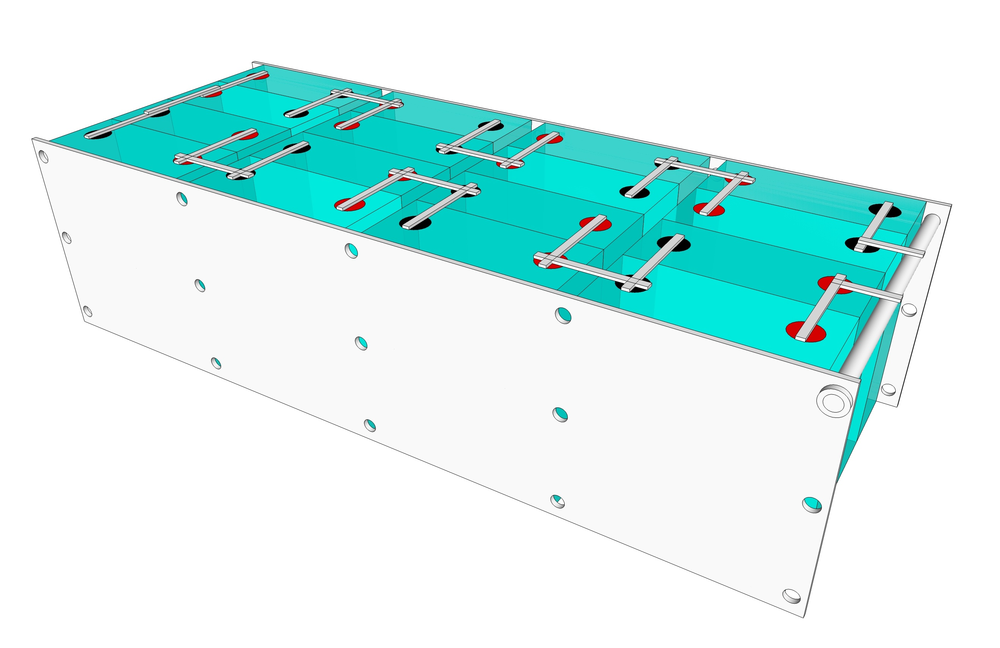
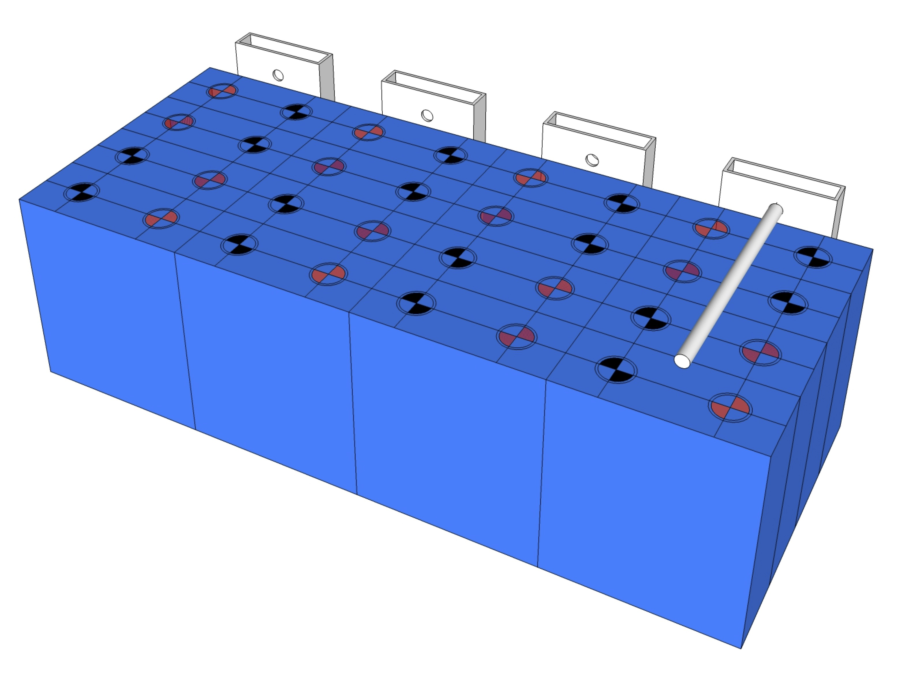
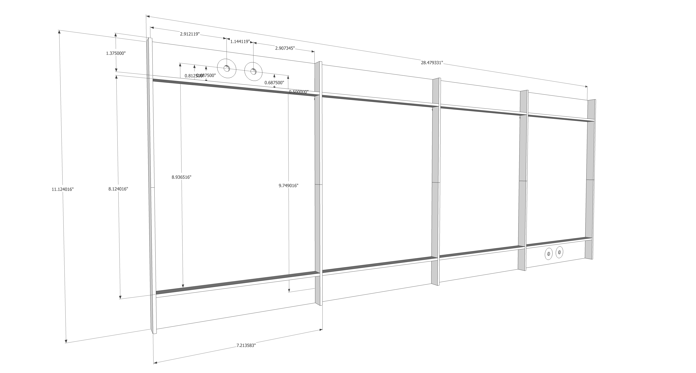
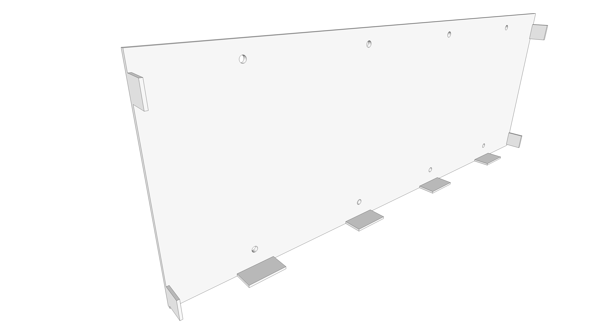

The battery will be constructed of 280AH cells.  It will be installed behind the driver side rear wheel.  Four rough concepts (A, B, C, and D) of the design are illustrated below.

_Concept A_

_Concept B_

_Concept C_

_Concept D_

# Cell Electrical Insulation

According to the Will Prowes' forum, the aluminum cased cells have positive terminal voltage on the outer case.  This means each group of cells will need to be isolated from each other and from any structure.  This will be accomplished by Kapton tape.

# Cell Compression

**TLDR: Concept D should provide adequate compression and is the most compact and simplest design.  It also eliminates the gaps between cells (vs concept A) potentially allowing for off the shelf busbars while minimizing overal length (at the expense of height).**

EVE engineers recommend approximately 12 PSI, with no more than 17 PSI, to be maintained on the cells.  Allegedly this increases rated cycles from 2500 to 3500.  They also identify approximately 1 mm expansion between 0 and 100% SOC.  Concepts A, B and C accomplish pressure and expansion allowance by threaded rod preloaded with belleville washers or springs arranged to give adequate pressure over the expected displacement.  Aluminum or steel sheet are used used for the compression side plates.  [This forum post has lots of good information](https://diysolarforum.com/threads/source-of-belleville-washers-for-300kgf-fixture.16733/).  Plan for about [$100](https://www.mcmaster.com/belleville-disc-springs/for-shaft-diameter~1-2/) in belleville washers.

However, a fourth concept (D) occurred to me while evaluating A, B, and C.  The flex of the side plates themselves function as two springs in series with any other springs in the system.  By designing the plates appropriately, they can be relied on exclusively for compression at high SOC and to accomodate the expected growth.  To apply some compression at low SOC, single bellville washers, fully flattened, can be used.  While this method will not be as calibrated as the others, it can guarentee some compression above 0 and less than 12 PSI at full SOC and is more compact, simpler, and cheaper.  This [belleville washer](https://www.mcmaster.com/9712K62/) fully flattened will give about 4 PSI at 0% SOC for this design.  This [belleville washer](https://www.mcmaster.com/9712K62/) fully flattened will give about 2.5 PSI at 0% SOC for this design.  

## Empirical Data

In [this post](https://diysolarforum.com/threads/cinergis-28-kwh-4-kw-solar-10-kw-inverter-rv-build.13786/post-198767), user @cinergi measured growth on 4 cells arranged in a similar fashion as they charged from 0 to 100%.  His springs were compressed to 30mm.  At 100% SOC he measured 1.0, 1.4, 1.4, and 2.0 mm growth over the four cells.  Between terminals he measured 0.15, 0.14, and 0.19 mm growth.

His [spring](https://www.leespring.com/compression-springs-hefty?search=LHL625D03) rate specification is 380 lbf/in per spring with a free length of 1.5 in.  Compression to 30mm would correspond to spring compression of 0.32 in (1.5 - 1.18).  That level of compression would correspond to 486.40 lbf (380x0.32x4) and 8.799 PSI initially.  The final level of compression would be 571 lbf  (380*((1.5-1.142) + (1.5-1.126) + (1.5-1.126) + (1.5-1.102))) and 10.339 PSI.

## Design for Service

### 100% SOC Condition Compression

Cell dimensions are 6.85 x 8.07 in.  Cell area is 55.279 in2.  With four cells in the arrangement, the total area under compression is 221.12 in2.  Assuming 12 PSI, this yields a total force of 2653.4 lbf.

* Assuming 15 points of compression, this yields a force per compression point of 176.89 lbf.

* Assuming 10 points of compression, this yields a force per compression point of 265.34 lbf.

* Assuming 8 points of compression, this yields a force per compression point of 331.68 lbf.

**To achieve this compressive force the spring must have a *load at solid height* of at least the above value for each case.  If this parameter matches closely, setup will be easier by simply tightening to the solid condition at 100% SOC.**

### 0% SOC Condition Compression

Cell dimensions are 6.85 x 8.07 in.  Cell area is 55.279 in2.  With four cells in the arrangement, the total area under compression is 221.12 in2.  Assuming 9 PSI, this yields a total force of 1990.0 lbf.

* Assuming 15 points of compression, this yields a force per compression point of 132.67 lbf.

* Assuming 10 points of compression, this yields a force per compression point of 199.00 lbf.

* Assuming 8 points of compression, this yields a force per compression point of 248.75 lbf.

### Growth Allowance

Assuming growth is 0.079 in (2 mm) from 0 to 100% SOC, the spring rate to achive the desired compression at each SOC is:

* Assuming 15 points of compression, spring rate is 559.75 lbf/in ((176.89 - 132.67)/0.079).

* Assuming 10 points of compression, spring rate is 839.75 lbf/in ((265.34 - 199.00)/0.079).

* Assuming 8 points of compression, spring rate is 1049.74 lbf/in ((331.68 - 248.75)/0.079).

**To achieve this range of compression the spring must have a *spring rate* of no more than the above value for each case and allow at least 0.079 in of compressive travel.**

### Candidate Compression Springs (must be 1 in or less in free length)

* For 15 points of compression, the following spring meets the above requirements:
  
  * LHL 625D 01 at $3.66 per spring [from here](https://www.leespring.com/compression-springs).  This could use up to 5/16 all thread.  It would provide 12.394 PSI compressed solid at 100% SOC and 9.018 PSI at 0% SOC.
  
* For 10 points of compression, the following spring (of many) meets the above requirement:

  * LHL 750C 01 at $4.93 per spring [from here](https://www.leespring.com/compression-springs).  This could use up to 3/8 all thread.  It would provide 10.786 PSI compressed solid at 100% SOC and 7.9458 PSI at 0% SOC.

* For 8 points of compression, the following spring meets the above requirements:

  * LHL 1000C 01at $6.40 per spring [from here](https://www.leespring.com/compression-springs).  This could use up to 1/2 all thread.  It would provide 11.939 PSI compressed solid at 100% SOC and 8.7952 PSI at 0% SOC.

### Candidate Extension Springs (Concept C) (must be ~11 in or less in free length) 

* For 8 points of compression, using doubled up springs at each point, the following spring meets the above requirement:
  * [3630N389](https://www.mcmaster.com/3630N389/) at $10.06 per spring from [McMaster](https://www.mcmaster.com/3630N389/).  It would provide 12.31 PSI at full extension at 100% SOC and 11.75 PSI at 0% SOC.

### Deformation (Concept A)

Calculations performed using clearcalcs [moment of inertia](https://clearcalcs.com/freetools/free-moment-of-inertia-calculator/us) and [beam](https://clearcalcs.com/freetools/beam-analysis/us) calculators.

####Conditions
- Center distance between compression 7.475t in
- Width of plate 8 in 
- Pinned boundary conditions
- Start of load 0.3125 in
- End of load 7.163 in
- Assumed Load 12 PSI * 55.279 in2 = 663.35 lbf
- Linear Load 663.35 lbf / 6.95 in = 95.446 lfb/in =  1145.3 lbf/ft

| Material      | E [ksi] | I [in4] | Deflection [in] | Keff [lbf/in]* |
| ------------- | ------- | ------------------ | --------------- | ------------------------- |
| 1/8 Aluminum  | 10,000  | 0.0013             | 0.296           | 1120.5                    |
| 1/8 Steel     | 29,000  | 0.0013             | 0.102           | 3251.7                    |
| 3/16 Aluminum | 10,000  | 0.00439            | 0.0876          | 3786.2                    |
| 3/16 Steel    | 29,000  | 0.00439            | 0.0302          | 10982.6                   |
| 1/2 Plywood   | 1,1015  | 0.0833             | 0.0455          | 7289.6                    |
_\* Effective Spring Rate doubles deflection from calc to account for the deformation in the opposite side plate (essentially another spring in series)._

### Deformation (Concept B)

Calculations performed using clearcalcs [moment of inertia](https://clearcalcs.com/freetools/free-moment-of-inertia-calculator/us) and [beam](https://clearcalcs.com/freetools/beam-analysis/us) calculators.

####Conditions
- Center distance between compression 8.874 in
- Width of plate 4 in 
- Pinned boundary conditions
- Start of load 0.5 i
- End of load 8.374 in
- Assumed Load 12 PSI * 55.279 in2 = 663.35 lbf
- Linear Load 663.35 lbf / 7.874 in = 84.246 lfb/in =  1010.9 lbf/ft

| Material         | E [ksi] | I [in4] | Deflection [in] | Keff [lbf/in]* |
| ---------------- | ------- | ------------------ | --------------- | ------------------------- |
| 4x1x1/8 Aluminum | 10,000  | 0.196              | 0.00342         | 96980.0                   |
_\* Effective Spring Rate doubles deflection from calc to account for the deformation in the opposite side plate (essentially another spring in series)._

### Deformation (Concept C)

Calculations performed using clearcalcs [moment of inertia](https://clearcalcs.com/freetools/free-moment-of-inertia-calculator/us) and [beam](https://clearcalcs.com/freetools/beam-analysis/us) calculators.

####Conditions
- Center distance between compression 9.75 in
- Width of plate 7.21 in 
- Pinned boundary conditions
- Start of load 0.813 in
- End of load 8.937 in (these don't exactly align with battery dimension thus analyzed load is high
- Assumed Load 12 PSI * 55.279 in2 = 663.35 lb
- Linear Load 663.35 lbf / 7.874 in = 84.246 lfb/in =  1010.9 lbf/ft 

| Material                | E [ksi] | I [in4] | Deflection [in] | Keff [lbf/in]* |
| ----------------------- | ------- | ------------------ | --------------- | ------------------------- |
| 1/8 Aluminum (1/2 ribs) | 10,000  | 0.0145             | 0.0661          | 5017.8                    |
| 1/8 Steel (1/2 ribs)    | 29,000  | 0.0145             | 0.0228          | 14547.1                   |
| 1/8 Aluminum (3/4 ribs) | 10,000  | 0.0397             | 0.0241          | 13762.4                   |
| 1/8 Steel (3/4 ribs)    | 29,000  | 0.0397             | 0.00831         | 39912.7                   |
_\* Effective Spring Rate doubles deflection from calc to account for the deformation in the opposite side plate (essentially another spring in series)._

### Deformation (Concept D)

Calculations performed using clearcalcs [moment of inertia](https://clearcalcs.com/freetools/free-moment-of-inertia-calculator/us) and [beam](https://clearcalcs.com/freetools/beam-analysis/us) calculators.

####Conditions
- Center distance between compression 8.5 in
- Width of plate 6.83 in 
- Pinned boundary condition
- Start of load 0.25 i
- End of load 8.125 in
- Assumed Load 12 PSI * 55.279 in2 = 663.35 lb
- Linear Load 663.35/7.87 = 84.288 lfb/in =  1011.46 lbf/ft

| Material      | E [ksi] | I [in4] | Deflection [in] | Keff [lbf/in]* |
| ------------- | ------- | ------------------ | --------------- | ------------------------- |
| 1/8 Aluminum  | 10,000  | 0.00111            | 0.512           | 647.803                   |
| 1/8 Steel     | 29,000  | 0.00111            | 0.177           | 1873.87                   |
| 3/16 Aluminum | 10,000  | 0.00375            | 0.152           | 2182.07                   |
| 3/16 Steel    | 29,000  | 0.00375            | 0.0523          | 6341.78                   |
_\* Effective Spring Rate doubles deflection from calc to account for the deformation in the opposite side plate (essentially another spring in series)._

Assuming the plates were just snug, approximate compression with 3/16 steel plates would be 9 PSI at 100% SOC if growth was 0.079 in at the center of deflection.

####Sanity Check for Max Allowed Compression
Assumed Load 17 PSI * 55.279 in2 = 939.74 lbf
Linear Load 939.74/7.87 = 119.401 lfb/in =  1432.89 lbf/ft

| Material   | E [ksi] | I [in4] | Deflection [in] | Keff [lbf/in]* |
| ---------- | ------- | ------------------ | --------------- | ------------------------- |
| 3/16 Steel | 29,000  | 0.00375            | 0.0741          | 6341.03                   |

17 PSI would result in deflections over double (accounting for both plates) the expansion what was observed emprically.  As this analysis doesn't account for the self limiting nature (cells will expand less under pressure), there is no way the cells will see compression of this scale.

### Additional Notes

The outer most compression points will see half the force/load of the rest of the fasteners for concept A.  Forum member [noenegdod](https://diysolarforum.com/members/noenegdod.6778/) suggested halving the spring rate on the outer springs to match the force applied per cell per displacment to provide consistent PSI.  If the 10 or 15 compression point designs are pursured, I will incorporate this suggestion.

For the system to work as analyzed, the effective spring rate of the plate (deforming) must be >> than the spring rate of the springs.  How much isn't obvious.  Twice might be enough in which case 1/8 steel might be sufficient.  3/16 steel would certainly be sufficient (its almost an order of magnitude).

For concept C, ATD Metal gave the following rough quote:

>Here are the prices:
>- steel, horizontal bars only $120 each 
>- aluminum, horizontal bars only $135 each
>- add vertical bars to either-additional $100
>- add holes $60

He also noted that aluminum welds have larger fillets (like 1/4) that shouldn't be ground down.  This favors the steel option.

## Design for Cell Testing and Top Balance

### 100% SOC Condition Compression

Cell dimensions are 6.85 x 8.07 in.  Cell area is 55.279 in2.  Assuming 12 PSI, this yields a total force of 663.35 lbf.  

* Assuming 4 points of compression, this yields a force per compression point of 165.84 lbf.
* Assuming 2 points of compression, this yields a force per compression point of 331.68 lbf.

**To achieve this compressive force the spring must have a *load at solid height* of at least the above value for each case.  If this parameter matches closely, setup will be easier by simply tightening to the solid condition at 100% SOC.**

### 0% SOC Condition Compression

Cell dimensions are 6.85 x 8.07 in.  Cell area is 55.279 in2.  Assuming 9 PSI, this yields a total force of 497.0 lbf.  

* Assuming 4 points of compression, this yields a force per compression point of 124.38 lbf.
* Assuming 2 points of compression, this yields a force per compression point of 248.76 lbf.

### Growth Allowance

Assuming growth is 0.316 in (8 mm) (four times the growth in four cells of 0.079 in) from 0 to 100% SOC for 16 cells, the spring rate to achieve the desired compression at each SOC is:

* Assuming 4 points of compression, spring rate is 131.20 lbf/in ((165.84 - 124.38)/0.3160).
* Assuming 2 points of compression, spring rate is 262.41 lbf/in ((331.68 - 248.76)/0.3160).

**To achieve this range of compression the spring must have a *spring rate* of no more than above value for each case and allow at least 0.3160 in of compressive travel.**

### Candidate Springs

* For four points of compression, the following spring meets the above requirements:
  * LHL 750B 08 at $6.29 per spring [from here](https://www.leespring.com/compression-springs) has a load at solid height of 183 lbf, 1.43 in of travel, and a spring rate of 128 lbf/in.  This could use up to 3/8 all thread.  It would provide 13.242 PSI compressed solid at 100% SOC and 10.315 PSI at 0% SOC.
* For two points of compression, the following spring meets the above requirements:
  * LHL 1000B 08 at $7.55 per spring [from here](https://www.leespring.com/compression-springs) has a load at solid height of 300 lbf, 1.39 in of travel, and a spring rate of 216 lbf/in.  This could use up to 0.5 in all thread.  It would provide 10.8540 PSI compressed solid at 100% SOC and 8.3845 PSI at 0% SOC.

### Plate Thickness

Based on the deflection analysis in the **Design for Service** section, 3/4 in plywood or rectanglar tube aluminum should be completely fine.

# Cell Interconnection

For the EVE 280AH from Amy, the studs are [M6](https://diysolarforum.com/threads/introducing-the-new-improved-shenzhen-luyuan-technology-co.15880/post-195184) with [15mm](https://diysolarforum.com/threads/introducing-the-new-improved-shenzhen-luyuan-technology-co.15880/post-203138) usable length. 

The content below is left for posterity, but is not under consideration based on observations by forum members that the braided flexible bus bars have flatness issues on the mounting surfaces.

~~[This product](https://www.erico.com/part.asp?part=MBJ16-100-6) is sized for an M6 stud, is 3.94 in center-to-center, has 31.57 kcmil cross section (5-6 AWG equivalent), and has an ampacity of 120A.  This ampacity rating is consistent with a [6AWG](http://assets.bluesea.com/files/resources/reference/21731.pdf) wire if the cross section is accurate.  Two trippled up connections stack to 0.354 in or 9 mm.  With a M6 nylock nut height of [6mm](http://www.fasnetdirect.com/refguide/Metnutd985.pdf) it should (barely) fit the stud.  It should work (tripled up) for the parallel cell interconnects (ampacity ~270A).~~

~~[This product](https://www.erico.com/part.asp?part=MBJ16-150-6) is sized for an M6 stud, is 5.9 in center-to-center, has 31.57 kcmil cross section (5-6 AWG equivalent), and has an ampacity of 120A.  This ampacity rating is consistent with a [6AWG](http://assets.bluesea.com/files/resources/reference/21731.pdf) wire if the cross section is accurate.  It should work (trippled up) for the series cell interconnects (ampacity ~270A)..~~

~~23*3 = 69 interconnects.  This would cost like $600~~

~~[This product](https://www.erico.com/part.asp?part=MBJ50-100-10) is sized for an M10 stud (hole diameter is 0.413 inches), is 3.94 in center-to-center, has 98.7 kcmil cross section (1-1/0 AWG equivalent), and has an ampacity of 250A.  This ampacity rating is consistent with a [1 AWG](http://assets.bluesea.com/files/resources/reference/21731.pdf) wire if the cross section is accurate.  Two connections stack to 0.196 in or 5 mm.  With a M6 nylock nut height of [6mm](http://www.fasnetdirect.com/refguide/Metnutd985.pdf) it should (comfortably) fit the stud.  With this size hole, good contact with the terminal can't be ensured.~~

[These busbars](https://www.aliexpress.com/item/1005001940967607.html?spm=a2g0o.productlist.0.0.18e64b71vAtzyG&algo_pvid=9b8bd3b4-3b93-4a0c-ba41-009269daf1a8&algo_expid=9b8bd3b4-3b93-4a0c-ba41-009269daf1a8-0&btsid=0b0a556e16128926681981046e2c00&ws_ab_test=searchweb0_0,searchweb201602_,searchweb201603_) should work for cell parallel internconnects.  They appear to be about 2mm thick, composed of laminated copper sheets.  By separating and re-combining, they could achieve the ampacity desired.  Because of the curve, the should accomodate the small amount of movement needed for parallel cell interconnects.  For series connections, a solid bar is probably fine because growth in that dimension should be negligable.  24-32 should be enough.  This would cost about $200.  It might be worth [nickel plating](https://diysolarforum.com/resources/tin-plating-and-nickle-plating-bus-bars.163/).   @cinergi from the diysolarpower forum pointed me to [this supplier](https://amprevolt.com/collections/battery-accessories/products/prismatic-cell-lifepo4-busbar?variant=32166752223284) of the same bus bars for $2.50 each.  This would bring the cost to under $100.o

