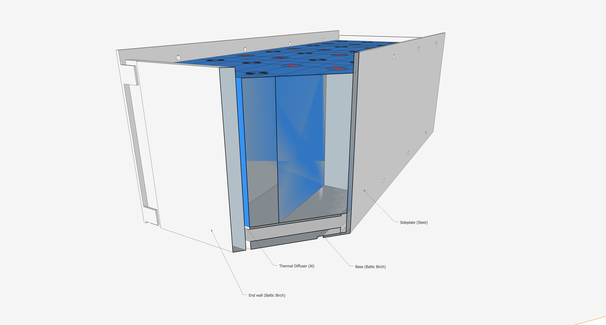

The battery will be constructed of 16 280AH cells in a 2P8S 560AH 24V configuration.  It will be installed behind the driver side rear wheel.  The selected design concept is illustrated below.

_Theory_

The design consists of two 3/16 steel side plates that sandwich the cells and are fastened together with 1/4-20 high strength steel all-thread and nyloc nuts.  The side plates include tabs that capture a plywood-aluminum base plate and plywood end plates to fully secure and constrain the cells.  The baseplate includes channels for installation of heating provisions and a 1/8 inch aluminum thermal diffuser in direct contact with the cells.  The plywood endplates will allow for attachment of battery management system components.

Note: Upon soliciting for fabrication, I found it was cheaper (and easier) to go with [sendcutsend.com](sendcutsend.com) using a bent tab design.  The new design is [here](sideplates_bends_r1.dxf).  To accomplish this, the design was reworked with the tabs the same thickness as the material and minor geometry changes to accommodate the bend allowances.  The critical dimensions (interior tab-to-tab distance, top plate edge-to-interior tab distance, hole spacing relative to center and top edge), remain essentially unchanged.  The aluminum baseplate/thermal diffuser was also ordered from sendcutsend.  The design is [here](aluminum_thermal_diffuser.dxf).

_Practice_

[**For all design concepts evaluated and associated calculations, see the battery box concept design page.**](/van/electrical/battery/Battery_box_design)

## Cell Electrical Insulation

According to the Will Prowes' forum, the aluminum cased cells have positive terminal voltage on the outer case.  This means each group of cells will need to be isolated from each other and from any structure.  This will be accomplished by Kapton tape.

## Cell Compression

**TLDR: The select design should provide adequate compression and is the most compact and simple design evaluated.**

EVE engineers recommend approximately 12 PSI, with no more than 17 PSI, to be maintained on the cells.  Allegedly this increases rated cycles from 2500 to 3500.  They also identify approximately 1 mm expansion between 0 and 100% SOC.   Use of springs and belleville washers were evaluated to provide compression.  In the selected design, the flex of the side plates themselves function as two springs in series with any other springs in the system.  By designing the plates appropriately, they can be relied on exclusively for compression at high SOC and to accomodate the expected growth.  To apply some compression at low SOC, single bellville washers, fully flattened, will be used.  While this method will not be as calibrated as the others, it can ensure some compression above 0 and less than 12 PSI at full SOC and is more compact, simpler, and cheaper.   This [belleville washer](https://www.mcmaster.com/9712K61/) fully flattened will give about 2.5 PSI at 0% SOC for this design.

For top balance, the stack of all 16 cells will be compressed by two 3/4 inch plywood panels with held with 4 rods all 1/4-20 all-thread.  The compression provided by the plywood panels will be provided by 4 springs outboard of the panel on a single side.  The four springs are type LHL 750B 08 from [leespring.com](https://www.leespring.com/compression-springs) which will provide 13.2 to 10.3 PSI with acceptable room for cell expansion.

## Cell Interconnection

Parallel cell connection will use either CALB-style flexible copper busbars, solid busbars from the supplier, or custom copper busbars.

Series cell connection will use solid busbars, either custom or purchased.

Nickel plating will be considered.

## Bill of Materials

### Cell Balance Rig

| Item                                | Quantity | Source        | Link                                        |
| ----------------------------------- | -------- | ------------- | ------------------------------------------- |
| Low-Strength 1/4-20 threaded rod 5' | 4        | McMaster-Carr | [Link](https://www.mcmaster.com/98837A054/) |
| 1/4-20 nut                          | 8        | stock         |                                             |
| 1/4 washer                          | 8        | stock         |                                             |
| 3/4 Plywood 9" x 8"                 | 2        | stock         |                                             |
| LHL 750B 08                         | 4        | Lee Spring    |                                             |

### Battery Box

| Item                                 | Quantity | Source          | Link                                          |
| ------------------------------------ | -------- | --------------- | --------------------------------------------- |
| High-Strength 1/4-20 threaded rod 3' | 4        | McMaster-Carr   | [Link](https://www.mcmaster.com/3313N11/)     |
| Belleville Washer                    | 8        | McMaster-Carr   | [Link](https://www.mcmaster.com/9712K61/)     |
| 1/4-20 nyloc nut                     | 8        | stock           |                                               |
| 1/4 washer                           | 8        | stock           |                                               |
| High Strength Lock-tite              | 1        | stock           |                                               |
| 2x2 ~12'                             | 1        | local/depot     |                                               |
| 1/2 Baltic Birch 5' x 5'             | 1        | Exotic Lumber   | [Link](https://www.exoticlumber.com/plywood/) |
| 11" x 27 1/4" 1/8 Aluminum Plate     | 1        | sendcutsend.com |                                               |
| Spar Urethane                        | 1        | local/depot     |                                               |
| Spray Paint                          | 1        | local/depot     |                                               |
| #10 1 1/4" flat head wood screws     | ~50      | local/depot     |                                               |
| #10 Counter sink drill bit           | 1        | Amazon          |                                               |
| Kapton tape                          | 1        | Amazon          |                                               |

