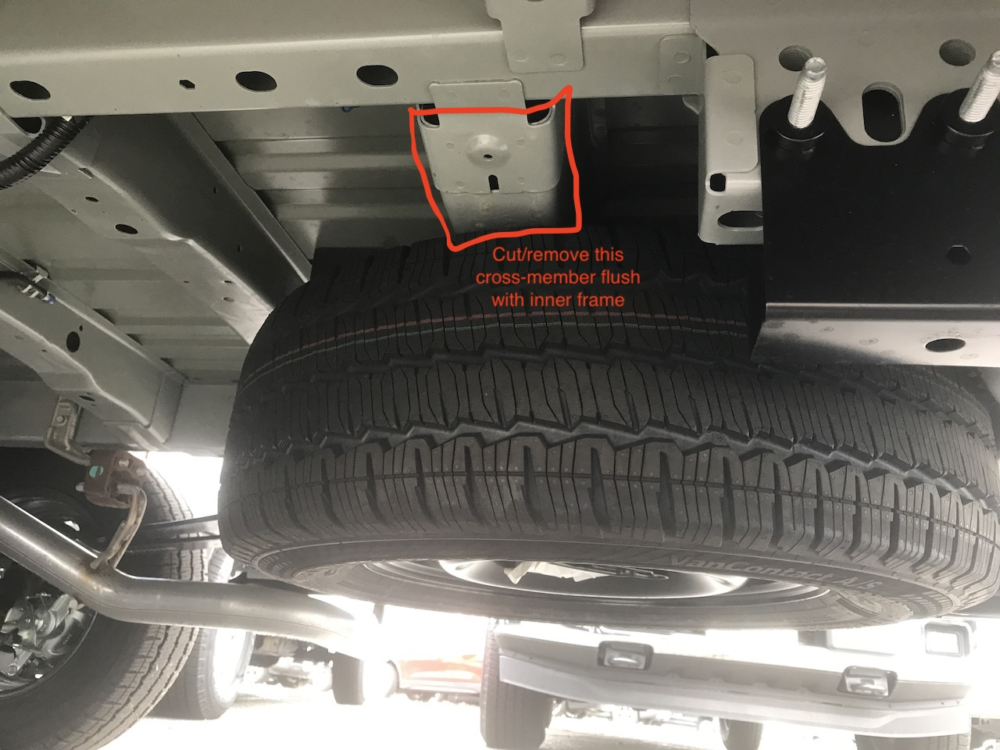
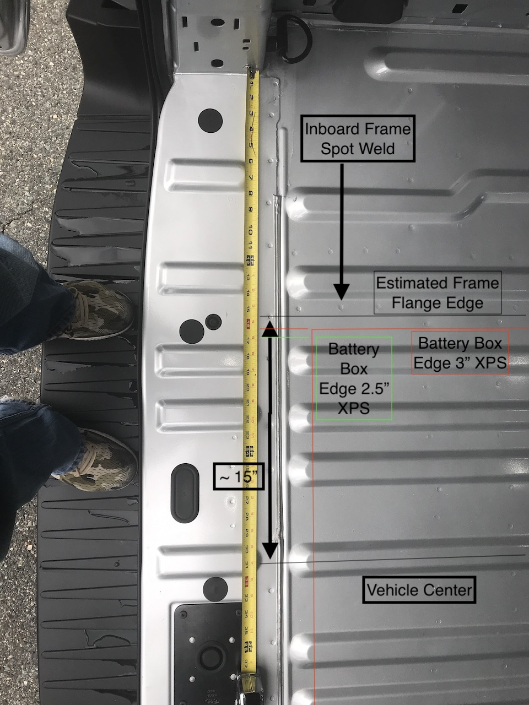
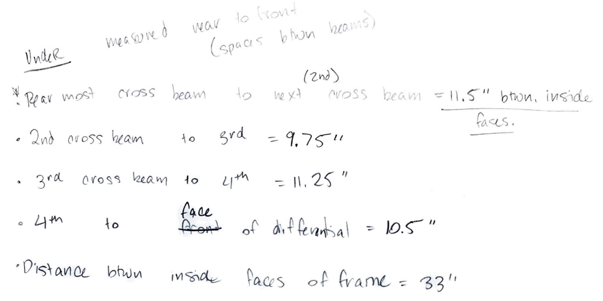
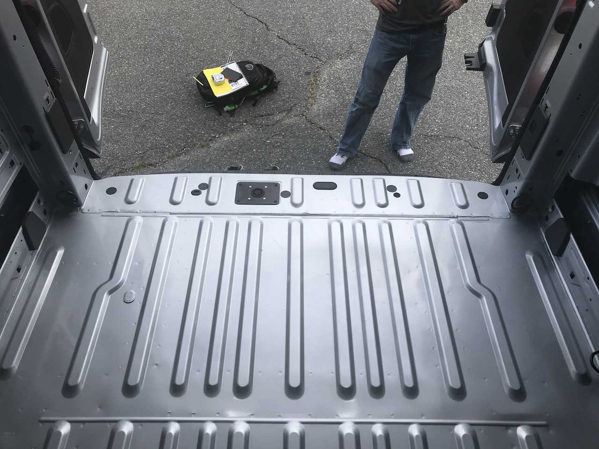

The battery box will be custom aluminum "trunk" centered in the rear of the cargo space between the frame members.  It is inspired by the [vancompass rear storage trunk for sprinters](https://vancompass.com/products/van-compass-rear-storage-trunk-2007-sprinter).  Note, while made for the sprinter, Van Compass did install it in a Transit as documented [in this thread](https://expeditionportal.com/forum/threads/van-compass-ford-transit-build-1-ton-4x4-conversion.188858/post-2437143).  Vancompass also stated via email that a [few customers have installed them on the short Transits](2020-8-2_email_with_van_compass.pdf).

## Fitup and Dimensions

To allow for installation of the battery box, the spare tire will be relocated to the rear door.  Additionally the 2nd to last cross-member will be cut flush with the inner frame sides.

Assuming the largest width battery design, with 3" XPS on the largest battery under consideration with 3/16 inch wall thickness, the edge of the battery box lies close enough to the frame flange edge to prevent through-bolting the battery box flange.  For that design concept, it would be necesary to extend the box flange over the ridge inside the frame and use plus-nuts for fastening.

Alternatively, with 2.5" XPS there is enough room to through-bolt the box.  Through-bolting should simplify the installation.

[This post](https://www.fordtransitusaforum.com/threads/lwb-extended-tall-day-van-tailgater.37297/post-547929) includes an underbody battery box, though not open to interior, but it doesn have good underside photos with the tire removed. 

TODO: Determine box flange - consider enough width to extend over the frame pinch welds for greater structural support under normal load (gravity)

TODO: Evaluate fore-aft dimensions.

## Insulation and Thermal

With 3 inches of XPS on the sides of the battery, the total thermal resistance is 4.49 C/W.  This only accounts for the sides and bottom of the container.  A minimal 10 Watts would at steady state drive a delta-T of 44.9 C over outside ambient temperatures.   

With 2.5 inches of XPS on the sides of the battery, the total thermal resistance is 3.74 C/W.  This only accounts for the sides and bottom of the container.  A minimal 10 Watts would at steady state drive a delta-T of 37.4 C over outside ambient temperatures

| Variable Name           | XPS    | XPS    |
| ----------------------- | ------ | ------ |
| kappa [W/mK]            | 0.03   | 0.03   |
| Area [inch2] | 877.33 | 877.33 |
| Thickness [inch]        | 3.00   | 2.50   |
| Thickness [m]           | 0.08   | 0.06   |
| Area [m2]    | 0.57   | 0.57   |
| Resistance [C/W]        | 4.49   | 3.74   |

In both cases a small continuous 1-5 W heat source would keep things well above freezing assuming sub-zero outside temps.

Assuming 0.3 mOhm internal cell resistances, a 16 cell 24V battery will disipate 21W during a 200A charge.  This means the battery should exchange heat with the van internals via the top.  

However, we must account for the specific heat capacity of the bank itself.  [This paper](https://core.ac.uk/download/pdf/144147357.pdf) provides lumped parameter assumptions for LFP.  Using the more conservative value for specific heat capacity (825 J/kg*C), with a pack mass of 87kg (16 280HA cells), a two hour 200A charge produces a bulk temperature increase of 21W * 7200s / (87kg * 825 J/kg*C) = **2.1C**, assuming adiabatic conditions.  Based on these numbers, overheating shouldn't be a problem even in summer as long is there is some communicaiton with the van interior.  

## Alternative Design

~~It looks as if the 800AH arranged in the long form placed athwart could tuck between the frame and cross members with no cutting required.  May have to insulate external to the box.~~

On a close look at the spot welds in the floor, which signifies the location of the flanges of the frame  and cross members, there isn't room without cutting into those flanges/welds.  In short I don't think this will work without cutting a frame member.  **Its either cut the crossmember, or move inside.**
