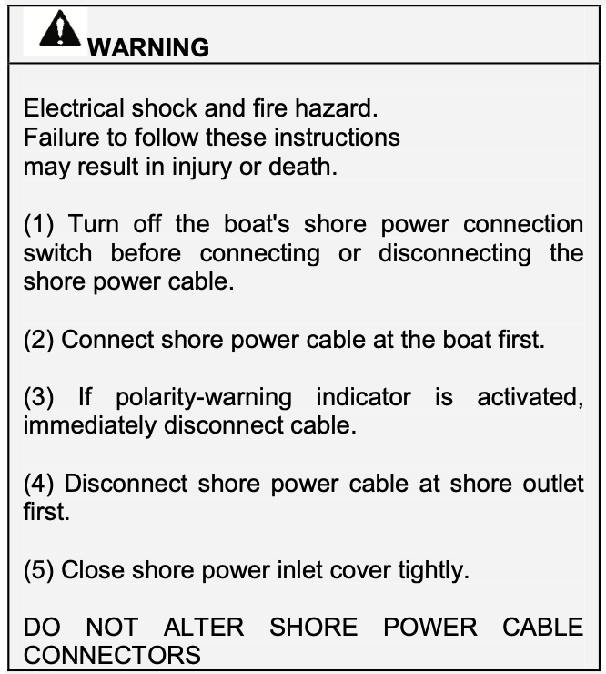
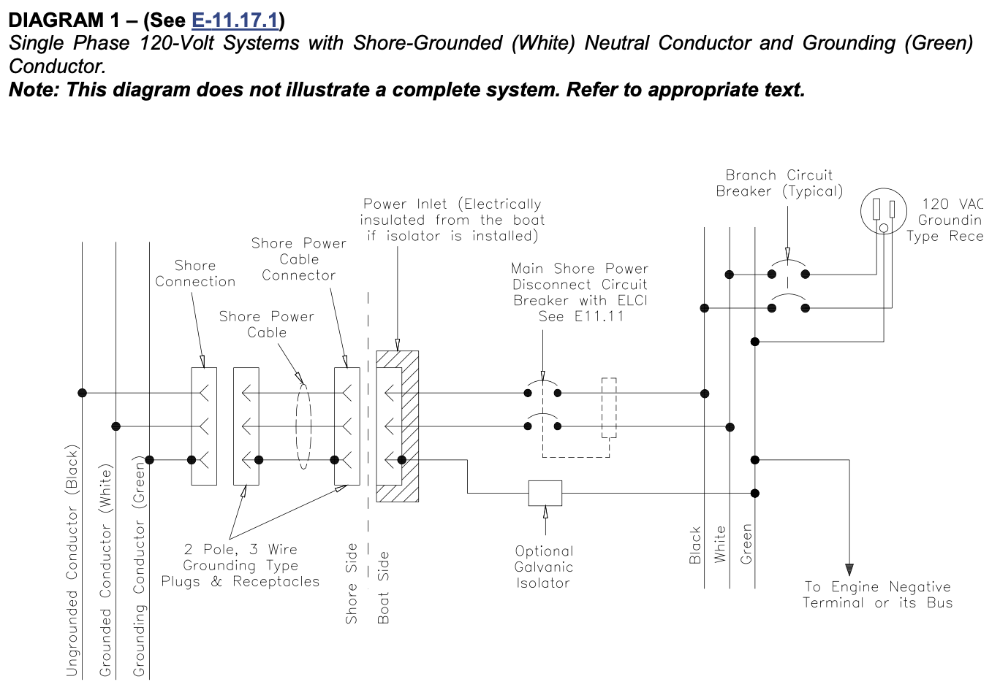
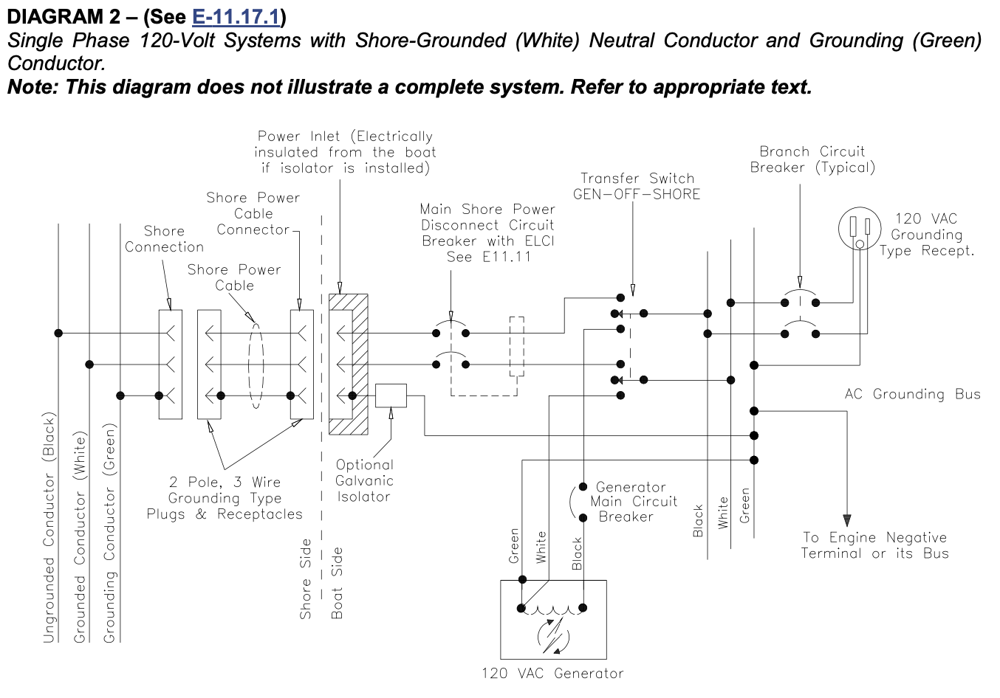
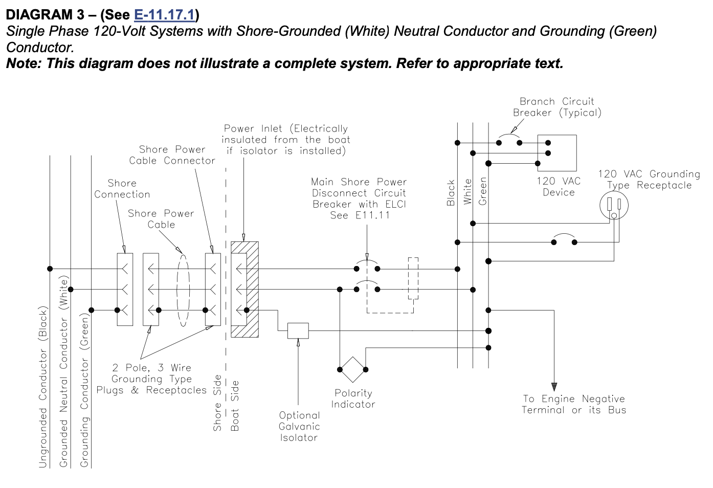
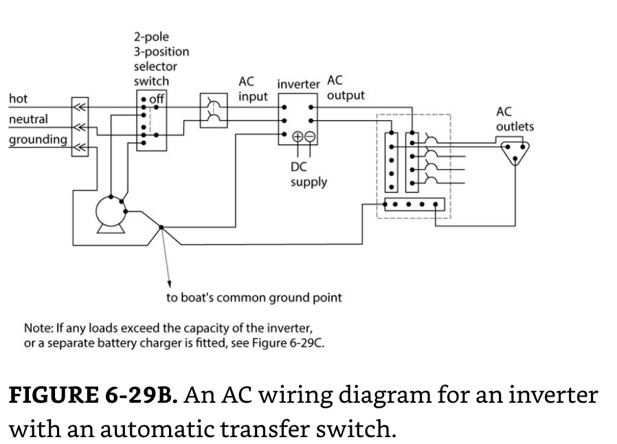
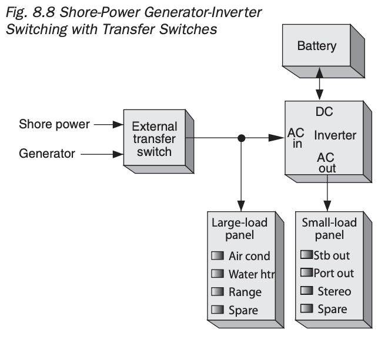
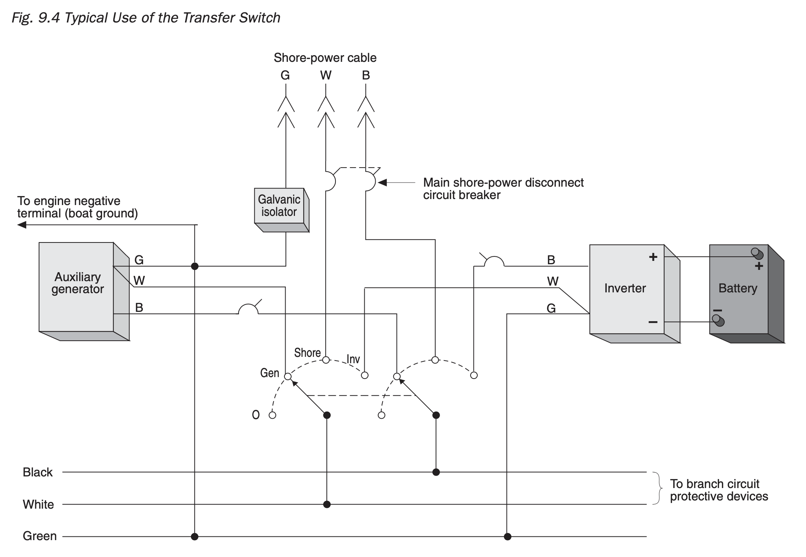
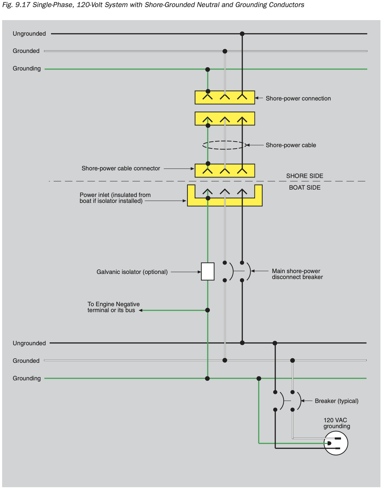
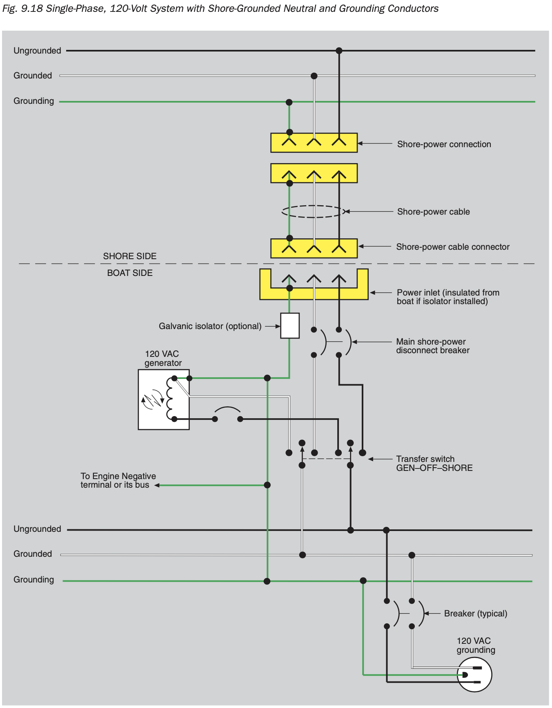
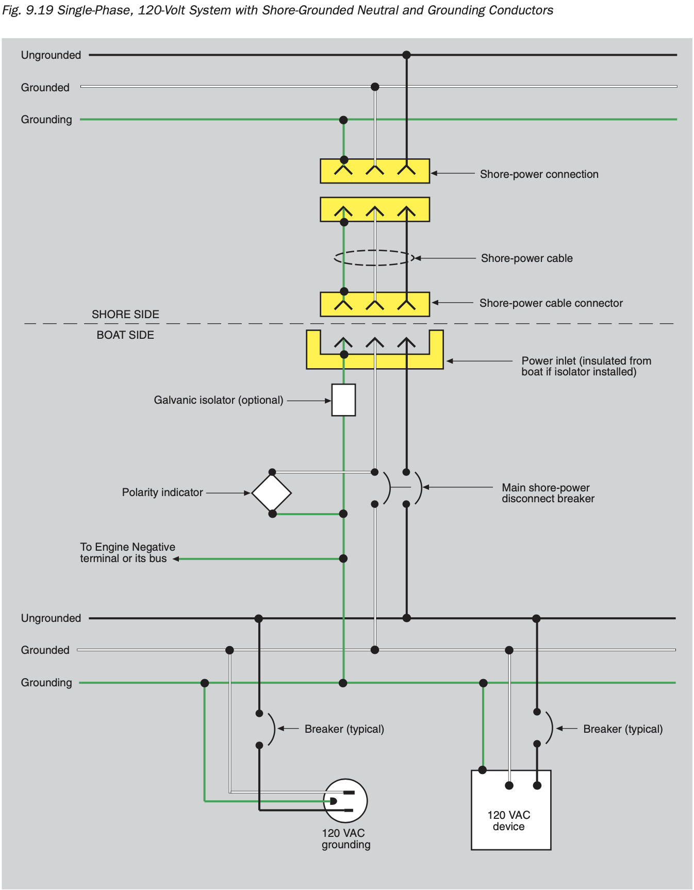

## TLDR: 

### An ELCI will be used for the Shore Power Disconnect Circuit Breaker

Use of an ELCI as the shore power disconnect circuit breaker will provide a trip:

* if a hot-to-ground fault occurs upstream of the Main Panelboard ELCI while connected to shore power with a functioning ground.
* if a latent hot-to-ground fault exists upstream of the Main Panelboard ELCI with an open shore power ground, when a person completes the path to earth (e.g. touches van metal while standing on earth). 

In the two cases above, and ELCI or GFCI at the shore power source should also provide the same protection, but will not be relied on.  Additionally, if the fault occurs downstream of the Main Panelboard ELCI, it would also provide the above trips.

### The Alternator-Inverter Will Not Have an Output Circuit Breaker

Because the Alternator-Inverter is self-limiting, it does not require overcurrent protection on its output.  

In the event of a hot-to-neutral fault between the Alternator-Inverter output and the Main Panelboard ELCI, the Alternator-Inverter will latch in an Overload / Short Circuit Shut Down ([assuming a Samlex PST](https://www.samlexamerica.com/documents/manuals/11001-PST-1500-2000-12-24-0513.pdf)).

In the event of a hot-to-ground fault between the Alternator-Inverter output and the Main Panelboard ELCI, the Alternator-Inverter will latch an Overload / Short Circuit Shut Down ([assuming a Samlex PST](https://www.samlexamerica.com/documents/manuals/11001-PST-1500-2000-12-24-0513.pdf)) because the gound and neutral are bonded at the Alternator-Inverter.

### The Main Panelboard will have an ELCI and Voltage Meter

### All Outlets will be GFCI Protected

## Sources

ABYC

The Boatowner's Illustrated Electrical Handbook

[A good website on boating electrical](https://gilwellbear.wordpress.com/2020/02/16/abyc-electrical-standard-mapped-to-sanctuarys-ac-system/)

Boatowners Mechanical and Electrical Manual 4E

## Electrical System Compliance with ABYC

11.4  **DEFINITIONS**

11.4.1 AC grounded conductor - A current carrying conductor that is intentionally maintained at ground potential.

**NOTE: This may be referred to as the neutral (white) conductor in AC electrical systems.**

11.4.2 AC grounding conductor (green or green with a yellow stripe) - A conductor, not normally carrying current, used to connect the metallic non-current carrying parts of AC electrical equipment to the AC grounding bus, engine negative terminal or its bus, and to the source ground.

**NOTE: The source of electrical power may be the shore AC power, an inverter, an isolation transformer or a generator.**

11.4.5 DC grounded conductor - A current carrying conductor connected to the side of the power source that is intentionally maintained at boat ground potential.

11.4.6 DC grounding conductor - A normally non-current carrying conductor used to connect metallic non- current carrying parts of direct current devices to the engine negative terminal, or its bus.

11.4.7 Double insulation system - A system comprised of basic insulation and supplementary insulation, with the two insulations physically separated and so arranged that they are not simultaneously subjected to the same deteriorating influences, e.g., temperature, contaminants, to the same degree.

11.4.8 Engine negative terminal - The point on the engine at which the negative battery cable is connected.

11.4.9 Equipment enclosure - The outside shell of equipment that provides personnel protection from electrical hazards, burns, rotating machinery, sharp edges, and provides protection to the device from mechanical damage or weather.

11.4.10 Equipment Leakage Circuit Interrupter (ELCI) - A residual current device which detects equipment ground fault leakage current and disconnects all ungrounded (110 V & 240V) and grounded (110 V neutral) current carrying conductors from the supply source at a preset trip threshold.

11.4.11 Galvanic isolator - A device installed in series with the (AC) grounding (green) conductor of the shore power cable to effectively block low voltage (DC) galvanic current, but permit the passage of alternating current (AC) normally associated with the (AC) grounding (green) conductor.

11.4.12 Ground - The potential of the earth's surface. The boat's ground is established by a conducting connection (intentional or accidental) with the earth, including any conductive part of the wetted surface of a hull.

11.4.13 Ground fault circuit interrupter (GFCI) - A device intended for the protection of personnel that functions to de-energize a circuit, or portion thereof, within an established period of time when a current to ground exceeds some predetermined value that is less than that required to operate the overcurrent protective device of the supply circuit.

11.4.14 Ground fault protector (GFP) - A device intended to protect equipment by interrupting the electric current to the load when a fault current to ground exceeds some predetermined value that is less than that required to operate the overcurrent protection device of that supply circuit.

11.4.16 Loom-A flexible covering designed to protect conductors.

11.4.17 Overcurrent protection device - A device, such as a fuse or circuitbreaker, designed to interrupt the circuit when the current flow exceeds a predetermined value.

11.4.18 Panelboard - An assembly of devices for the purpose of controlling and/or distributing power on a boat. It includes devices such as circuit breakers, fuses, switches, instruments, and indicators.

11.4.19 Pigtails - Conductors provided integral to an electrical component or appliance for the purpose of connection to external circuits.

11.4.20 Polarized system AC- A system in which the grounded and ungrounded conductors are connected in the same relation to terminals or leads on devices in the circuit.

11.4.21 Polarized system DC - A system in which the grounded (negative) and ungrounded (positive) conductors are connected in the same relation to terminals or leads on devices in the circuit.

11.4.22 Readily accessible - Capable of being reached quickly and safely for effective use under emergency conditions without the use of tools.

11.4.23 Self-limiting - A device whose maximum output is restricted to a specified value by its magnetic or electrical characteristics.

11.4.24 Sheath - A material used as a continuous protective covering, such as overlapping electrical tape, woven sleeving, molded rubber, molded plastic, loom, or flexible tubing, around one or more insulated conductors.

11.4.25 Shore power inlet - The fitting designed for mounting on the boat, of a reverse service type, requiring a female connector on the shore power cable in order to make the electrical connection.

11.4.26 Switchboard - An assembly of devices for the purpose of controlling and/or distributing power on a boat. It may include devices such as circuit breakers, fuses, switches, instruments, and indicators. They are generally accessible from the rear as well as from the front, and are not intended to be installed in cabinets.

11.4.27 Transformer, isolation - A transformer meeting the requirements of E-11.7.1 installed in the shore power supply circuit on a boat to electrically isolate all AC system conductors, including the AC grounding conductor (green) on the boat, from the AC system conductors of the shore power supply.

11.4.29 Trip free circuitbreaker - A resettable overcurrent protection device; designed so that the means of resetting cannot override the current interrupting mechanism.

11.4.30 Watertight - Constructed so that water will not enter the enclosure under the test conditions specified in NEMA Standard 250, Type 6P or IEC Standard 60529 Type IP67.

11.4.31 Weatherproof - Constructed or protected so that exposure to the weather will not interfere with successful operation under the test conditions specified in NEMA Standard 250, Type 3 or IEC Standard 60529 Type IP 54.

11.5 **GENERAL REQUIREMENTS**

11.5.4 GENERAL REQUIREMENTS - DC SYSTEMS

11.5.4.1 Two-Wire System - All direct current (DC) electrical distribution systems shall be of the two-wire type. (See FIGURE 9A, FIGURE 9B, FIGURE 10A and FIGURE 10B.)

**EXCEPTION: Engine mounted equipment.**

11.5.4.2 DC Grounding Systems and Bonding - A metallic hull, or the bonding and DC grounding systems, shall not be used as a return conductor. (See FIGURE 9A, FIGURE 9B, FIGURE 10A and FIGURE 10B, and E-11.16)

11.5.4.3 Grounded Systems - If one side of a two-wire direct current system is connected to ground, it shall be the negative side and polarized as defined in E-11.4.

11.5.4.4 Multiple Engine Installation - If a boat has more than one engine with a grounded cranking motor, which includes auxiliary generator engine(s), the engines shall be connected to each other by a common conductor that can carry the cranking motor current of each of the grounded cranking motor circuits. Outboard engines shall be connected at the battery negative terminals (See FIGURE 10A).

11.5.4.5 Crossover (Parallel) Cranking Motor Circuits - In multiple inboard engine installations, which includes auxiliary generator(s) with cross-over (parallel) grounded cranking motor systems, the engines shall be connected together with a cable large enough to carry the cranking motor current. This cable and its terminations shall be in addition to, and independent of, any other electrical connections to the engines including those required in E-11.5.4.4. (See FIGURE 10A)

11.5.4.6 If a paralleling switch is installed, it shall be capable of carrying the largest cranking motor current.

**NOTE: A paralleling switch may be either of the maintained contact or momentary contact type.**

11.5.4.7 DC System Negative Connections

11.5.4.7.1 If an alternating current (AC) system is installed, the main AC system grounding bus shall be connected to the engine negative terminal or its bus. On boats with outboard motors, the load return lines shall be connected to the battery negative terminal or its bus, unless specific provision is made by the outboard motor manufacturer for connection to the engine negative terminal.

11.5.4.7.1.1 the engine negative terminal or the DC main negative bus on grounded DC systems, or

11.5.4.7.1.2 the boat’s DC grounding bus in installations using ungrounded DC electrical systems. (See Figure 18)

11.5.4.7.2 The negative terminal of the battery, and the negative side of the DC system, shall be connected to the engine negative terminal or its bus. On boats with outboard motors, the load return lines shall be connected to the battery negative terminal or its bus, unless specific provision is made by the outboard motor manufacturer for connection to the engine negative terminal.

 11.5.4.7.3 If an accessory negative bus with provision for additional circuits is used for the connection of accessories, the ampacity of this bus, and the conductor connected to the engine negative terminal or the DC main negative bus, shall be at least equal to the ampacity of the feeder(s) to the panelboard(s) supplying the connected accessories. (See Figure 9A, Figure 9B, Figure 10A and Figure 10B and E-11.16)

11.5.4.7.4 If the negative side of the DC system is to be connected to ground, the connection shall be made only from the engine negative terminal, or its bus, to the DC grounding bus. This connection shall be used only as a means of maintaining the negative side of the circuit at ground potential and is not to carry current under normal operating conditions.

11.5.4.7.5 Continuously energized parts, such as positive battery terminals and both ends of all wire connected thereto, shall be physically protected with boots, or other form of protection, that cover all energized surfaces to prevent accidental short circuits.

**EXCEPTION: Circuits that have overcurrent protection at the source of power in accordance with E- 11.10.**

11.5.5 GENERAL REQUIREMENTS - AC SYSTEMS

11.5.5.1 The system shall be polarized as defined in E-11.4

11.5.5.2 Grounded Neutral - A grounded neutral system is required. The neutral for AC power sources shall be grounded only at the following points:

11.5.5.2.1 The shore power neutral is grounded through the shore power cable and shall not be grounded on board the boat.

11.5.5.2.2 The secondary neutral of an isolation transformer or polarization transformer shall be grounded at the secondary of an isolation or polarization transformer. (See DIAGRAM 6, DIAGRAM 7, DIAGRAM 8 and DIAGRAM 9. See **EXCEPTION**.)

11.5.5.2.3 The generator neutral shall be grounded at the generator. (See DIAGRAM 2 or DIAGRAM 4.)

11.5.5.2.4 The inverter output neutral shall be grounded at the inverter. The inverter output neutral shall be disconnected from ground when the inverter is operating in the charger or the feed-through mode(s). (See ABYC A-31, *Battery Chargers and Inverters*.)

**EXCEPTION: Exception to E-11.5.5.2.2, E-11.5.5.2.3 and E-11.5.5.2.4: For systems using an isolation transformer or polarization transformer, both the generator or inverter neutral and the transformer secondary neutrals may be grounded at the AC main grounding bus instead of at the generator, inverter, or transformer secondaries. (See DIAGRAM 5.)**

11.5.5.3 The main AC system grounding bus shall be connected to

11.5.5.3.1 the engine negative terminal or the DC main negative bus on grounded DC systems, or

11.5.5.3.2 the boat’s DC grounding bus in installations using ungrounded DC electrical systems.  

11.5.5.4 In AC circuits, all current carrying conductors and the grounding conductor shall be run together in the same cable, bundle or raceway.

11.5.5.5 There shall be no switch or overcurrent protection device in the AC grounding (green) conductor.

11.5.5.5.1 Where isolation of galvanic currents is desirable, only devices meeting the requirements of ABYC A-28*, Galvanic Isolators*, shall be used in the grounding path.

11.5.5.6 Isolation of Sources – Individual circuits shall not be capable of being energized by more than one source of electrical power at a time. Each shore power inlet, generator, or inverter is considered a separate source of power.

11.5.5.6.1 Transfer of Power - The transfer of power to a circuit from one source to another shall be made by a means that opens all current-carrying conductors, including neutrals, before closing the alternate source circuit, to maintain isolation of power sources.

11.5.5.6.2 Multiple Shore Power Inlets - Where more than one shore power inlet is used, the shore power neutrals shall not be connected together on board the boat.

**EXCEPTION: Exception to E-11.5.5.6 and its subsections: The grounded neutral from a polarization transformer, isolation transformer, generator or inverter may be permanently connected to the same main AC grounding bus (See E-11.17, DIAGRAM 5) and is not required to be switched.**

11.5.5.7 Power Source Disconnecting Means - A means for disconnecting all power sources from the load shall be provided at the same location.

11.5.5.8 Guarding of Energized Parts - Energized parts of electrical equipment shall be guarded against accidental contact by the use of enclosures or other protective means. Access to energized parts of the electrical system shall require the use of hand tools. An electrical enclosure shall not be used for any other purpose.

11.6 **POWER SOURCE**

11.6.1 BATTERY

11.6.1.2 Battery Switch

11.6.1.2.1 A battery switch shall be installed in the positive conductor(s) from each battery or battery bank with a CCA rating greater than 800 amperes.

**NOTE: Conductors supplying the following may be connected to the battery side of the switch (See FIGURE 11):**
**a. Electronic equipment with continuously powered memory;**
**b. Safety equipment such as bilge pumps, alarms, CO detectors and bilge blowers; c. Battery charging equipment.**

11.6.1.2.2 A battery switch shall be mounted in a readily accessible location as close as practicable to the battery.

11.6.1.2.3 Battery Switch Ratings - The intermittent rating of a battery switch shall not be less than the maximum cranking current of the largest engine cranking motor that it serves. The minimum continuous rating of a battery switch shall be the total of the ampacities of the main overcurrent protection devices connected to the battery switch, or the ampacity of the feeder cable to the switch, whichever is less.

11.6.2 POWER SOURCE FOR AC SYSTEMS

11.6.2.1 AC System Voltage

11.6.2.2 Nominal system voltages for AC electrical systems shall be selected from the following:

11.6.2.2.1 120 volts AC, single phase;

11.6.3 SHORE POWER

11.6.3.1 Shore Power Supply

11.6.3.1.1 Power Inlet - The receptacle, or receptacles, installed to receive a connecting cable to carry AC shore power aboard shall be a male type connector.

11.6.3.1.1.1 Power inlets installed in locations subject to rain, spray, or splash shall be weatherproof whether or not in use.

11.6.3.1.1.2 Power inlets installed in areas subject to flooding or momentary submersion shall be watertight whether or not in use.

11.6.3.1.1.3 Metallic power inlets installed on metallic or carbon fiber reinforced boats using an isolation transformer or a galvanic isolator shall be insulated from metallic structure and components. On non-metallic boats using an isolation transformer or a galvanic isolator the power inlet shall be insulated from metallic components connected to the boat's ground.

11.6.3.1.2 Shore Power Cable – On each boat equipped with an AC shore power system, a shore power cable that contains the conductors for the power circuit and a grounding (green) conductor shall be provided.

11.6.3.1.2.1 Except where the shore power cable is permanently connected to the boat, the boat end of this cable shall be terminated with a locking and grounding female type connector to match the boat power inlet. (See FIGURE 13 and FIGURE 14)

11.6.3.1.2.2 The shore power cable shall be flexible cord with the minimum properties of Type SOW, STW, STOW, SEOW, or STOOW, and shall be suitable for outdoor use. The shore connection end of this cable shall be fitted with a locking and grounding type plug with the required number of poles and shall comply with Article 555 of the National Electrical Code. (See FIGURE 13 or and Table VII-A)

**EXCEPTION: Pin and sleeve devices in accordance with Figure14.**

11.6.3.2 Shore Power Inlet Warning

11.6.3.2.1 Labels and warnings shall comply with ABYC T-5, *Safety Signs and Labels**.*

11.6.3.2.2 Labels shall include the following informational elements:

11.6.3.2.2.1 the signal word for the level of hazard intensity;

11.6.3.2.2.2 nature of the hazard;

11.6.3.2.2.3 consequences that can result if the instructions to avoid the hazard are not followed; and 

11.6.3.2.2.4 instructions on how to avoid the hazard.

11.6.3.2.3 A permanently mounted waterproof warning label shall be located at each shore power inlet location on the boat.

**NOTE: An example of such a label follows:**

**EXCEPTIONS:**
**1. Item 3 is not required if a polarity indicator is not installed. (See E-11.6.3.3)**
**2. Items 2 and 4 are not required for permanently connected shore power cables.**

11.6.3.3 Shore Power Polarity Devices

11.6.3.3.1 Reverse polarity indicating devices providing a continuous visible or audible signal shall be installed in 120 V AC shore power systems and must respond to the reversal of the ungrounded (black) and the grounded (white) conductors (See E-11.17.1, DIAGRAM 3), if

11.6.3.3.1.1 the polarity of the system must be maintained for the proper operation of the electrical devices in the system, or

11.6.3.3.1.2 a branch circuit is provided with overcurrent protection in only the ungrounded current- carrying conductors per E-11.10.2.6.1 **Exception.**

**NOTES:**

**1. Reverse polarity indicating devices respond to the reversal of an ungrounded conductor and the grounded (white) conductor only when there is continuity of the grounding (green) conductor to shore.**

**2. Reverse polarity indicating devices might not respond to reversals of an ungrounded conductor and the grounding (green) conductor, the grounded (white) conductor and the grounding (green) conductor, or three-phase conductors.**

11.6.3.3.2 Reverse polarity indicating devices are not required in systems employing polarization or isolation transformers that establish the polarity on the boat.

11.6.3.3.3 The total impedance of polarity indicating and protection devices connected between normal current carrying conductors (grounded [white] conductor and ungrounded [black] conductor) and the grounding conductor shall not be less than 25,000 ohms at 120 volts, 60 hertz at all times.

11.6.4 AC GENERATOR

11.6.4.1 AC generators shall be connected to the electrical distribution system as required in E-11.5.5.6 (See E-11.17.1, DIAGRAM 2, E-11.17.2, DIAGRAM 4, E-11.17.3, DIAGRAM 5)

11.6.4.2 The power feeder conductor from the AC generator shall be sized to at least accommodate the generator’s maximum rated output and shall be protected at the generator with overcurrent protection devices in accordance with E-11.10.2.1. The rating of these overcurrent protection devices shall not exceed 120 percent of the generator rated output.

**EXCEPTION: Self limiting generators, whose maximum overload current does not exceed 120 percent of its rated current output, do not require additional external overcurrent protection.**

11.9 **PANELBOARD**

11.9.1 GENERAL 

11.9.1.1 Boats equipped with AC and DC systems may have their distribution panel boards, separate or combined, and constructed such that access to the DC system does not allow access to energized AC parts without further use of tools.

11.9.1.2 A panelboard shall be installed in a readily accessible location and shall be weatherproof or be protected from weather and water splash.

11.9.2 PANELBOARD MARKING FOR DC SYSTEMS

11.9.2.1 Panelboards used on boats with more than one system voltage shall have a permanent marking showing the system voltage and its type (DC).

11.9.3 PANELBOARD MARKING FOR AC SYSTEMS

11.9.3.1 The face of panelboards shall be permanently marked with the system voltage and either "VAC" or system frequency.

11.9.3.2 A system voltmeter shall be installed on the main panelboard if the system is permanently connected to

11.9.3.2.1 an electric motor, or

11.9.3.2.2 a generator, or

11.9.3.2.3 an inverter or inverter/charger. If the inverter or inverter/charger does not have a true sinusoidal output, the voltmeter shall be a true RMS type. (See ABYC A-31, Battery Chargers and Inverters.)

**EXCEPTION: The inverter or inverter/charger voltmeter may be installed in proximity to the panelboard.**

> Note to Self: This requirement means the main panelboard must have a voltmeter.  Also note, the Multiplus and Multiplus Compact manual requires and ECLI breaker in series with its output.  Based on this requirement, [this Blue Sea product](https://www.bluesea.com/products/8102/ELCI_Main_30A_Double_Pole_%2B_2_Positions_with_Voltmeter) satisfies all these constraints, provides for two AC circuits (enough), and is available from PKYS for about $300.
>
> **The AC main panelboard will be a Blue Sea 8102 panel**

11.10. **OVERCURRENT PROTECTION**

11.10.2 FOR AC SYSTEMS

11.10.2.1. Circuit breakers shall meet the requirements of UL 489, *Molded Case Circuit Protectors For Circuit Breaker Enclosures*, or UL 1077, *Supplementary Protectors For Use In Electrical Equipment*, and 

11.10.2.1.1 shall be of the manually reset trip-free type, and

11.10.2.1.2 shall be capable of an interrupting capacity in accordance with TABLE IV -B.

**EXCEPTION: Integral overcurrent protection in electrical devices.**

11.10.2.3 The current rating of the overcurrent protection device shall not exceed the maximum current carrying capacity of the conductor being protected. (See TABLE VI A-E)

11.10.2.4 The AC voltage rating of the overcurrent protection device shall not be less than the nominal voltage of the supply circuit

11.10.2.6 Branch Circuits - Each ungrounded conductor of a branch circuit shall be provided with overcurrent protection at the point of connection to the panelboard bus. Each circuit breaker or fuse used for this purpose shall be rated not to exceed the current rating of the smallest conductor between the fuse or circuit breaker and the load.

**EXCEPTION: If there is not a standard current rating of the overcurrent protection device equal to 100 percent of the allowable current for the conductor in TABLE VI , the next larger standard current rating may be used, provided it does not exceed 150 percent of the current allowed by TABLE VI orTABLE XII.**

11.10.2.6.1 For boats wired with 120 volt, single-phase systems, branch circuit breakers shall simultaneously open both current-carrying conductors. Fuses shall not be used. (See E-11.17.1, DIAGRAM 1 and DIAGRAM 2.)

**EXCEPTION: Branch circuit breakers may open only the ungrounded current carrying conductor if the AC system on the boat is equipped with a polarity indicator, or transformer (See DIAGRAM 3 and  DIAGRAM 6).**

11.10.2.6.2 If branch circuits contain two or more ungrounded current carrying conductors protected by fuses, means shall be provided to disconnect all energized legs of the circuit simultaneously or remove all fuses from the circuit simultaneously.

11.10.2.6.3 If a branch circuit contains two or more ungrounded current-carrying conductors protected by a circuit breaker, the circuit breakers shall be of the simultaneous trip type.

11.10.2.8  Location of Overcurrent Protection – AC Circuits

11.10.2.8.1 Each ungrounded current carrying conductor shall be protected by a circuit breaker or fuse.

11.10.2.8.1.1 A circuit breaker or fuse shall be placed at the source of power for each circuit or conductor except that

11.10.2.8.1.2 if it is physically impractical to place the circuit breaker or fuse at the source of power, it can be placed within seven inches (178 mm) of the source of power for each circuit or conductor, measured along the conductor.

11.10.2.8.1.3 if it is physically impractical to place the circuit breaker or fuse at or within seven inches of the source of power, it can be placed within 40 inches (102 cm) of the source of power for each circuit or conductor, measured along the conductor, if the conductor is contained throughout its entire distance between the source of power and the required circuit breaker or fuse in a sheath or enclosure such as a junction box, control box, or enclosed panel.

**EXCEPTION TO E-11.10.2.8.1.1. Overcurrent protection as required in sections E-11.10.2.8.3 and E- 11.10.2.8.4.**

11.10.2.8.2 Simultaneous trip circuit breakers shall be provided in power feeder conductors as follows:

11.10.2.8.2.1 120 volt AC, single phase - ungrounded and grounded conductors (white),

11.10.2.8.3  Additional Overcurrent Protection - If the location of the main shore power disconnect circuit breaker is in excess of 10 feet (three meters) from the shore power inlet or the electrical attachment point of a permanently installed shore power cord, additional fuses or circuit breakers shall be provided within 10 feet (three meters) of the inlet or attachment point to the electrical system of the boat. Measurement is made along the conductors.

11.10.2.8.4 If required, overcurrent protection for power-feeder conductors from AC generators and inverters, shall be within seven inches (180 mm) of the output connections or may be within 40 inches (1.0 meter) of the output connections if the unprotected insulated conductors are contained throughout their entire distance in a sheath or enclosure such as a conduit, junction box or enclosed panel.

> Note to Self: "if required" I think refers to whether the power souce is self limiting (and the cabling is sized appropriately from an ampacity perspective).  My basis for this interpretation is:
>
> * the exception under section 11.6.4.1 for AC generators that says "**Self limiting generators, whose maximum overload current does not exceed 120 percent of its rated current output, do not require additional external overcurrent protection.**"
>
> * The Boatowner's Illustrated Electrical Handbook says, regarding Generator and Inverter sources: "...the feed conductors from the genertor or inverter must be of sufficient ampacity to carry the maximum rated output. In addition, the generator or inverter output must be protected at its output with an overcurrent device, rated at no more than 120% of the rated output, unless the generator or inverter is self- limiting to the same degree."
>
> **Thus, if an inverter is self-limiting to within the ampacity of its output wiring, overcurrent protection is not required.**
>
> **Thus, the inverter fed by the factory alternator can be direct wired to a transfer switch. **
>
> **Related, this would apply to the alternator as well.  Based on this I will not fuse the alternator as the ampacity of its output wire will support its maximum output current in a fault.**

11.11 **GROUND FAULT PROTECTION – AC SYSTEMS**

11.11.1 An Equipment Leakage Circuit Interrupter (ELCI) shall be installed with or in addition to the main shore power disconnect circuit breaker(s) or at the additional overcurrent protection as required by E- 11.10.2.8.3 whichever is closer to the shore power connection.

> Note to Self: This requirement means the main shore power disconnect shall be an ELCI breaker.  Per other requirements, it must also be a double pole, and it must have polarity indication.  The breaker that meets all these requirements is [this Blue Sea panel](https://www.bluesea.com/products/8100/ELCI_Main_30A_Double_Pole) which is available from PKYS for under $200.  Also, if the installed location is by the driver wheel well, the 10 foot requirement of 11.10.2.8.3 will be met.
>
> **The main shore power disconnect will be a Blue Sea 8100 panel**

11.11.1.1 This device shall meet the requirements of UL 1053 *Standard for Safety for Ground-Fault Sensing and Relaying Equipment* and the requirements of UL 943 *Ground Fault Circuit Interrupters* with the exception of trip level and trip time. Trip level shall be a maximum of 30mA. The trip time shall be a maximum of 100ms.

**NOTE: Trip levels of less than 30ma and times of less than 100ms may result in nuisance trips in certain environments.**

11.11.1.2 The ELCI shall be readily accessible.

11.11.2 If installed, a ground fault protector (GFP) shall only be used to protect equipment.

11.11.3 GFCI breakers shall meet the requirements of Underwriters Laboratories standard UL 943*, Ground Fault Circuit Interrupters*, and the requirements of UL 489, *Molded Case Circuit Protectors for Circuit Breaker Enclosures.*

11.11.4 GFCI breakers may be installed as panelboard feeder breakers to protect all associated circuits or in individual branch circuits.

11.11.5 Single-pole GFCI breakers shall only be used if:

11.11.5.1 the single phase 120 volt system has a polarity indicator, or

11.11.6 GFCI receptacle devices shall meet the requirements of Underwriters Laboratories' standard UL 943, *Ground Fault Circuit Interrupters*, and the requirements of UL 498, *Electrical Attachment Plugs and Receptacles*.

11.11.7 GFCI receptacle devices may be installed as part of a convenience outlet installation either in single outlet applications or in multiple feed through installations. (See E-11.13.3.5)

11.13 **PLUGS AND RECEPTACLES**

11.13.1 GENERAL

11.13.1.1 Receptacles shall be installed in locations not normally subject to rain, spray, or flooding but if receptacles are used in such areas the following shall apply:

11.13.1.1.1 Receptacles installed in locations subject to rain, spray, or splash shall be weatherproof when not in use.

**NOTE: Weatherproofing may be provided by means such as spring-loaded, self-closing, or snap- type receptacle covers.**

11.13.1.1.2 Receptacles installed in areas subject to flooding or momentary submersion shall be of a watertight design as may be provided by a threaded, gasketed cover.

11.13.1.2 Receptacles provided for the galley shall be located so appliance cords can be plugged in without crossing a traffic area, stove or sink.

11.13.1.3 Receptacles and matching plugs used on AC systems shall not be interchangeable with receptacles and matching plugs used on DC systems.

11.13.3 FOR AC SYSTEMS

11.13.3.1 Receptacles shall be installed in boxes that meet the requirements of UL 514A, *Metallic Outlet Boxes,* or 514C, *Nonmetallic Outlet Boxes, Flush Device Boxes And Covers*.

11.13.3.2 Receptacles shall be of the grounding type with a terminal provided for the grounding (green) conductor as shown in FIGURE 12, FIGURE 13 and FIGURE 14.

11.13.3.3 Power wiring for receptacles shall be connected so that the grounded (white) conductor attaches to the terminal identified by the word "white" or a light color (normally white or silver). The ungrounded conductor(s) shall be attached to the terminal(s) identified by a dark color (normally brass or copper) and, optionally, the letters X, Y, and Z or L1, L2, and L3.

11.13.3.4 A branch circuit supplying a combination of receptacle loads and permanently connected loads shall not supply permanently connected loads in excess of the following:

11.13.3.4.1 600 watts for a 15-ampere circuit;

11.13.3.4.2 1000 watts for a 20-ampere circuit.

**NOTE: Refer to E- 11.8.2.2 for load calculations.**

11.13.3.5 If installed in a head, galley, machinery space, or on a weather deck, the receptacle shall be protected by a Type A (nominal 5 milliamperes) Ground Fault Circuit Interrupter (GFCI). (See E-11.11.)

**NOTE: GFCI receptacle devices are not necessarily ignition protected per E-11.5.3.1.**

> Note to Self: This requirement requires GFCI outlets in addition to and ELCI.  Because we are planning for a single circuit of outlets, this will be easy to accomplish by installing a GFCI on the first outlet from the main AC distribution panel, and chaining all that follow.  The internets say that there is not limit to number of chained outlets as long a the conductor run is less that ~150 ft.
>
> **All outlets will be GFCI protected by making the first outlet a GFCI**

11.14 **SYSTEM WIRING**

11.14.5 WIRING TERMINALS

11.14.5.1 Wiring connections shall be designed and installed to make mechanical and electrical joints without damage to the conductors.

11.14.5.2 Metals used for the terminal studs, nuts, and washers shall be corrosion resistant and galvanically compatible with the conductor and terminal lug. Aluminum and unplated steel shall not be used for studs, nuts, and washers.

11.14.5.3 Each splice joining conductor to conductor, conductor to connectors, and conductor to terminals must be able to withstand a tensile force equal to at least the value shown in Table XV for the smallest conductor size used in the splice for a one minute duration, and not break.

11.14.5.4 Terminal connectors shall be the ring or captive spade types. (See FIGURE 17)

**EXCEPTION: Friction type connectors may be used on components if**

**1. the circuit is rated not more than 20 amperes or the manufacturer's rating for a terminal designed to meet the requirements of UL 310, “Electrical Quick-Connect Terminals”, or UL 1059, “Terminal Blocks, and**

**2. the voltage drop from terminal to terminal does not exceed 50 millivolts for a 20 amp current flow, and**

**3. the connection does not separate if subjected for one minute to a six pound (27 Newton) tensile force along the axial direction of the connector, on the first withdrawal.**

11.14.5.5 Connections may be made using a set-screw pressure type conductor connector, providing a means is used to prevent the set-screw from bearing directly on the conductor strands.

11.14.5.6 Twist on connectors, i.e., wire nuts, shall not be used.

11.14.5.7 Solder shall not be the sole means of mechanical connection in any circuit. If soldered, the connection shall be so located or supported as to minimize flexing of the conductor where the solder changes the flexible conductor into a solid conductor.

**EXCEPTION: Battery lugs with a solder contact length of not less than 1.5 times the diameter of the conductor.**

**NOTE: When a stranded conductor is soldered, the soldered portion of the conductor becomes a solid strand conductor, and flexing can cause the conductor to break at the end of the solder joint unless adequate additional support is provided.**

11.14.5.8 Solderless crimp on connectors shall be attached with the type of crimping tools designed for the connector used, and that will produce a connection meeting the requirements of E-11.14.5.3.

11.14.5.9 The shanks of terminals shall be protected against accidental shorting by the use of insulation barriers or sleeves, except for those used in grounding systems.

11.14.6 INSTALLATION - GENERAL

11.14.6.8 Conductors shall be supported throughout their length or shall be secured at least every 18 inches (455mm) by one of the following methods:

11.14.6.8.1 By means of non-metallic clamps sized to hold the conductors firmly in place. Non- metallic straps or clamps shall not be used over engine(s), moving shafts, other machinery or passageways, if failure would result in a hazardous condition. The material shall be resistant to oil, gasoline, and water and shall not break or crack within a temperature range of -30°F (-34°C) to 250°F (121°C);

11.14.6.8.2 By means of metal straps or clamps with smooth, rounded edges to hold the conductors firmly in place without damage to the conductors or insulation. That section of the conductor or cable directly under the strap or clamp shall be protected by means of loom, tape or other suitable wrapping to prevent injury to the conductor;

11.14.6.8.3 By means of metal clamps lined with an insulating material resistant to the effects of oil, gasoline, and water.

***EXCEPTIONS: Exception to E-11.14.6.8:***

***1. Battery cables within 36 inches (910mm) of a battery terminal.***

11.14.6.9 No more than four terminals shall be secured to any one terminal stud. If additional connections are necessary, two or more terminal studs shall be connected together by means of jumpers or copper straps.

11.14.6.9.1 Multiple conductors may be swaged or crimped into a terminal provided that:

11.14.6.9.1.1 The combined Circular Millimeters of the conductors does not exceed the Circular Millimeter capacity of the terminal and

11.14.6.9.1.2 The connection is tested in accordance with E-11.14.5.3 pulling on the smallest conductor according to its rating in TABLE XV .

11.14.6.10 Ring and captive spade type terminal connectors shall be the same nominal size as the stud.

11.14.6.11 Conductors terminating at panelboards in junction boxes or fixtures shall be arranged to provide a length of conductor to relieve tension, to allow for repairs and to permit multiple conductors to be fanned at terminal studs.

11.14.6.13 FOR AC SYSTEMS

11.14.6.13.1 All connections normally carrying current shall be made in enclosures to protect against shock hazards.

11.14.6.13.2 Nonmetallic outlet boxes, flush device boxes and covers shall meet the requirements of UL 514C, *Non-metallic Outlet Boxes, Flush Device Boxes and Covers.*

11.15 **APPLIANCES AND EQUIPMENT**

11.15.1 GENERAL

11.15.3 FOR AC SYSTEMS

11.15.3.1 Fixed AC electrical equipment used on boats shall be designed so that the current carrying parts of the device are effectively insulated from all exposed electrically conductive parts.

11.15.3.2 All exposed, electrically conductive, non-current carrying parts of fixed AC electrical equipment and appliances intended to be grounded shall be connected to the grounding conductor.

11.17 **APPLICATION OF TYPES OF SHORE POWER CIRCUITS**

11.17.1 Single Phase 120-Volt Systems with Shore-Grounded (White) Neutral Conductor and Grounding (Green) Conductor. (See DIAGRAM 1, DIAGRAM 2 and DIAGRAM 3.)

11.17.1.1 The shore grounded (white) and ungrounded shore current carrying conductors are connected from the shore power inlet to the boat's AC electrical system through an overcurrent protection device that simultaneously opens both current-carrying conductors. Fuses shall not be used instead of simultaneous trip devices. (See E-11.10.2.8.2.)

11.17.1.2 Neither the shore grounded (white) neutral conductor nor the ungrounded current carrying conductors shall be grounded on the boat. (See E-11.5.5.2.1.)

11.17.1.3 When more than one shore power inlet is used, the shore power neutrals shall not be connected together on the boat. (See E-11.5.5.6.2.)

11.17.1.4 The shore-grounding (green) conductor is connected, without interposing switches or overcurrent protection devices (See E-11.5.5.5.), from the shore power inlet to

~~11.17.1.4.1 an optional galvanic isolator, and then to~~

11.17.1.4.2 all non-current carrying parts of the boat’s AC electrical system, including 

11.17.1.4.3 the engine negative terminal or its bus.

~~11.17.1.5 If an optional galvanic isolator is used, the shell of a metallic shore power inlet shall be electrically insulated from the boat.~~

11.17.1.6 If the boat's AC electrical system includes branch circuit breakers, the branch circuit breakers shall simultaneously open both current carrying conductors unless a polarity indicating device is provided. (See E-11.10.2.6.1 **EXCEPTION**.)

11.17.1.7 Polarization of conductors must be observed in all circuits.

**TABLE IV - B – CIRCUIT BREAKER INTERRUPTING CAPACITY FOR SYSTEM OVER 50 VOLT**

| SHORE POWER SOURCE | MAIN SHORE POWER DISCONNECT CIRCUIT BREAKER | BRANCH BREAKER |
| :----------------: | :-----------------------------------------: | :------------: |
|     120V – 30A     |                    3000                     |      3000      |
|     120V – 50A     |                    3000                     |      3000      |

***NOTES:***

***1. The main circuit breaker shall be considered to be the first circuit breaker connected to a source of AC power. All subsequent breakers, including sub-main breakers connected in series with a main circuit breaker, shall be considered to be branch circuit breakers.***

***2. A fuse in series with, and ahead of, a circuit breaker may be required by the circuit breaker manufacturer to achieve the interrupting capacity in TABLE IV-A and TABLE IV-B.***

From **Boatowners Mechanical and Electrical Manual 4E**

From **Boatowner's Illustrated Electrical Handbook.pdf**

### Transfer Switch

### Main Panelboard

All AC systems must have a main panelboard, which may (it usually does) also serve as the AC distribution panel. The panelboard must be easily accessible and either weatherproof or in a location protected from the weather.

The panelboard must be clearly and permanently marked with the system voltage and frequency. Two common markings are “120VAC” and “120V-60Hz.” If there are either AC motors or an AC generator aboard, the panelboard should also include an AC voltmeter. It is recommended that the voltmeter display upper and lower operating voltage limits.

The main panelboard should also contain a shore- power polarity indicator that warns of reversed polar- ity in the shore-power connection with either a contin- uous sound or light. A polarity indicator *must* be installed if:

1. Any of the boat’s branch circuits have overcur- rent protection in the ungrounded conductor only, or
2. Polarity is critical to the operation of any of the AC devices on the boat.

A polarity indicator is not needed, however, if the shore power feeds through an isolation transformer, since the transformer acts as a separate source of power on the boat, and its output conductors are permanently wired.

### Main Supply Protection

Specifications for overcurrent protection of the main supply conductors include:

1. The shore-power feeder conductors should be protected by multi-pole breakers. In a 120 VAC system the breakers should protect both the ungrounded (black) and the neutral (white) conductors. In any system containing either 240 VAC or 208 VAC, there should be breakers in all of the ungrounded conductors. Note that the green grounding conductor is never interrupted.
2. If there are isolation or polarization transform- ers in the shore-power feed, primaries should be protected by a circuit breaker that opens both primary feeders simultaneously and that is rated at no more than 125% of the primary rating. If the secondary provides 120/240 VAC, it also should be protected by a circuit breaker that opens both secondary feeders simultaneously and that is rated at no more than 125% of the rated secondary current of the transformer.
3. The maximum unprotected conductor length from boat inlet connector to circuit breaker must not exceed 10 feet. If the length is greater than 10 feet, add additional slow-blow fuses or breakers within 10 feet of the inlet. If additional fuses or circuit breakers are provided, they must be larger, but not more than 125% larger, than the main shore-power disconnect breaker.
4. The maximum unprotected conductor length from an AC generator must be less than 7 inches. However, up to 40 inches is allowed if the con- ductor is protected by a sheath or enclosure.

***Note to self: From this book: "In either case, the feed conductors from the generator or inverter must be of sufficient ampacity to carry the maximum rated output. In addition, the generator or inverter output must be protected at its output with an overcurrent device, rated at no more than 120% of the rated output, unless the generator or inverter is self-limiting to the same degree."***

