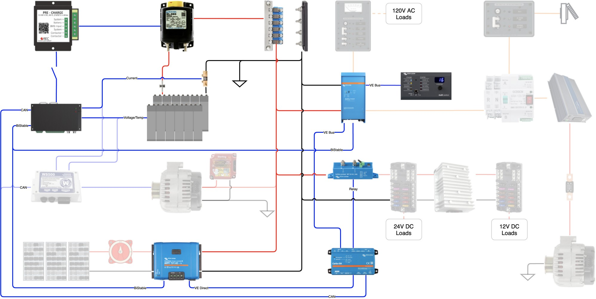

Compatibility testing consists of all testing that occurs prior to installation of the electrical system in the van.  Due to the methods used for initial battery charge and cell balancing, it includes those operations as well.

### Initial BMS Powerup

#### Required Equipment

RIDEN 6018 Power Supply or Equivalent

UNI-T UT61E Digital Multimeter or Equivalent

Battery Cell Simulator 

Logging RPi

#### Prequisites

None

#### Procedure

- [x] 1 Match the potentiometer value to equal the values of the 7 resistors.
- [x] 2 Connect the BMS to Battery Simulator and Logging RPi:
  - [x] 2a Connect CAN Cable
  - [x] 2b Set Cell Number and BMS Address
  - [x] 2c Connect Temperature Sensor
  - [x] 2d Connect Current Sensor
  - [x] 2e Connect Outputs
  - [x] 2f Connect Cells
- [x] 3 Open/Verify Open BMS to Precharge Switch on Battery Simulator.
- [x] 4 Attach the Digital Multimeter across the potentiometer to measure voltage.
- [x] 5 Apply 26V to the Battery Cell Simulator using the power supply.
- [x] 6 Power up the BMS using the ON Switch.
- [x] 7 Verify BMS Startup Sat:
  - [x] 7a Red Error LED on for self test
  - [x] 7b Red LED off after 7 seconds, Green LED flashes at 2 second intervals

#### Notes

Prior to BMS startup, upon application of voltage, simulated Cell 1 voltage is lower than expected by resistor balance (by approximately 0.4 volts).  This suggests some small microamp level draw from 1st cell when BMS is off.  After turned on, voltage on simulated cell 1 was in line with other other simulated cells based on resistance balance.

Green on briefly, then Red for a few seconds, then Green flashing as expected.  

Disconnected the RPi, power supply reads 0.01 amps (minimum resolution).

With Simulator Powered, RPi disconnected, BMS Off, current draw is 12.752 mA (mostly 24-12v converter).

With Simulator Powered, RPi disconnected, BMS On, current draw is 20-21 mA (fluctuating).  Pack+ current measured at ~8-9mA with BMS On.

### High Cell Voltage Protection Checkout

#### Required Equipment

RIDEN 6018 Power Supply or Equivalent

UNI-T UT61E Digital Multimeter or Equivalent

Battery Cell Simulator (7 equal resistors and a pot in series, with taps around each)

Logging RPi

#### Prequisites

None

#### Procedure

- [ ] 1 Match the potentiometer value to equal the values of the 7 resistors.
- [ ] 2 Connect the BMS to Battery Simulator and Logging RPi:
  - [ ] 2a Connect CAN Cable
  - [ ] 2b Set Cell Number and BMS Address
  - [ ] 2c Connect Temperature Sensor
  - [ ] 2d Connect Current Sensor
  - [ ] 2e Connect Outputs
  - [ ] 2f Connect Cells
- [ ] 3 Apply 26V to the Battery Cell Simulator using the power supply.
- [ ] 4 Power up the BMS using the ON Switch.
- [ ] 5 Use the potentiometer to raise voltage on the assocated cell to ~0.1 volts above the next highest cell voltage.
- [ ] 6 Attach the Digital Multimeter across the potentiometer to measure VOLTS in MANUAL.
- [ ] 7 Connect/Verify Connected the Digital Multimeter and power supply to the Logging RPi via USB
- [ ] 7 Run the cell over voltage protection test script `python3 cell_over_voltage_test.py` and paste the output in the notes below.

- [ ] Turn on the battery by closing the switch between the BMS and the Precharge Unit
- [ ] Slowly increase the power supply voltage while monitoring high cell voltage and the status of the BMS controlled main contactor and charge enable signal.
- [ ] Record the potentiometer voltage when the charge enable signal is removed.
	- Potentiometer Voltage: 
	- BMS *Cell end of charge voltage* Setpoint:
	- Date/Time:
- [ ] Record the potentiometer voltage when the main contactor is opened.
	- Potentiometer Voltage:
	- BMS *Cell over-voltage switch-off per cell* Setpoint:
	- Date/Time:
- [ ] Slowly lower the potentiometer resistance while monitoring voltage and the status of the BMS controlled main contactor and charge enable signal.
- [ ] Record the potentiometer voltage when the main contactor is closed.
	- Potentiometer Voltage:
	- BMS *Cell over-voltage switch-off per cell* + *Over-voltage switch-off hysteresis per cell* Setpoint:
	- Date/Time:
- [ ] Record the potentiometer voltage when the charge enable signal is applied.
	- Potentiometer Voltage: 
	- BMS *Cell end of charge voltage*  + *End of charge hysteresis per cell* Setpoint:
	- Date/Time:

#### Acceptance Criteria

Charge Enable turn off @ Potentiometer Voltage = BMS*Cell end of charge voltage* setpoint +/- 0.1V

Main Contactor open @ Potentiometer Voltage = BMS *Cell over-voltage switch-off per cell* setpoint +/- 0.1V

Charge Enable turn on @ Potentiometer Voltage = BMS *Cell end of charge voltage*  + *End of charge hysteresis per cell* setpoint +/- 0.1V

Main Contactor closed @ Potentiometer Voltage = BMS *Cell over-voltage switch-off per cell* + *Over-voltage switch-off hysteresis per cell* setpoint +/- 0.1V

### Low Cell Voltage Protection Checkout

#### Required Equipment

RIDEN 6018 Power Supply or Equivalent

UNI-T UT61E Digital Multimeter or Equivalent

Battery Cell Simulator (7 resistors and a pot in series, with taps around each)

#### Prequisites

None

#### Procedure

- [ ] Match the potentiometer value to equal the values of the 7 resistors.
- [ ] Connect the BMS to the Battery Cell Simulator treating each resistor and the pot as a cell.
- [ ] Attach the Digital Multimeter across the potentiometer to measure voltage.
- [ ] Apply 26V to the Battery Cell Simulator.
- [ ] Turn on the battery by closing the switch between the BMS and the Precharge Unit
- [ ] Slowly increase the potentiometer resistance while monitoring voltage and the status of the BMS controlled main contactor.
- [ ] Record the potentiometer voltage when the main contactor is opened.
	- Potentiometer Voltage:
	- BMS *Under voltage protection switch-off per cell* Setpoint:
	- Date/Time:
- [ ] Slowly lower the potentiometer resistance while monitoring voltage and the status of the BMS controlled main contactor.
- [ ] Record the potentiometer voltage when the main contactor is closed.
	- Potentiometer Voltage:
	- BMS *Under voltage protection switch-off per cell* + *Under voltage protection switch-off hysteresis per cell* Setpoint:
	- Date/Time:

#### Acceptance Criteria
Main Contactor open @ Potentiometer Voltage = BMS *Under voltage protection switch-off per cell* Setpoint +/- 0.1V

Main Contactor closed @ Potentiometer Voltage = BMS *Under voltage protection switch-off per cell* + *Under voltage protection switch-off hysteresis per cell* Setpoint +/- 0.1V

### Initial Battery Charge

#### Required Equipment

Multiplus Compact with 120VAC Power

UNI-T UT61E Digital Multimeter or Equivalent

Logging R-Pi

#### Prequisites

[High Cell Voltage Protection Checkout](#High-Cell-Voltage-Protection-Checkout)

[Low Cell Voltage Protection Checkout](#Low-Cell-Voltage-Protection-Checkout)

#### Procedure

- [ ] Verify all cells are within X volts of each other.
- [ ] Assemble the cells into the normal 2P8S configuration.
- [ ] Connect the BMS system including the precharge unit and main contactor.
- [ ] Connect the Multiplus Compact Inverter/Charger.
- [ ] Turn on the battery by closing the switch between the BMS and the Precharge Unit.
- [ ] Turn the Multiplus Compact on in Charger Only Mode.
- [ ] Configure the Multiplus Compact as follows:
	- Absorbtion Voltage = 
	- Maximum Charging Current = 
	- Float Voltage = 
	- BMS Assistant that secures charging upon removal of charge enable.
- [ ] Connect the Digital Multimeter across the battery to measure voltage.
- [ ] Connect the Logging R-Pi to log the Digital Multimeter and BMS CANBUS data
- [ ] Initiate Logging
- [ ] Apply 120VAC Power to the Multiplus
- [ ] Charge battery until the BMS interrupts charge
- [ ] Save all log files

### Initial Cell Balance

#### Required Equipment

RIDEN 6018 Power Supply or Equivalent

UNI-T UT61E Digital Multimeter or Equivalent

Logging R-Pi

#### Prequisites

[Initial Battery Charge](#Initial-Battery-Charge)

#### Procedure

Complete initial battery charge

Disconnect the BMS, precharge unit, and main contactor.

Remove all battery busbars.

Reconfigure the battery in the 16P1S configuration.

### Initial Battery Capacity Test

#### Required Equipment

#### Prequisites

#### Procedure

- [ ] Verify all cells are within X volts of each other.
- [ ] Assemble the cells into the normal 2P8S configuration.
- [ ] Install the BMS system including the precharge and main contactor.
- [ ] Connect the Multiplus Compact Inverter/Charger.
- [ ] Power and configure the Multiplus Compact.
- [ ] Charge battery until the BMS interrupts charge.
- [ ] Load the Multiplus to achieve a <= 1C discharge rate
- [ ] Discharge the battery until the BMS interrups discharge.

