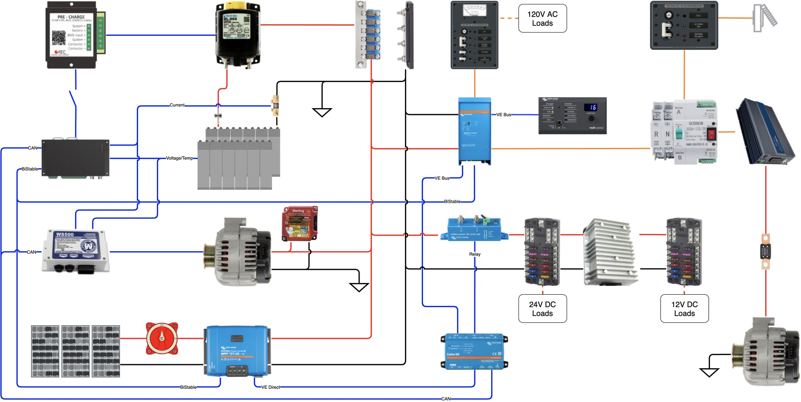

This page provides an overview of the electrical system.

# DC Electric Plant
The DC System is a 24V system that features a 560AH LFP battery.  The system can be charged via the roof mounted solar panels, the factory alternator or shorepower, and a secondary aftermarket alternator.

# AC Electric Plant
The AC System is a 120VAC 60Hz system.  This system is powered by shorepower or the house battery by way of the inverter.

# Wiring
# Solar

