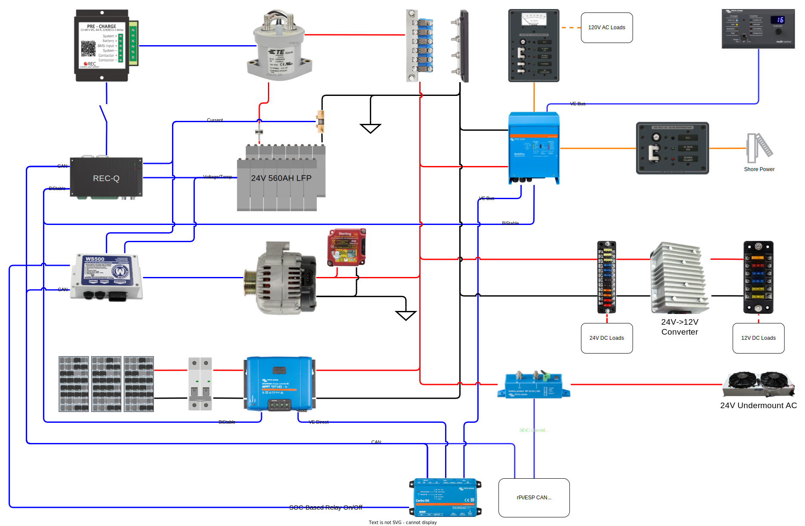

The van electrical system consists of DC and AC portions.  The DC portion is primarily 24V with a 24V 560 AH LFP battery and directly supplies 24V loads and uses power conversion to supply 12V loads.  The AC portion is 120V at 60 Hz and supplies all AC loads.  Connecting the AC and DC portions is an inverter/charger that can supply DC power or AC power.  The system is capable of using and storing power from solar panels installed on the roof, a shore power connection, the factory alternator, and a dedicated alternator.  The schematic below provides an overview of the system.

_High level system schematic_

## System Goals

The **primary goal** of the system is to store enough power from solar to supply all normal day-to-day loads without needing to plug in or run the engine for as many days as possible.  This is a pretty standard boring goal.

The **secondary goal** of the system is to provide enough storage and charge capability to allow overnight use of air conditioning with minimal engine based charging time.  This goal is what makes things interesting.

It should go without saying, but I'll say it: there is a third, implicit goal of doing the two jobs above safely, reliably, and servicably.  To the maximum exent possible, ABYC requirements were leveraged in the design.  While its not a boat, it has enough in common that the requirements carry over.

## Battery

To support both system goals, we planned to install as much battery capacity as possible without being ridiculous.  A lot of this came down to cost, weigh, and size.  It goes without saying that we planned to use a lithium-iron-phosphate (LFP) based battery based on our experience with Van 1.0 and the fact that Non-LFP batteries will not meet our goals (charge rate and capacity).

Given LFP, the choice is then whether you buy an off-the-shelf product, or roll your own.  These days there are some great, proven products (e.g., Battleborn).  However, for the capacity we are looking for, a product like that is cost-prohibitive.  For perspective, for where we landed on capacity, it would have been about 4 times more expensive.

So, buckle up, we are/did roll our own LFP battery.  If you are considering this path yourself, take a lot of time to read through the incredible information available from Will Prouse's forum: insert link.

We settled on a battery built from 280AH LFP cells that are in heavy production and available from China.  Based on size, weight, cost, and partially system constraints, we settled on 16 cells.  Battery sizing is somewhat discrete.  We knew we would need at least a 24V system (more later).  That would mean a 2-Parallel 8-Series configuration.  The next discrete size up would be 24 cells, which would not fit any of our constaints.  Later I'll discuss why we settled on 24V vice 48V, but for now just accept it, we settled on a...

**24V 560AH LFP Battery**

With that settled, we ordered our cells and began designing all the things to turn those 16 cells into a battery.  [All the details of the battery physical design can be found in this article.](/van/electrical/battery/Battery_box_design_final)  If that isn't enough you can read about the alternative concepts and calculations that led the final design [here](/van/electrical/battery/Battery_box_design.md) and and a half-baked abandoned concept [here](/van/electrical/battery_box_deprecated/Battery_box_design.md).

If you roll your own LFP battery, you have to provide a Battery Management System (BMS).  The secondary goal mean we needed a BMS with external charge/discharge cutoff.  Based on our Van 1.0 experience we wanted a BMS that was reasonably open source.  This led us two consider two products, the Orion Jr and the REC Q.  Either would work, we opted for the REC Q because it seems to be the path more traveled when it comes to integrating with a Victron ecosystem of components.  I can't speak for the Orion, but the REC Q is bomb-proof and has been a pleasure to tinker with.  [All the details of integrating the REC Q with the rest of the system to ensure the battery is adquately protected can be found in this article.](/van/electrical/BMS_wiring_logic/REC_Q_BMS_Wiring_Logic)

## DC System Voltage

Most vans out there are 12V these days.  Our first van was based on a 12V DC system.  If you aren't exceeding roughly 3000W charge or discharge, 12V systems make a lot of sense and are simple to design and build.  

However, because of our secondary goal, we want more than 3000W charge capability...a lot more.  In fact, we want as much as we can get, within reason.  A good starting place if you are maximizing charge rate, is to aim to achieve a 0.5C charge rate.  Based on our battery capacity, this equates to 280A with a 24V battery or 140A with a 48V battery. (Note for a 12V system that would be 560A which is basically a non-starter).

To obtain those kind of charge rates, a dedicated alternator operating at the battery voltage is a requirement.  Nations starter and alternator currently has a 24V alternator that fits our van and can supply about 150A.  We can make up the remainder with the factory alternator and some intervening power conversion.  Details on all this to follow.  Nations is about to release a 48V alternator that can source more than enough power.  From a charge source perspective, both 24V and 48V are feasible.  Likewise, the current for the 24V and 48V charge rates are also both managable from a cabling and fusing perspective.

The decision primarily came down how each would integrate with existing off-the-shelf components, reliability, and the effect of system voltage on base load (i.e., the primary goal).  [This article details our evaluation of 24V vs 48V for our system voltage.](/van/electrical/voltage_trade_studies/Electrical_24V_vs_48V_concepts)  In short, the 24V system is attractive because of the fans, lights, refridgerators, freezers, fuses, breakers, contactors, etc., etc., that can operate natively at that voltage.  In a 48V system everything has to be powered by an intermediate conversion stage.  That said, I think in 4 years time, I would probably be making a different decision based on where things seem to be heading.  In the meantime, **its 24V for us.**

If you want to read old design detritus looking at the merits of 24V or 48V over a standard 12V system, you can find some [here](/van/electrical/voltage_trade_studies/Electrical_24v) and [here](/van/electrical/voltage_trade_studies/Electrical_48v).

## Load Analysis

## Solar Charging

To support the primary goal, the roof arrangement was optimized for as much solar as possible.  [This article covers physical details of those trade-offs.](/van/vehicular/roof_arrangement/roof_rack_and_arrangement_notes)

Based on the arrangement constraints, we settled on 800W of solar.  [This article captures all of those details.](/van/electrical/solar/solar)

## Shore Power (and Charging)

## Factory Alternator Charging

## Dedicated Alternator Charging

## Circuits and Wire Size

