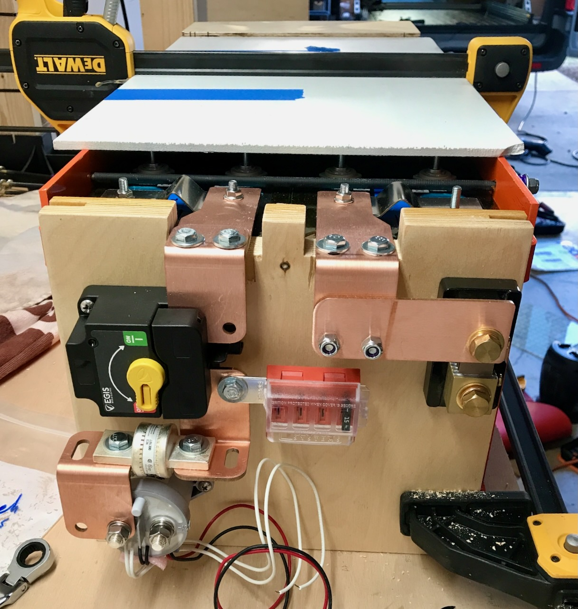

# Main Contactor

**TLDR: We selected the [TYCO EV200HAANA](datasheet-kilovac-ev200.pdf) for our main contactor.  Our original choice, the [Blue Sea ML-RBS 7717](https://www.bluesea.com/products/7717/ML-RBS_Remote_Battery_Switch_with_Manual_Control_Auto-Release_-_24V) had a parasitic draw when open, which was unnacceptable for our application.  The contactor main is paired with the [Egis XD 500](8700-xd-series-mechanical-disconnect-switch.pdf) that functions as a manual disconnect.**

**~~TLDR: We selected the [Blue Sea ML-RBS 7717](https://www.bluesea.com/products/7717/ML-RBS_Remote_Battery_Switch_with_Manual_Control_Auto-Release_-_24V).~~**

## Latching Contactor

The Latching Contactor (that behaves as a NO Contactor) under consideration is the [Blue Sea ML-RBS 7717](https://www.bluesea.com/products/7717/ML-RBS_Remote_Battery_Switch_with_Manual_Control_Auto-Release_-_24V)

* Power usage is 0.013A * 24V = 0.312W
* Max Voltage = 32
* 10,000 cycles at 24V and 150A*
* Continuous Rating 2/0 225A
* Continuous Rating 4/0 300A
* Cost $200 (Amazon)

_* This should be good enough.  Manual interrupt will occur at low current as a matter of practice.  Un-planned loaded interrupt will generally be at will at cell Over Voltage (OV) or cell Under Voltage (UV). Cell OV will occur during charge, which should be low current as managed by the BMS (we found later this assumption is NOT a valid assumption). Cell UV will occur during discharge, which should be well under 150A even with a fully loaded multiplus compact (~75A)._

The primary attraction to this device is its low power draw while on.  

The secondary attraction is that this device also replaces a separate manual battery disconnect.  This was confirmed via second hand discussion with Blue Sea:

>**Me:** what I’d like to know is if the manual switch will physically open (ie break welded contacts) or is it just a secondary soft control...any idea?

>**[@Van Gogh](https://www.fordtransitusaforum.com/members/van-gogh.89410/):** Nevermind, I see what you mean. Read your github, so 24V, and you're asking about yellow manual switch behavior during or after a fault scenario that welded its contacts. I'll add it to my next round of questions for Blue Sea.

>**[@Van Gogh](https://www.fordtransitusaforum.com/members/van-gogh.89410/):** They confirmed its a mechanical breaking of the contacts.

### Latching Contactor Testing

During testing we found the Blue Sea ML-RBS 7717 draws 4mA of current when open.  This means that after the BMS attempts to cutoff all current draw due to a cell UV condition, the contactor continues to draw a parasitic load, which runs counter to the whole point.  In short, it was a deal breaker.  We took another look at a non-latching NO contactor.

## Normally Open (NO) Contactor

The NO contactor under consideration that meets all requirements is the [TYCO EV200AAANA](http://www.rec-bms.com/datasheet/Technical_datasheet_Kilovac.pdf)

* Power usage is 0.07A * 24V = 1.68W
* Rated Voltage < 36V
* 10,000 Cycles at 24V and 2000A
* 100,000 Cycles at 24V and 200A
* Continuous Rating 400MCM 500A
* Cost $178

Power consumption while ON is lowest in class.  However, to fully replicate the function provided by the Blue Sea ML-RBS 7717 a separate manual battery disconnect must be provided.  We were not sure we could fit a manual disconnect in the electrical arrangement so late in the design.  But we discovered a brand new manual disconnect product that was allegedly on verge of being released.

## Manual Disconnect

The [Egis XD 500](8700-xd-series-mechanical-disconnect-switch.pdf) met all of our needs on paper.  We contacted the manufacture and confirmed that it was available.  Equally important, we were able to arrange it into our battery output area.

Thus we have system design that doesn't have to rely on engineering judgement to justify not having a manual disconnect (which we were ready to do if needed).

_On the left side, from top to bottom, is the manual disconnect, the main battery fuse, and the main contactor in series._
