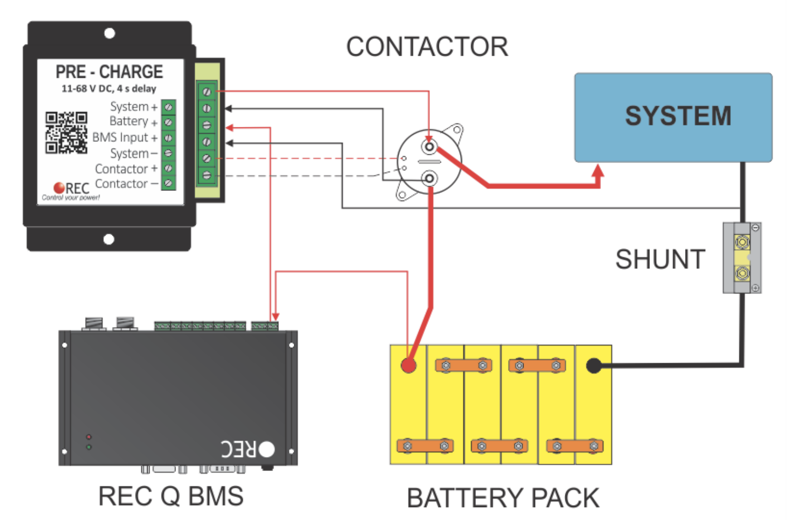
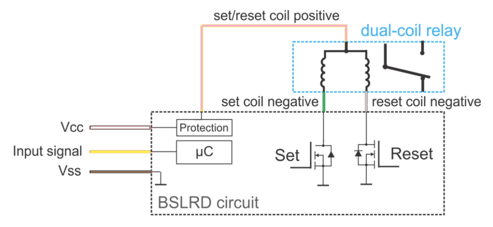

Precharge is recommended to minimize damage to contactors that apply battery power to the Multplus.  The Multpluss has large input capcitors tied directly to the DC input terminals.  Upon connection to the battery, capacitor charge current is initially limited by conductor resistance and battery internal resistance.  For an LFP system this can be quite high, and result in tack-welding the contactor shut.

[This Discussion](https://community.victronenergy.com/questions/13165/multiplus-123000120-50-120v-inrush-current-on-init.html) convinced me of the need.

### Example devices:

[REC Pre-Charge unit](UserManualPrechargeNew.pdf): This unit can be adjusted to 2/4/8/1s delays, is rated for up to 68V, and has a 66 ohm power resistor.  For a 24v system, when powered, Relay ON consumption is < 8mA (for the duration of the time delay) and Relay OFF consumption is ~ 3mA (while system is up and running).

### Open Issues/Questions:

How the other DC loads could cause complications?  Namely, while you've connected the capacitors, you have also connected DC loads, which will also draw power and could affect the required precharge time and resistor value and rating.  The REC unit manual says, "Some of the inverters/controllers on the system side may start to work with low voltage and their power consumption prevent system voltage to rise."  Probably just need to test.  Probably just fine.

How to integrate this with a latching relay like the BlueSea Remote Battery Switch?  Since forming the question we have become aware of the a variant of the BlueSea Remote Battery Switch that behaves interface-wise as a simple Normally Open relay which has been incorporated into our design.

How is the BMS powered?  I think it needs to be directly (switch/fused) off the battery.  It would remain powered after the main relay opens.  I think this is ok as long as the BMS has low power consumption.  Also could implement redundant relay (in series approach).

### Integration:

