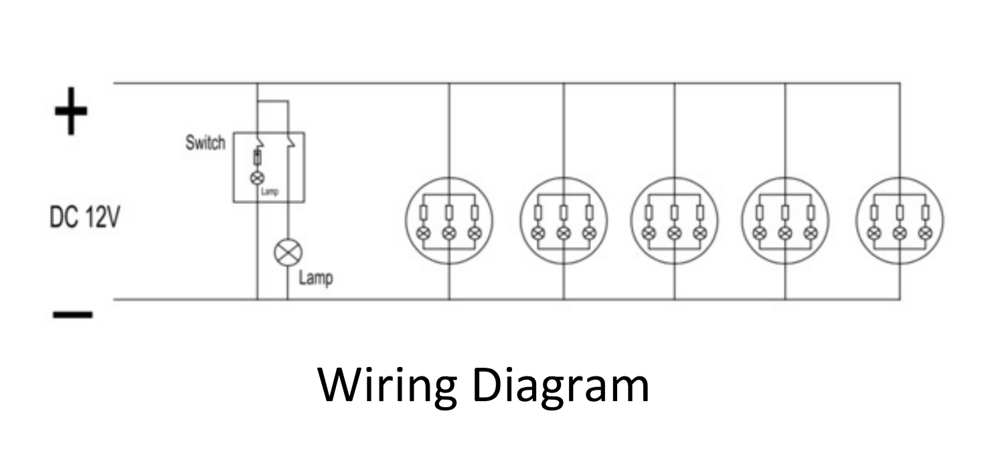
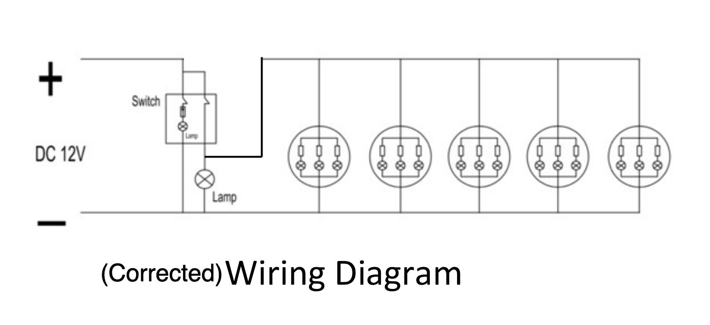
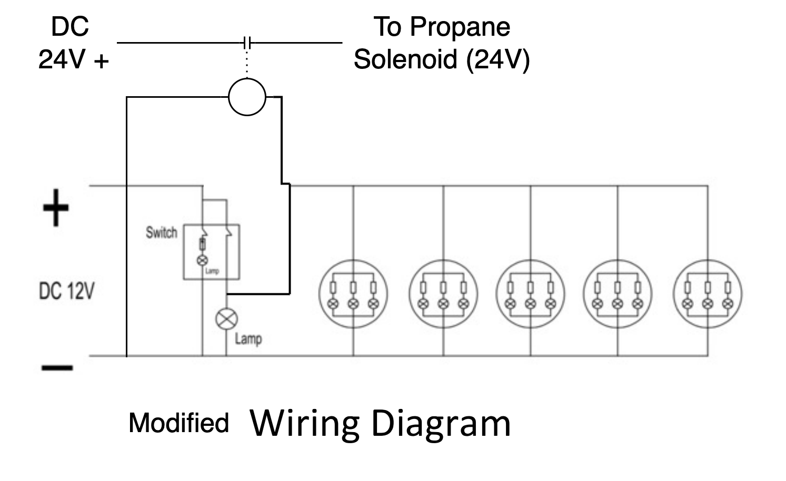

We settled on a 21 inch Greystone 3 Burner Oven/Range.  There is some experience with it on the transit forum and the Dometic's availability was sketch.

From the [drawing](greystone-drawing.pdf) and [manual](greystone-instruction-manual.pdf):

BTU Per Hour:
 * Front burner 8000 BTU/hr 
 * Left burner 6500 BTU/hr
 * Right burner 6500 BTU/hr
 * Oven 7100 BTU/hr
 * Total 28100 BTU/hr

Inlet Pressure: 
 * 10" WC min
 * 13.8" WC max

Power usage: less than 2A at 12V.  We tested with a DC power supply and saw current draw of about 1A at 12V.

The circuit diagram in the manual is not correct.

_This one is wrong._

_This on should be about right._

We modified the wiring to allow the switch that turns on the LEDs and oven light to also drive a relay to switch the propane solenoid valve on.  This way it is very obvious when propane is on.  This made a lot of sense for us since the oven is our only propane load.

_Modified wiring._

