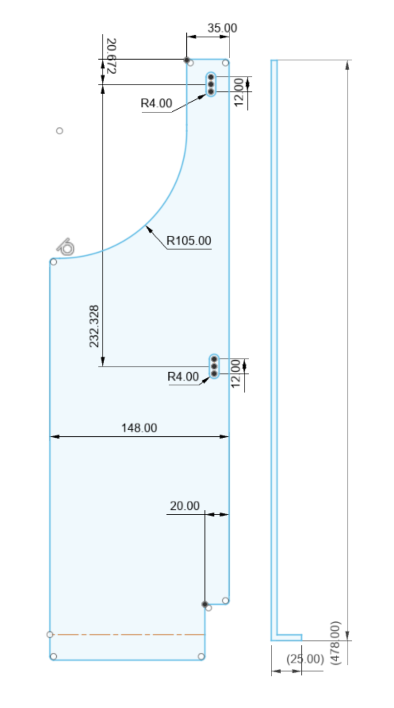

We had a decent experience with a Lagun table in Van 1.0 and plan to use the same.

The B-pillars have been used successfully for mounting the tables.  In our case, the mount will also be used to hold down the floor (overcoming some subfloor warping).

[This post covers GregoryX's mount.](https://www.fordtransitusaforum.com/threads/lagun-mount-plate.85568/)  He used 1/4 inch aluminum and bolted at three locations on the passenger B-pillar.

[This post covers a new 30" lagun leg that might be useful.](https://www.fordtransitusaforum.com/threads/lagun-now-selling-a-30-table-leg.75296/)

[Another DIY B-Pillar mount from 86scotty.](https://www.fordtransitusaforum.com/threads/swivel-table-on-passenger-b-pillar.58073/)  He used 3/16 steel and bolted in two locations on the passenger B-Pillar.  Images of rough measurements are in [this post](https://www.fordtransitusaforum.com/threads/swivel-table-on-passenger-b-pillar.58073/post-805802).

[Wheezer notes that B-Pillar holes are M6.](https://www.fordtransitusaforum.com/threads/swivel-table-on-passenger-b-pillar.58073/post-816130)

[An etsy DXF for sale.](https://www.etsy.com/in-en/listing/923750395/lagun-table-mount-template-pdf-dxf-with)

[This post from skTransit has a dimensioned sketch.](https://www.fordtransitusaforum.com/threads/swivel-table-on-passenger-b-pillar.58073/post-1138234)

[Note, there are left and right sided Lagun legs.](https://www.fordtransitusaforum.com/threads/swivel-table-on-passenger-b-pillar.58073/post-1138708)  I think having the handle towards the interior like Bazz suggests is ideal.

SkTransit's design is almost 7" wide.  86scotty's is 6" wide.  Bazz's looks closer to SkTransits dimensions.

SkTransit also locates the Lagun Mount about an inch lower than 86scotty.  We're going with SkTransit's dimensions.

When the floor is compressed into place properly, the surface of the lonseal is just below the top of the B-piller tie-down hole.  We will aim to locate for the bottom surface of the flange to this point.  We will slot the M6 holes to allow for adjustment of the flange to compress the floor.  The 1/4 plusnut hole will be marked in the as built, as compressed position, and drilled.

Note, the thickest aluminum send cut send will bend is 1/8.  So we are going with 3/16 mild steel.

_This is what we ended up with._

The dxf file we ordered with from sendcutsend is [here](b-pillar-mount-order-drawing.dxf).  Caveat emptor: We are using ours as a restraint on the floor AND a lagun mount, so this may not work out of the box for you (if you have a different floor thickness for example).

