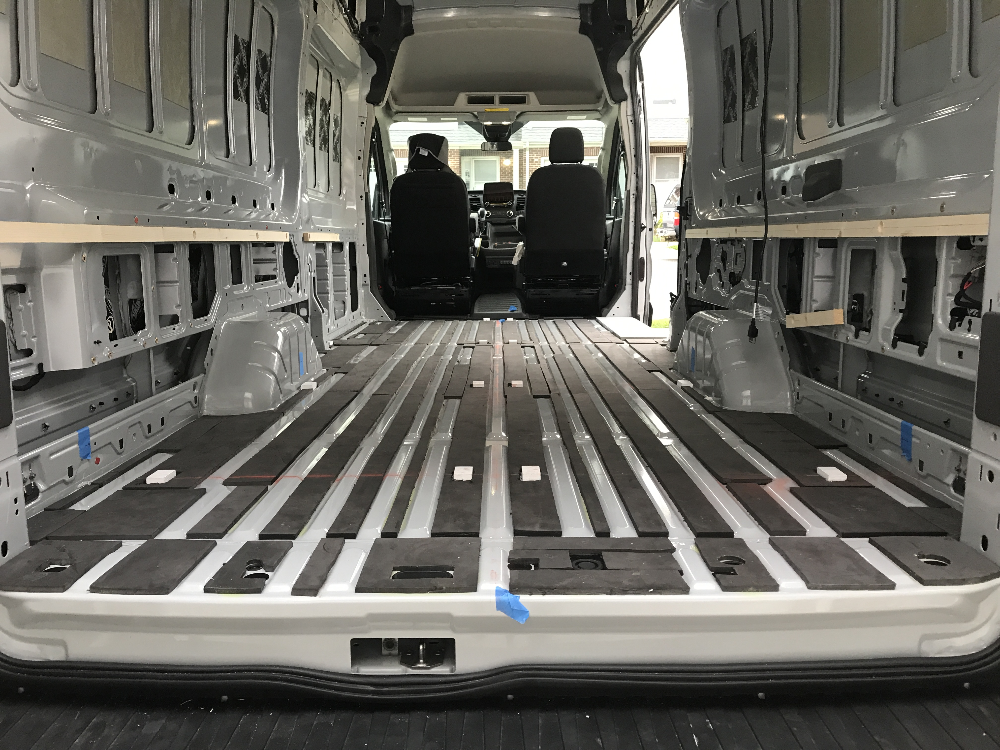

The floor is constructed of a patchwork of 0.4 inch minicell foam to fill the corrugations, followed by a layer of 0.5 inch minicell for additional insulation, followed 0.5 inch of baltic birch plywood, topped with a continuous sheet of Lonseal vinyl flooring.  This design follows [Far Out Ride's](https://faroutride.com/floor-installation/) recommendations pretty closely.

## Adhesives and Sealing

We used Weldwood Landau contact adhesive anywhere we need things to stick and stay in place.  Its spray-able and brush-able and we've had great results in test.

We solicited advice on the Transit forum for how to seal the wood and got some [great ideas](https://www.fordtransitusaforum.com/threads/best-treatment-for-sealing-wood-floor-and-panels.86467/#post-1127785).  Based on those we decided to go with Kilz exterior primer and porch paint.  It is water-based, and very low VOC, which makes application simple.  It also is mold and mildew resistant which is a major concern for any wood in this build.  Additional forum discussions on the merits sealing are [here](https://www.fordtransitusaforum.com/threads/off-gassing-or-wet.79475/#post-1042042), [here](https://www.fordtransitusaforum.com/threads/skadi-%C3%84ventyrsvagnen-four-person-winter-adventure-van.77510/post-1039859), and [here](https://www.fordtransitusaforum.com/threads/van-flooring-options.72196/post-959018).

Based on some light internet research we settled on J-B Weld 8276 KwikWeld to expoy the blocks to the floor that anchor the edges of the plywood subfloor.

## Insulation

Minicell for floor insulation is a well-worn path.  It isn't as high performing as XPS, nor is it as rigid.  However, after doing some [thermal modeling](/van/parietal/insulation/insulation) to compare performance of various configurations and thickness, we judged 0.4 and 0.5 inch mini-cell as sufficient.  Check that last link if you want the gritty details.

## Wood Layer

Baltic birch as the floor's structural component is also a well-worn path.  We are not wood people, but from what we understand the adhesives used are more water resistant than normal cabinet grade plywood.  It also has fewer voids and defects.  We have the luxury of an amazing wood supplier near us that can get 4x8 sheets easily.  A note:  You will sometimes read/hear of "marine grade baltic birch".  When I asked our [wood supplier](https://www.exoticlumber.com/plywood/), a top wood supplier in Annapolis, a marine construction heavy community, he looked at me like I had two heads.  In short, I'm not sure "marine grade" baltic birch is a real thing (or any different from normal baltic birch).

The 4x8 sheets of baltic were cut down to 68 7/8 inches (max floor width).  Two sheets were left at 48 inches wide, one sheet was cut to 44 inches wide, and the last sheet at the back was cut to fit width-wise.  We created a monolithic template of all wheel wells, depressions, etc, and traced it on the wood pieces all at once.  We jigsawed the edge features in and then dry fit all four at once.

~~To keep the edges from popping we used biscuits and wood glue to join the four pieces.  We will install the final wood layer install as a single monolith strong-backed by 16 foot 2x4s for the insertion.~~

To keep the edges from popping and increase ease and flexibility of install, we epoxied 1.5x2.5 inch blocks to the floor at the seams of the plywood pieces.  We then screwed the plywood to these blocks.  The anchor blocks were fabricated from two layers of 1/2" baltic birch glued together.  We then used a hand planer to plane the thickness down to about 7/8 inch, just below the top foam layer.

This approach allows us to install the floor in pieces and arrange them individually to ensure good clearance from the van walls and features (i.e., no squeaks).

See [this forum post](https://www.fordtransitusaforum.com/threads/plywood-sub-floor.29410/#post-378098) for an alternative approach.

## Side Door Step

We are completely covering our side door step which requires some beefy structure under the wood floor layer.  Many [designs were considered](/van/structural/side_door_step/Transit_Side_door_step).  In the end we chose a wood based structure composed of half inch baltic birch glued together with the sides shaved to drop the height to match the top of the insulation layer.  A metal bracket at the center span adds additional support.

## Alternatives Considered

Initially we planned to use two layers of XPS foam for floor insulation.  The first layer would be cut width-wise and thickness-wise to fill the corrugations in the floor (using a foam cutter).  This would be followed by another 1 inch of XPS.  We decided this would be very labor-intensive, and may carry some squeak risk.  After running the numbers on performance, we didn't feel it was worth it.

If we started over, we'd probably swap the baltic birch for okoume marine plywood.  The price is about the same, its available locally, and is lighter weight.  It would have shaved maybe 30 lbs off the build. 

