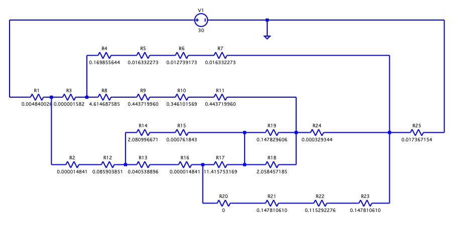

This article documents some of our work the led to the insulation choices we ended up with.  It allowed us to make some informed decisions on what was and wasn't worth it.  These calculations provide a basis of comparison between difference material choices.  The absolute watts should be taken only as a metric, not an absolute.  We've also included a few links that were helpful.  Lastly, don't bother with reflectix, unless you put it outside the van reflecting away.

## Floor
**TLDR: For our build, the thermal benefit of using XPS over all minicell is hard to justify given the additional complexity.  Also the thermal benefiit of a thicker floor is also hard to justify given the loss of headroom.**

The floor is modeled as two parallel series of resistors with each parallel branch corresponding to rib and non-rib fractions of the floor (estimated and thus one source of error).  No consideration was given to the fact that much of the floor will be covered by cabinets or the garage compartement.  Therefore the following analyses should only be used as a basis of comparison.  Actual heat loss will be substantially less.

[Link to google spreadsheet](https://docs.google.com/spreadsheets/d/17qdIqUtVVReb5lz_uMptEpswP-8dfLng_9TE0L671E0/edit?usp=sharing) used for the models.

| Configuration                         | Heat Loss @ 30C DeltaT [watts] |
|---------------------------------------|--------------------------------|
| Minicell rib fill + 0.5 inch Minicell | 267.742                        |
| Minicell rib fill + 0.5 inch XPS      | 228.874                        |
| XPS rib fill + 0.5 inch XPS           | 210.774                        |
| Minicell rib fill + 1.0 inch XPS      | 153.930                        |
| XPS rib fill + 1.0 inch XPS           | 145.152                        |

## Ceiling

**TLDR:  XPS doesn't offer a substantial advantage over Thinsulate.  Insulating the backside of the panels doesn't offer a substantial advantage over not insulating the backside of the panels.  Lizard Skin isn't worth it.**

The ceiling was modeled as a fairly complex resistor network.  [This google spreadsheet](https://docs.google.com/spreadsheets/d/17qdIqUtVVReb5lz_uMptEpswP-8dfLng_9TE0L671E0/edit?usp=sharing) was used to calculate resistance values.  LTSpice was used to solve it.  One area of uncertainty is the thermal break between the roof skin and ribs.  In this [forum discussion](https://www.fordtransitusaforum.com/threads/spray-foam-insulation-roof-leaks.74412/post-986882), Hein refers to the roof rib thermal break as urethane foam.  Specific details for associated assumptions are in the google spreadsheet.

### Thermal Model

_Ceiling thermal model._

_LT Spice model with resistance values shown.
_
### Thinsulate vs XPS Sensitivity

The following analyses use a delta T of 30C applied as a DC voltage potential to the resistor network.  Current represents heat flow in watts.  Total loss for Thinsulate and XPS are 182W and 155W respectively.  Other than bulk transfer, the next major loss path is the ribs corresponding to between 25-30% of the total loss.

Loss by Model Component

| Resistor | Thinsulate Watts | XPS Watts |
| -------- | ------------------ | ----------- |
| I(R25)   | 182.335            | 155.128     |
| I(R24)   | 15.3492            | 15.7066     |
| I(R23)   | 46.43              | 47.511      |
| I(R22)   | 46.43              | 47.511      |
| I(R21)   | 46.43              | 47.511      |
| I(R19)   | 10.1815            | 10.4186     |
| I(R18)   | 0.731193           | 0.748217    |
| I(R17)   | 1.53897            | 1.5748      |
| I(R16)   | 47.969             | 49.0858     |
| I(R15)   | 9.37374            | 9.59198     |
| I(R14)   | 9.37374            | 9.59198     |
| I(R13)   | 47.969             | 49.0858     |
| I(R12)   | 57.3427            | 58.6778     |
| I(R11)   | 4.43649            | 4.53979     |
| I(R10)   | 4.43649            | 4.53979     |
| I(R9)    | 4.43649            | 4.53979     |
| I(R8)    | 4.43649            | 4.53979     |
| I(R7)    | 120.555            | 91.9108     |
| I(R6)    | 120.555            | 91.9108     |
| I(R5)    | 120.555            | 91.9108     |
| I(R4)    | 120.555            | 91.9108     |
| I(R3)    | 124.992            | 96.4505     |
| I(R2)    | 57.3427            | 58.6778     |
| I(R1)    | 182.335            | 155.128     |

### Panel Backside Insulation Sensitivity

The following analyses use a delta T of 30C applied as a DC voltage potential to the resistor network.  Current represents heat flow in watts.  Backside insulation consists of 1/8" of Neoprene adhered to the backside of panels.  Total loss for backside insulation and no-backside insulation are 182W and 205W respectively.  Most of the additional heat loss is seen in the rib regions.

Loss by Model Component

| Resistor | Panel Backside Insulation Watts | NO Panel Backside Insulation Watts |
| -------- | ------------------------------- | ---------------------------------- |
| I(R25)   | 182.335                         | 205.443                            |
| I(R24)   | 15.3492                         | 14.5922                            |
| I(R23)   | 46.43                           | 62.977                             |
| I(R22)   | 46.43                           | 62.977                             |
| I(R21)   | 46.43                           | 62.977                             |
| I(R19)   | 10.1815                         | 9.22395                            |
| I(R18)   | 0.731193                        | 0.662424                           |
| I(R17)   | 1.53897                         | 1.33158                            |
| I(R16)   | 47.969                          | 64.3086                            |
| I(R15)   | 9.37374                         | 8.55479                            |
| I(R14)   | 9.37374                         | 8.55479                            |
| I(R13)   | 47.969                          | 64.3086                            |
| I(R12)   | 57.3427                         | 72.8633                            |
| I(R11)   | 4.43649                         | 4.70583                            |
| I(R10)   | 4.43649                         | 4.70583                            |
| I(R9)    | 4.43649                         | 4.70583                            |
| I(R8)    | 4.43649                         | 4.70583                            |
| I(R7)    | 120.555                         | 127.873                            |
| I(R6)    | 120.555                         | 127.873                            |
| I(R5)    | 120.555                         | 127.873                            |
| I(R4)    | 120.555                         | 127.873                            |
| I(R3)    | 124.992                         | 132.579                            |
| I(R2)    | 57.3427                         | 72.8633                            |
| I(R1)    | 182.335                         | 205.443                            |

### Lizard Skin Evaluation

The following analyses use a delta T of 30C applied as a DC voltage potential to the resistor network.  Current represents heat flow in watts.  Lizard Skin was looked at in two different cases.  In one case, the effect of Lizard Skin was examined by modeling it as insulation on the backside of panels, which would be analogous to applying it to the full interior surface of the ceiling (including the ribs).  In the second case, the effect of Lizard Skin was examined by modeling it as rib insulation, which would be analogous to applying it to just the ribs.  Total loss for Lizard Skin applied to the full interior, the ribs, and no treatment are 203.8W, 204.4W, and 205.4W respectively.  All of the above cases used Thinsulate for bulk insulation as the base case.

Loss by Model Component

| Resistor | Full Lizard Skin | Rib Lizard Skin | No Lizard Skin |
|----------|------------------|-----------------|----------------|
| I(R25)   | 203.834          | 204.356         | 205.443        |
| I(R24)   | 14.6532          | 14.6684         | 14.5922        |
| I(R23)   | 61.7214          | 61.6933         | 62.977         |
| I(R22)   | 61.7214          | 61.6933         | 62.977         |
| I(R21)   | 61.7214          | 61.6933         | 0              |
| I(R19)   | 9.2951           | 9.29086         | 9.22395        |
| I(R18)   | 0.667534         | 0.66723         | 0.662424       |
| I(R17)   | 1.34707          | 1.34646         | 1.33158        |
| I(R16)   | 63.0685          | 63.0397         | 64.3086        |
| I(R15)   | 8.61556          | 8.61163         | 8.55479        |
| I(R14)   | 8.61556          | 8.61163         | 8.55479        |
| I(R13)   | 63.0685          | 63.0397         | 64.3086        |
| I(R12)   | 71.684           | 71.6514         | 72.8633        |
| I(R11)   | 4.69058          | 4.71029         | 4.70583        |
| I(R10)   | 4.69058          | 4.71029         | 4.70583        |
| I(R9)    | 4.69058          | 0               | 0              |
| I(R8)    | 4.69058          | 4.71029         | 4.70583        |
| I(R7)    | 127.459          | 127.995         | 127.873        |
| I(R6)    | 127.459          | 127.995         | 127.873        |
| I(R5)    | 127.459          | 0               | 0              |
| I(R4)    | 127.459          | 127.995         | 127.873        |
| I(R3)    | 132.15           | 132.705         | 132.579        |
| I(R2)    | 71.684           | 71.6514         | 72.8633        |
| I(R1)    | 203.834          | 204.356         | 205.443        |

## Helpful Links

[Sprinter Source Thread](https://sprinter-source.com/forums/index.php?threads/74260/)
[Transit Forum Thread](https://www.fordtransitusaforum.com/threads/insulation-effectiveness.76890/)

[Video Regarding XPS vs PolyISO](https://www.youtube.com/watch?v=evMsenbwttw) - XPS prefered with potential moisture and more physically robust according to company spokesperson.

TODO:  Include some sketches/photos of key parameters in the model (e.g. Ltrack fastenting, panel construction, rib thermal break).