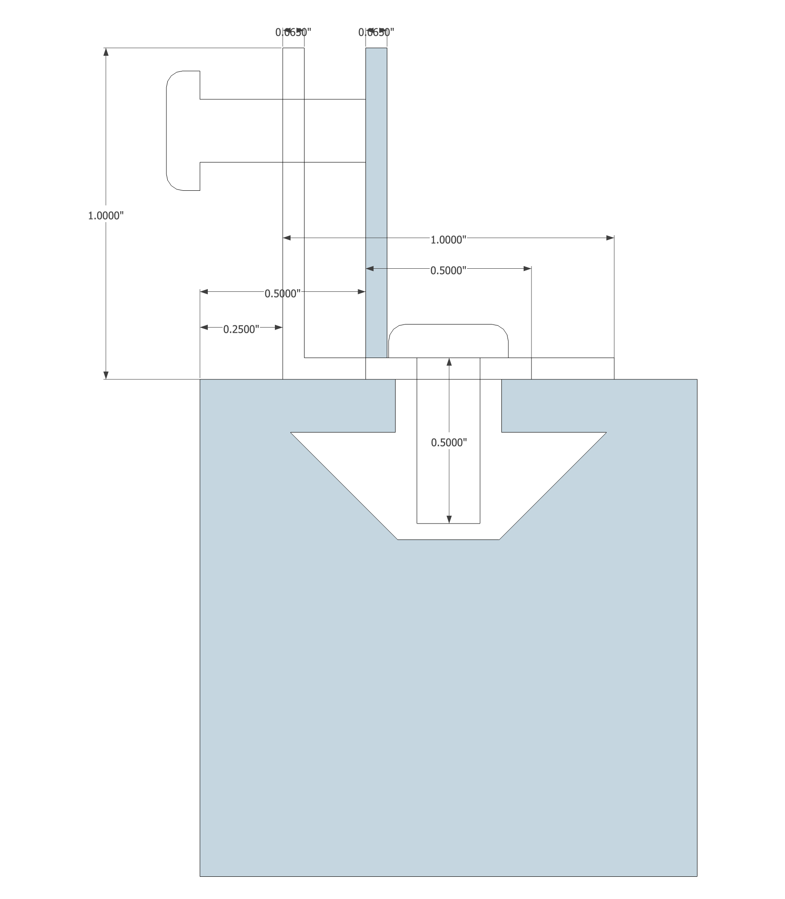

There does not appear to be a cheap, solid, turn-key solution to mounting inset panels to 8020.

Catalog solutions:

Custom solutions:

1/4-20 drop in t-nuts are available for 15 series 8020 from tnutz.com.  Using 1/4-20 hard

10-32 drop in t-nuts are also available for 15 series 8020 from tnuts.com.  Using #10 hardware will minimize likelihood of head interference with the perpendicular angle surface. Half-inch fastners will work with 1/16th thick angle and the 8020.  For mounting half-inch thick panels a 3/4 inch fastener will work for that connection.

For quarter-inch thick panels we would want 1x1x1/16 aluminum angle.  For half-inch thick panels we would want 1x1/2x1/16 aluminum angle.

For the holes the panels mount to, we can use clip nuts which are available from mcmaster.

