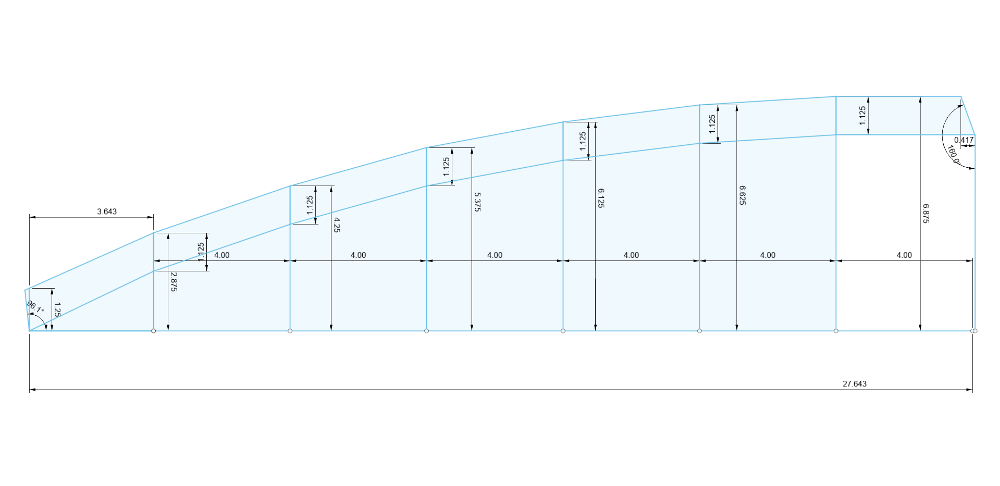

The ceiling is composed of three panels.  The Forward panel spans from the rib behind the headliner (rib 1) back to the next rib (rib 2) covering the curved transition of the roof.  The Mid panel spans from rib 2, over rib 3, to rib 4.  The Aft panel spans from rib 4 to the arch over the D-pillar.

## Forward Panel

TODO: Insert Template Dims
TODO: Describe Mount Scheme

## Mid Panel

The forward edge of the mid panel is retained under an awthart strip of L-track installed on rib 2.  The aft edge of the mid panel is retained under an athwart strip of L-track installed on rib 4.  The middle-center of the Mid panel is help by an athwart strip of L-track that bolts through the panel into rib 3.  The side edges of the mid panel are restrained by three LED Channel mounting clips on each side that fasten through the panel into overhanging ceiling brackets VHB taped to the top of fore-aft ceiling L-track.

## Ceiling Brackets
The ceiling brackets contain two holes on each side that each accept this [6-32 clip nut](https://www.mcmaster.com/94808A107/).  For the clip nut we have selected, our bracket material is limited to 1/16 thick.  Based on our mockup with the selected lighting track and track mounts, we will center the holes in the ceiling brackets 1/2 inch from the inboard edge of the ceiling L-track.  The holes in the bracket will be 13/64 diameter. The holes in the panel can be oversized beyond this.

The L-track is 1.385 inches wide.  The holes are centered 1/2 inch beyond the edge of the L-track.  The clipable length of the clip nut is 0.468 inches.

The distance between holes in the LED track bracket is 1.065 inches, or 27.051 mm.  We're going to assume that we just can't measure that close and the holes are 27 mm apart on center.

TODO: Add sketch of bracket

Things to consider: Maybe should have adjusted the dimensions to allow for adding a strip of VHB on small flange to stick to side of L-track
