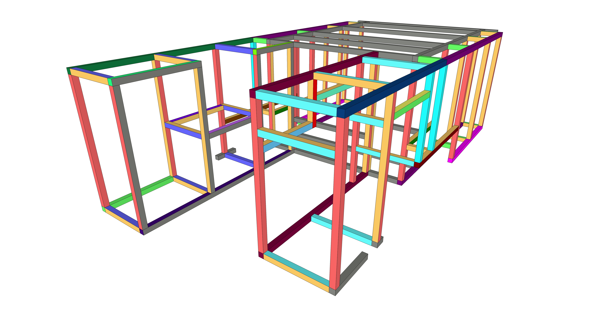
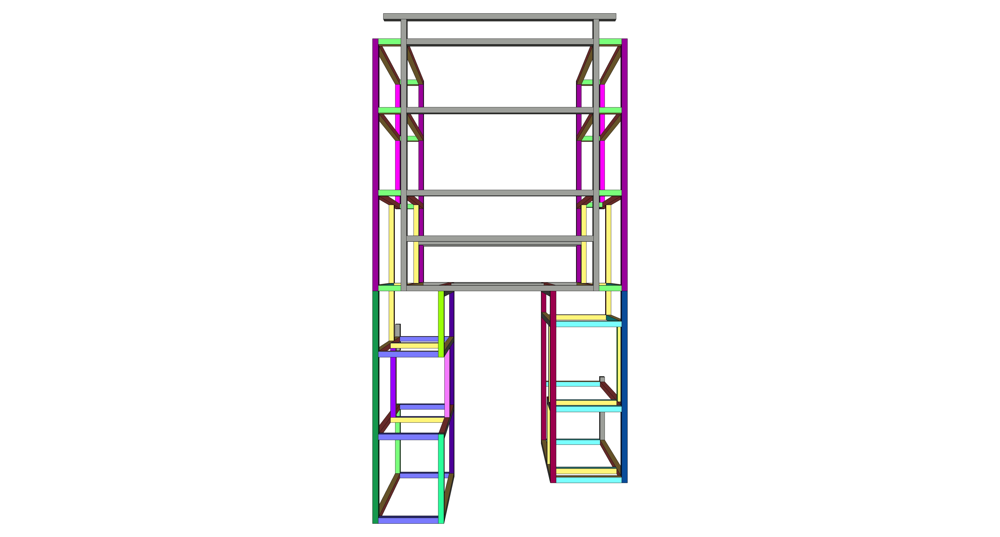
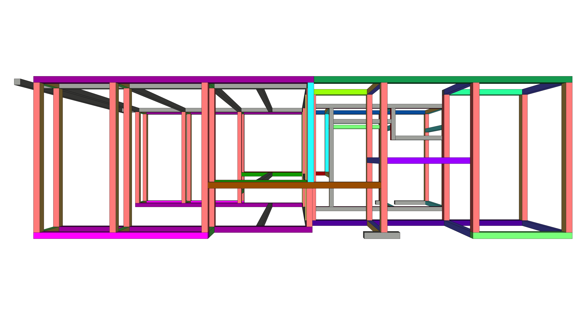

The interior of the van is/will be framed out using [8020](https://8020.net/) fractional 15 series extruded aluminum.  These are 1.5 inch by 1.5 inch lengths of T-slotted anodized 6061 Aluminum.

For joining of the extrusions, we will be using 8020's [interior anchor fasteners](https://catalogs.8020.net/80-20-Inc-University-Booklet/18/).  This requires ordering the lengths with counterbores pre-machined.  This in turn requires ordering the exact lengths of the extrusions (you can't cut to length).

The design tenets for the structure were:
* Maintain all fasteners accessible to allow tightening or tightness checks.
* Allow constructions of free-standing submodules to allow assembly in functional stages (e.g., garage).
* Maintain a reasonable tolerance around all components and van structure (1/8 inch generally).

After measuring 5 times, consulting drawings, agonizing over a computer screen for days, and measuring 5 more times, we completed our design.

TODO: Update with post mockup structure.

_Isometric View_

_Plan View_

_Section View from Passenger Side_

The Bill of Materials for the order, with cost and weights is captured in [this google spreadsheet](https://docs.google.com/spreadsheets/d/1hqJElnqDAgyVD-M6ryy4JeQU1woKh2F8f8kn4qlit8s/edit?usp=sharing).
