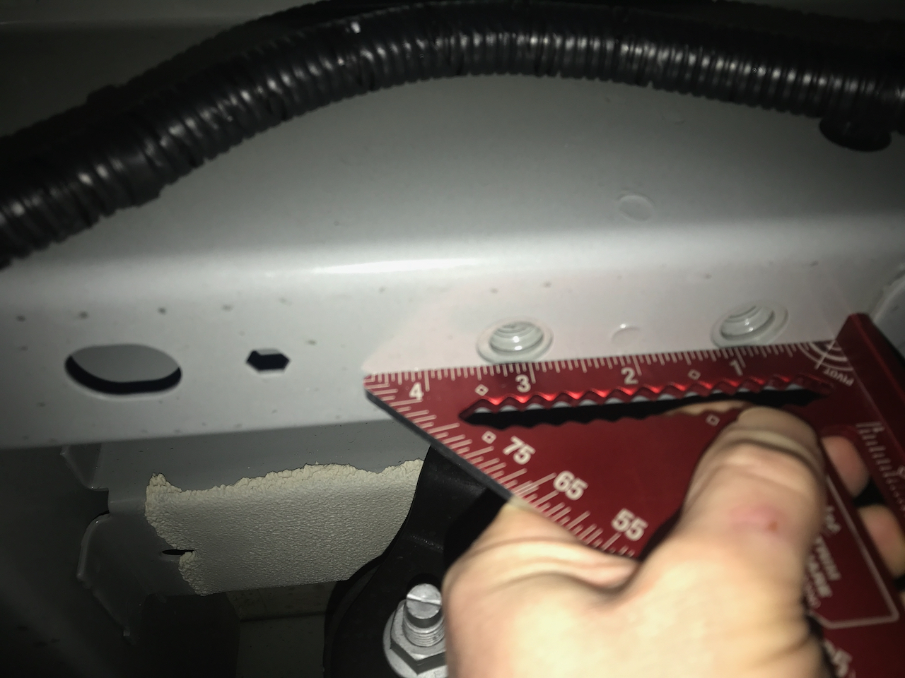
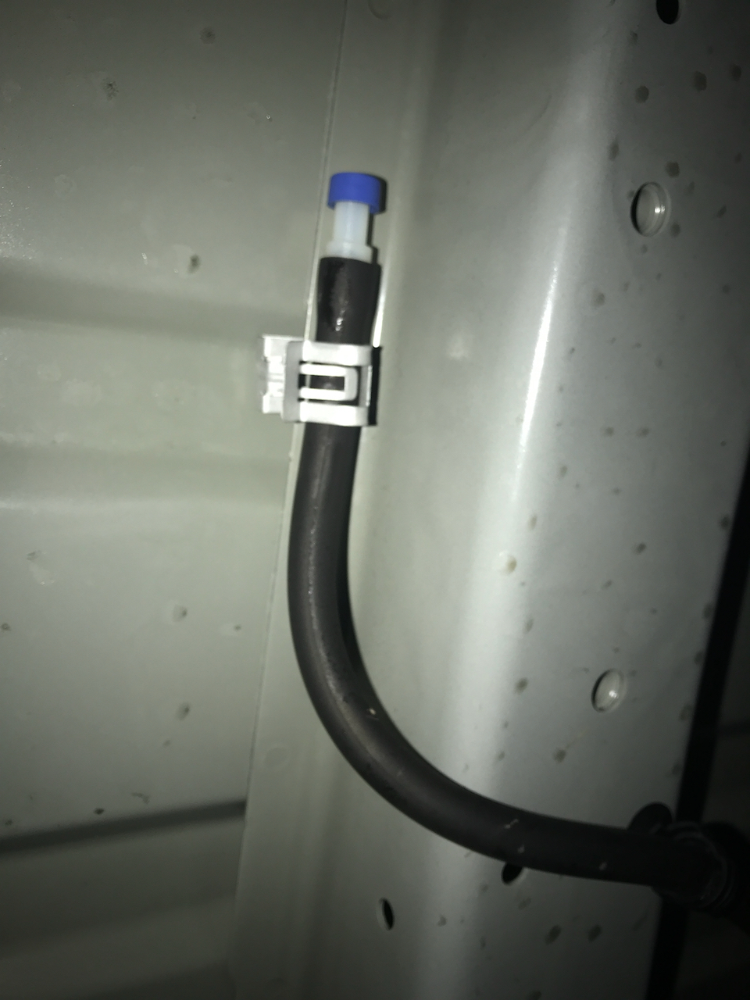
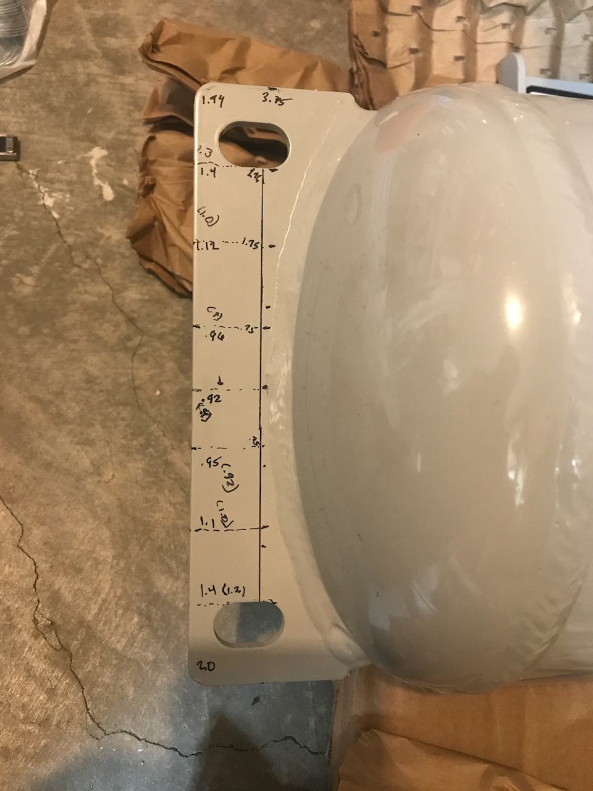
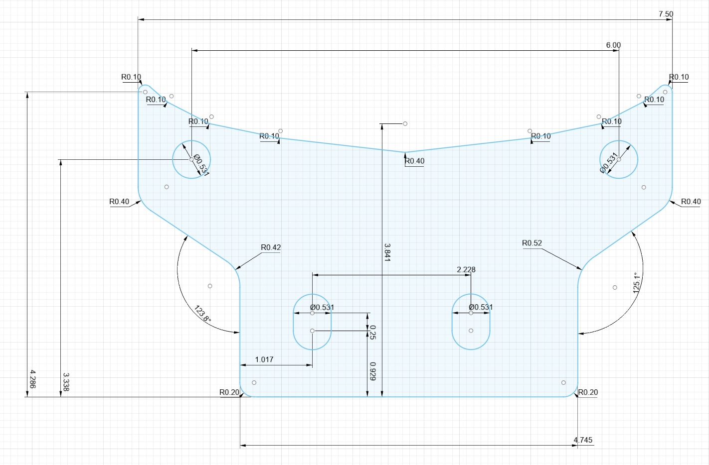

We intend to mount the propane tank between the first two cross members aft of the differential, centered between the frame members.

There are two M12 threaded holes in the frame on each side that we will use with a custom bracket.  I have an M12-1.25 and an M12-1.5 thread checker...neither fit, so we are going to assume they are M12-1.75 by process of elimination.

_We'll know soon enough what the thread pitch is._

Based on a quick inspection there aren't any fixed interferences under the van in that location (some trailer wiring and a diff vent line).

_This vent line just clips on the cross member flange._

Our bracket is based on this drawing modified by as-built dimensions as best we could measure.  They were off by about 1/4" over the length.  We toleranced the holes to account for this discrepancy, the large weld between the tank bolting plates and the tank, and variability in the Transit factory hole spacing.  That said, large out of plane errors and out-of-squareness could torpedo this approach.

_Don't judge!_

## Bracket Design
We did some rough analysis of the stress and settled on 3/8 inch 6061-T6 Aluminum.  While this seems like overkill, and it is from straight stress, it keeps us away from the fatigue endurance limit of 6061 with cycles up to 2G load.  The stress and deflection calculations are in this [google spreadsheet](https://docs.google.com/spreadsheets/d/1aNNlL1umVhzd7SIzrKfZGM0gUSt8glP1tKBB95vL_zE/edit?usp=sharing).

We chose aluminum over steel to limit general corrosion risk.  We might paint it just to limit any galvanic corrosion risk.

Our brackets will bolt to the tank with M12 bolts, washers, and lock-nuts.  They will bolt to the frame with the same M12 bolts and washers.

_This is the bracket design.  DXF file is [here](propane-mount.dxf).  Caveat Emptor until we complete the install!_

The total for two brackets from sendcutsend is $50.80, with free shipping and deburring.

## Fasteners
For the frame we need at least 22mm: 19mm (frame to end of threads) + 2.7mm (washer).

For the tank we need 25mm: 5mm (tank flange thickness) + 5.4mm (two washers) + 14mm (lock-nut).

From all this we have the following hardware:
* [25mm M12-1.75 Class 8.8 Zinc Plate Bolts](https://www.mcmaster.com/91280A714/)
* [M12-1.75 Class 8.8 Zinc Plated Nyloc Nuts](https://www.mcmaster.com/97131A160/)
* [M12 Class 8.8 Zinc Plated Washers](https://www.mcmaster.com/91455A150/)

Spec Torque for these is [55 ft-lbs](https://crafter.fastenal.com/static-assets/pdfs/Torque-Tension_Chart_for_Metric_Fasteners.pdf).  We might back off to 21.4 ft-lbs (Grade 4.6) since we don't know what Ford's threaded inserts are made of.  That still gives us 3000 lbf clamping per fastener.

# Discrepancies

We hope our tolerancing can accommodate all of these:

* Model predicted tank length = 32.3603 (drawing + hole to bolting flange measurement)
* Tape measured length = 32.0625 (side one)
* Tape measured length = 32.125 (side two)
* Model predicted frame hole spacing = 35.4331
* Tape measured frame hole spacing = 35.3125 (measurement one)
* Tape measured frame hole spacing = 35.375 (measurement two)

If not we'll resort to the dremel.
