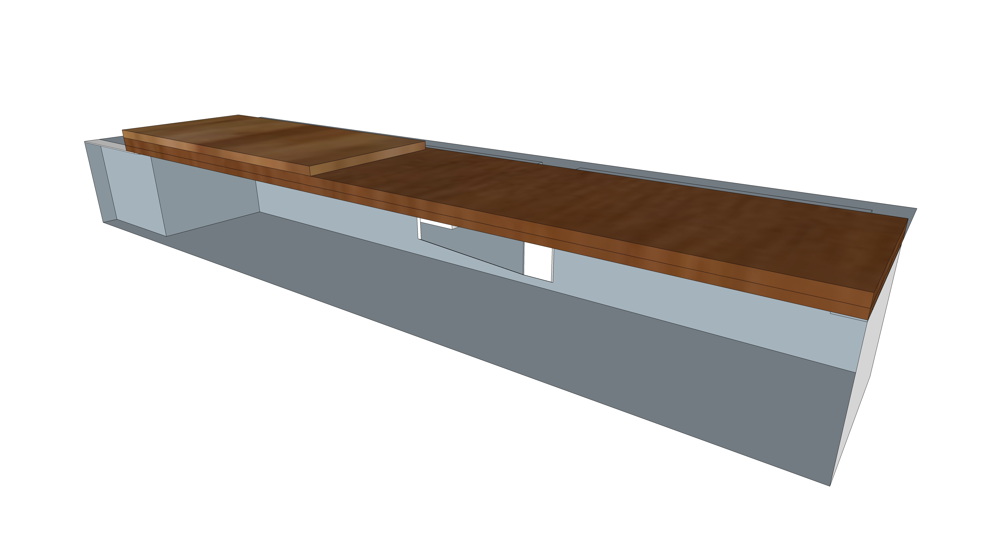
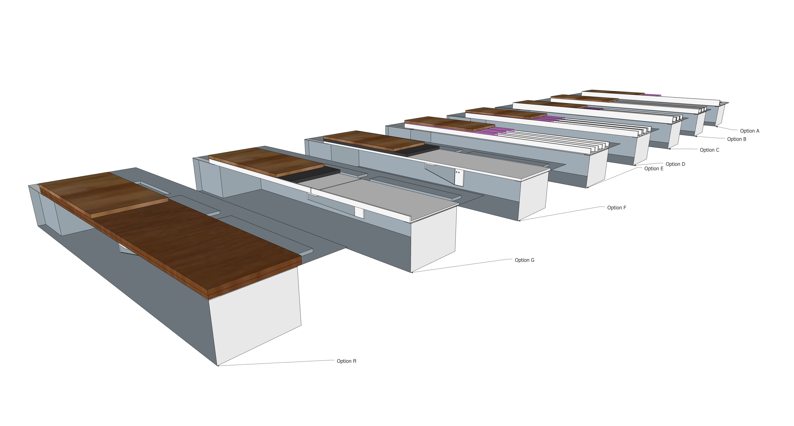
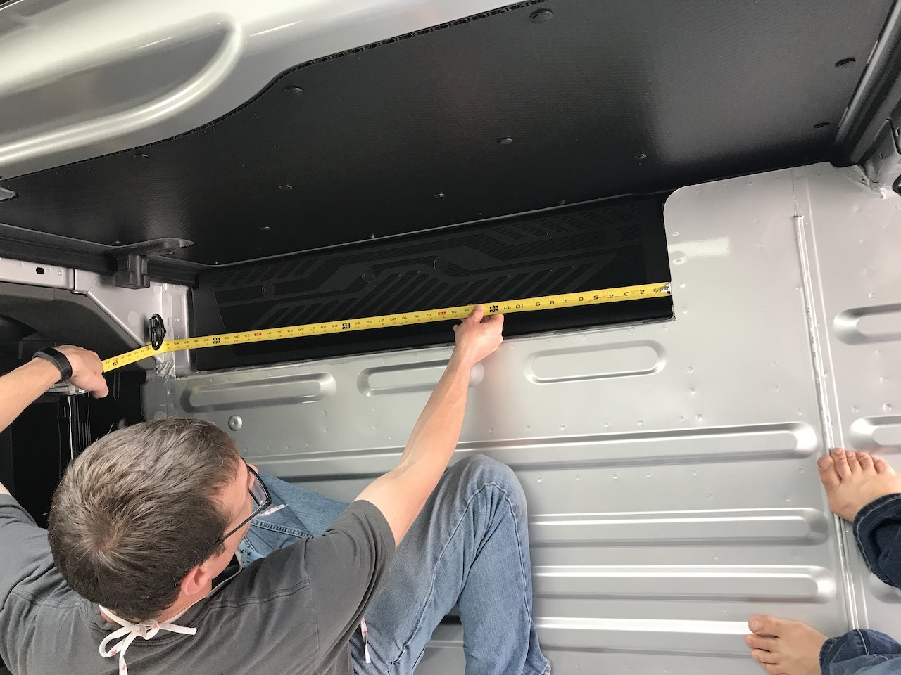
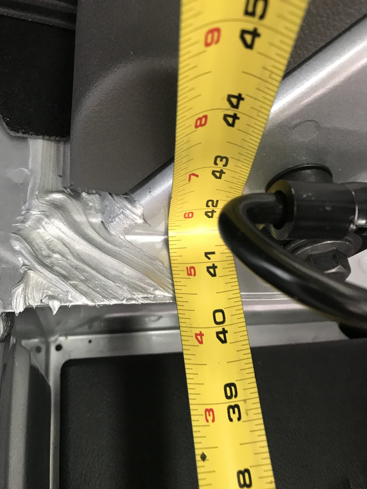

# Transit Side Door Step

This structure will support extension of the floor over the sliding door step area.  Piece-parts are standard metal shapes (angle and flat bar) welded and cut to drawing.  It will be attached to where the floor overhangs the step on the aft and forward sides of the step (through-bolted).

Most design options include a spacer (probably FR4) up to 1/8 inch thick under the structure to clear any protuberances in the floor.  Even so, some local grinding might be needed in some areas.  

For structual analysis: Assume length is 43.5 in.  A36 E = 30000.  6061 E = 10000.  Plywood E = 1150  Apply a point load of 250 lbs at mid point in length (with the exception of Option D).  Using clearcalcs.com for both  [moment of Inertia](https://clearcalcs.com/freetools/free-moment-of-inertia-calculator/us) and [beam deflection](https://clearcalcs.com/freetools/beam-analysis/us) calculations.

For option F, point load is applied at midpoint of longest unsupported span.

## Selected Design

~~The selected design is Option E.  It provides a good balence of strength, weight, and simplicity (only 6 fastened points).  It should provide a consistent feel to the floor as the plywood rests on XPS like all other floor areas.  It also provides for easy through bolting of the cabinet overhang if desired.  Lastly, it requires no welds.~~

~~The selected design is Option F.  With the discovery of sendcutsend, fabrication is simple, and installation is the simplest of all considered options.~~

The selected design is Option H.  Its plywood, so lots of flexibility with fitment.  With the discovery of sendcutsend, fabrication of the span support is simple, and installation is the simplest of all considered options.  Weight is also competitive with the lightest options.

## Alternatives Considered

### Option A - Welded Angle and Flat Bar 6061 Al

Material thickness is 1/4", which was chosen for strength and to match to van floor rib height with a 1/8" spacer/washer (FR4) to clear any protuberences.  The edge of the out-most angle is flush with the top of the plywood so load on the edge is carried only by the metal structure and recieves no benefit from the plywood.  Metalsdepot carries 1-3/4 inch x 1-3/4 inch x 1/4 inch in 6061 (0.94 lb/ft).  In addition to being fastened at the long ends, this option would be fastened to the floor on the inward ends of the athwart structure (to plus nuts or through-bolted).

Estimated material volume: 73 in3

Material: 6061Al 

Estimated weight: 7.1 lbs

Structural analysis:  I = 0.227 in4.  Max deflection fixed-fixed is 0.0472 in, free-free is 0.189 in. 

### Option B - Hollow Rectagular Tube 6063 Al

Metalsdepot.com has one compatible shape: 2-1/2 inch x 1-1/4 inch x 1/8 wall in 6063-T52.    No steel options are available in standard sizes.  The 1/2 inch wood subfloor would lay directly on top of the structure composed of 3 elements.  

Material: 6063 Al

Estimated weight: (3 x 43.5 inch / 12 inch) * 1 lb/ft = 10.875

Structural analysis: I = 0.219 in4.  Max deflection fixed-fixed is 0.0489 in, free-free is 0.196 in.

### Option C - Angle only 6061 Al or A36

This option would use three sets of angle.  The out-most angle's vertical ligament would reach the top of the wood.  All other vertical ligaments would directly support the wood and are flush with the top of the XPS.  Metalsdepot.com carries 1-1/4 inch x 1-1/4 inch x 1/4 inch in 6061 (0.65 lb/ft) and A36 (1.92 lb/ft).  Metalsdepot.com carries 1-3/4 inch x 1-3/4 inch x 1/4 inch in 6061 (0.94 lb/ft) and A36 (2.78 lb/ft).

Estimated weight (6061 Al): (43.5 in / 12 inch) * 0.94 lb/ft + (5 * 43.5 / 12 inch) * 0.65 lb/ft = 15.89 lb

Estimated weight (A36): (43.5 in / 12 inch) * 2.78 lb/ft + (5 * 43.5 / 12 inch) * 1.92 lb/ft = 44.877

Structural analysis (6061): Same as Option A

Structural analysis (A36):  I = 0.227 in4.  Max deflection fixed-fixed is 0.063 in, free-free is 0.0157 in. 

### Option D - Angle only Uniform Size 6061 Al or A36

This option would use three sets of angle of uniform size.  I uses  1/8 spacer (FR4 Strip) to raise the XPS above the lip of the vertical ligament such that wood is not directly supported by metal structure.  This should increase the load distribution throughout the structure.  For analysis assume 75% of point load acts on out-most structure.  Metalsdepot.com carries 1-1/4 inch x 1-1/4 inch x 1/4 inch in 6061 (0.65 lb/ft) and A36 (1.92 lb/ft).  

Estimated weight (6061 Al): (6 * 43.5 / 12 inch) * 0.65 lb/ft = 14.38 lb

Estimated weight (A36): (6 * 43.5 / 12 inch) * 1.92 lb/ft = 41.76 lb

Structural analysis (6061): I = 0.0767 in4.  Max deflection fixed-fixed is 0.105 in, free-free is 0.419 in. 

Structural analysis (A36):  I = 0.0767 in4.  Max deflection fixed-fixed is 0.0349 in, free-free is 0.14 in.  

### Option E - Channel A36

This option would use three pieces of channel.  Aluminum isn't available in a standard size that works well.  The XPS extends above the vertical lips of the channels such that the wood is not directly supported by metal structure.  This should increase the load distribution throughout the structure. Metalsdepot.com carries  2 inch x 1 inch x 3/16 inch in A36 (2.32 lb/ft).

Estimated weight: (3 * 43.5 / 12 inch) * 2.32 lb/ft = 25.23 lb

Structural analysis: I = 0.0599 in4.  Max deflection fixed-fixed is 0.0596 in, free-free is 0.239 in. 

### Option F - Flat Plate with mid-span support

This option would use flat 1/4 or 3/8 steel or aluminum with a mid span support that makes use of a factory threaded hole in the side of the step well.  Plate and span would be fabricated by sendcutsend.  While thick, this matches the depth of the ribs, so flooring and insulation would be simple.

The max length of unsupported span is 24.75 inches. 

#### 3/8 Plate
Estimated weight (Aluminum): 14.68 lb
Structural analysis (Aluminum): I = 0.0396 in4.  Max deflection fixed-fixed is 0.0498 in, free-free is 0.199 in (free-free is the correct boundary for this design).

Estimated weight (Steel): 41.40 lb
Structural analysis (Steel): I = 0.0396 in4.  Max deflection fixed-fixed is 0.0166 in, free-free is 0.0665 in (free-free is the correct boundary for this design).

#### 1/4 Plate
Estimated weight (Aluminum): 9.79 lb
Structural analysis (Aluminum): I = 0.0117 in4.  Max deflection fixed-fixed is 0.169 in, free-free is 0.675 in (free-free is the correct boundary for this design).

Estimated weight (Steel): 27.60 lb
Structural analysis (Steel): I = 0.0117 in4.  Max deflection fixed-fixed is 0.0562 in, free-free is 0.225 in (free-free is the correct boundary for this design).

### Option G - Bent Edge Flat Plate with mid-span support

This option would use two flat 3/16 steel or aluminum plate, with a bent edge to increase stiffness and a mid span support that makes use of a factory threaded hole in the side of the step well.  Plate and span would be fabricated by sendcutsend.  FR4 spacers under would be used to match the surface to the top of the ribs to simplify flooring and insulation.

The max length of unsupported span is 23.25 inches. 

#### 3/16 Plate 5/8 Lip

Estimated weight (Aluminum): 7.8 lb
Structural analysis (Aluminum): I = 0.0139 in4.  Max deflection fixed-fixed is 0.118 in, free-free is 0.471 in (free-free is the correct boundary for this design).

Estimated weight (Steel): 22.073 lb
Structural analysis (Steel): I = 0.0139 in4.  Max deflection fixed-fixed is 0.0166 in, free-free is 0.157 in (free-free is the correct boundary for this design).

#### 3/16 Plate 3/4 Lip

Estimated weight (Aluminum): 7.8 lb
Structural analysis (Aluminum): I = 0.0217 in4.  Max deflection fixed-fixed is 0.0754 in, free-free is 0.302 in (free-free is the correct boundary for this design).

Estimated weight (Steel): 22.073 lb
Structural analysis (Steel): I = 0.0217 in4.  Max deflection fixed-fixed is 0.0251 in, free-free is 0.101 in (free-free is the correct boundary for this design).

### Option H - Plywood with mid-span support

This option would use flat 7/8 inch baltic birch plywood or glued and screwed 1/4 and 3/8 inch baltic birch with a mid span support that makes use of a factory threaded hole in the side of the step well.  Mid-span support would be fabricated by sendcutsend.  While thick, this matches the depth of the ribs plus the minicell, so flooring and insulation would be simple.  By gluing the top to the "plate" to the 1/2 inch baltic birch subfloor a very stiff structure is obtained at fairly low weight compared to competing options.

The max length of unsupported span is 24.75 inches. 

#### 7/8 Plywood (Nominal or glued and screwed)
Estimated weight: 8.9 lb
Structural analysis: I = 0.502 in4.  Max deflection fixed-fixed is 0.0342 in, free-free is 0.137 in (free-free is the correct boundary for this design).

#### Glued to 1/2" Subfloor
Structural analysis: I = 1.95 in4.  Max deflection fixed-fixed is 0.0088 in, free-free is 0.0352 in (free-free is the correct boundary for this design).

## Images

Relevant Images:

