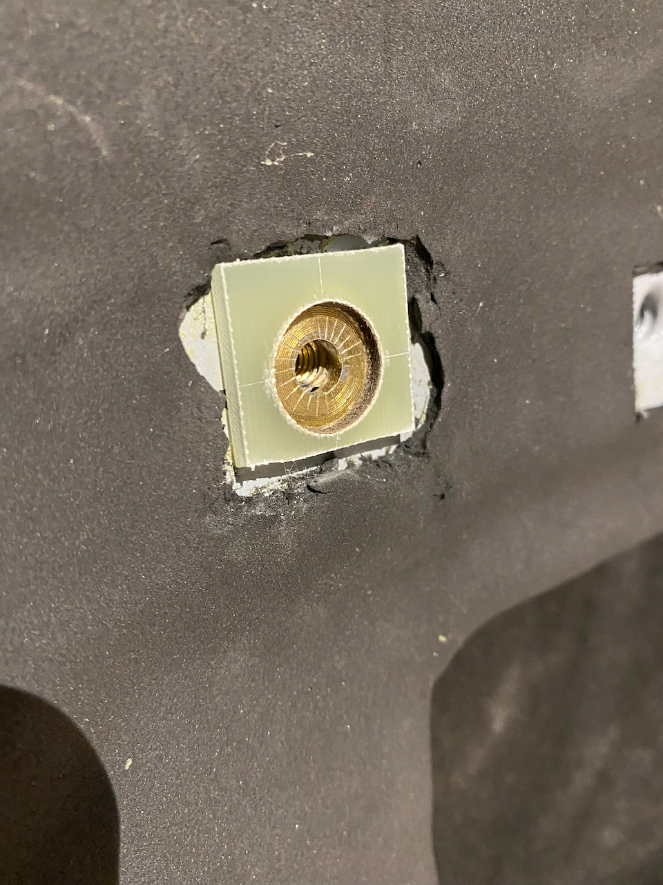
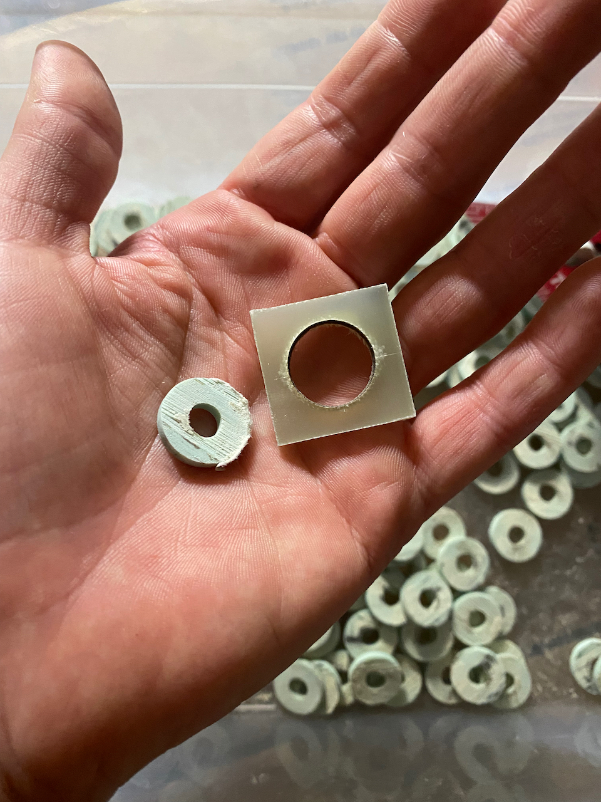
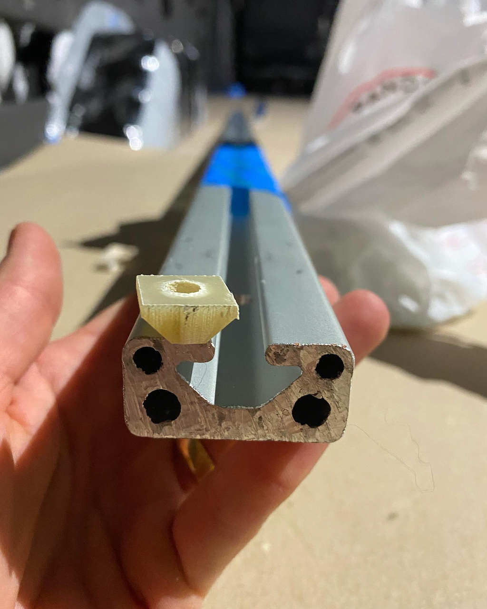
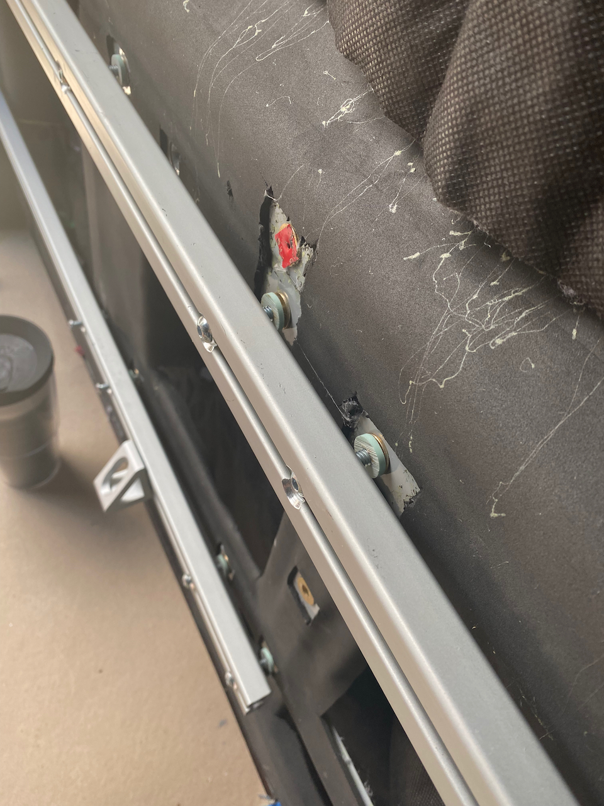

TLDR: If you want to use thermal breaks in your structural joints, you must use a material of sufficient compressive strength (e.g. FR4).  It's better to have thermal shorts than weak, failure-prone joints.

To minimize thermal "shorts" through our insulation, we employed thermal breaks at all locations where interior metal structure (8020 or L-track) is fastened to the van walls.

Many materials have much lower thermal conductivity than steel or aluminum.  However, that is not enough.  The material must also have compressive strength and creep resistance sufficient for a properly preloaded bolted joint.  This eliminates a lot of common and otherwise desirable materials such as plywood, nylon, uhmw.

We settled on FR4, a fiberglass material.  Its compressive strength is 35-60 KSI.  Its thermal conductivity is 0.25 W / m-K.  According to the [intertubes](https://lairdplastics.com/catalogs/item-content/66712/glass-epoxy-black/pr_66712/cp_/shop-by-material/laminates-glass-epoxy), FR4 "is also used for mechanical applications when outstanding strength, stiffness, and excellent creep resistance are required."  I have some professional experience with it in electrical and mechanical applications as well, so it's a known (to me) quantity.

During the concept design phase for the van, we factored in 1/8 inches of FR4 sheet where ever we bolted structure.  Later, as the build progressed, we realized that the outward flange of the plusnuts that we use almost exclusively sits proud of the van structure by a small amount (like 1/32 inches).  Based on this, we purchased 1/8 inch sheet, cut squares, and drilled a large enough hole to pass the raised flange of the plusnut.

Then, it occured to me, in the midst of a shower, that given the thin sheet metal of the van structure, if such a joint is torqued properly, the sheet metal could pucker and the plusnut might be pulled into the FR4 hole.  If this occurs it is unlikely you will ever get a fastener properly tensioned without destroying the van sheet metal/plusnut.  This was confirmed, empirically, by forum/instagram acquaintence, carryingforks.  Based on theory and practice, we went in a different direction.

_The plusnut and sheet metal will get pulled into the spacer hole when a fastener is tightened._

If you take the yield strength of a 1/4-20 bolt and divide by the area of that plusnut flange (minus the center hole), you'll find the FR4 can take that load with plenty of margin (Even a grade 8 1/4-20 bolt at max tension will only load the FR4 to ~15 KSI).

McMaster sells [FR4 hollow rod](https://www.mcmaster.com/6394A16/), with OD of 5/8 inches and an ID of 1/4 inches, perfectly matching the plusnut flange.  All you have to do is slice it into 1/8 inch thick "washers".  This can be done fairly easily on a band saw with the right jig (I would not recommend a table saw).

_Final approach on the left._

We also included a thermal break inside the slot of the 8020.  There are more details of that design/fabrication in our [article on wall 8020](/van/structural/wall_8020_mount/Wall-8020-Mounting).

_Thermal break for inside the 8020._

Putting it all together you have an 8020 structure that is insulated at every contact point from any metal that is, or touches van metal.

Note: For L-track we also used the FR4 on the backside.  However, the thermal benefit is greatly reduced by the fastener which is in contact with the plusnut/van and also directly contacts the L-track.  It's better than the alternative, but only cuts the heat transfer down by a little over 25% of full contact.

