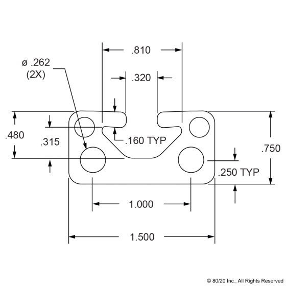
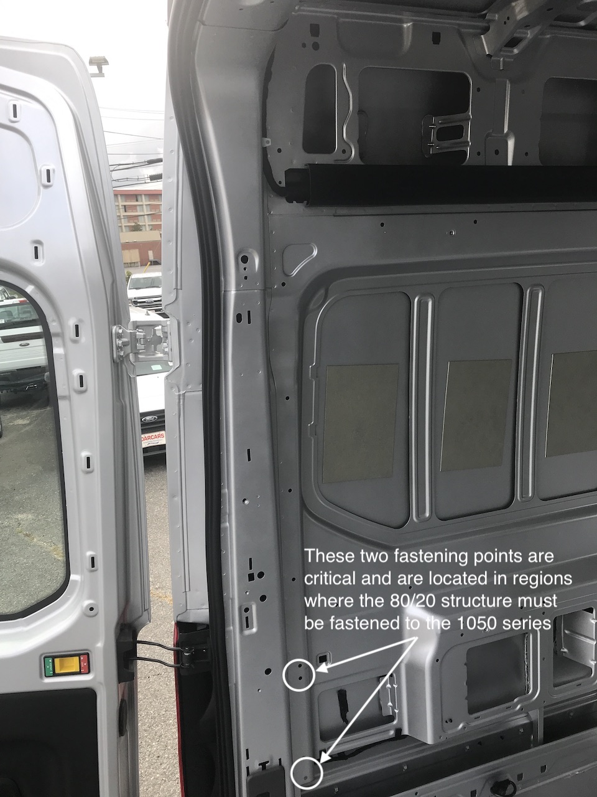
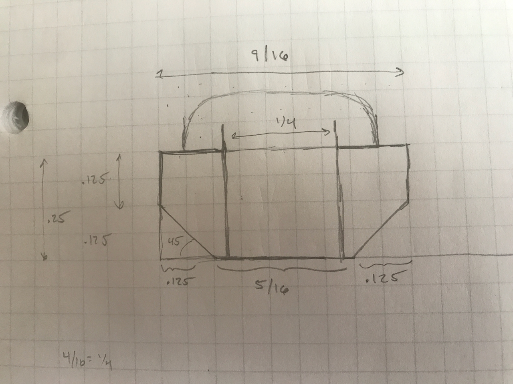

All 80/20 structures will be secured to the walls by attaching to 1575 series 80/20 that will be directly mounted to the walls running fore-aft on both sides of the van.  Method of attachment to the 1575 series will likely be via purchased l-brackets.

1575 series will be fastened into existing OEM holes fitted with 1/4-20 plus-nuts using 1/4 inch button-head socket capscrews.  Based on the stackup of the 80/20, and the two spacers, a 1.5" fastener will have full thread engagement in the plus-nut.  These [fasteners](https://www.mcmaster.com/91306A384/) are available from McMaster.

It is important that the fastening method  is flush or recessed with respect to the outer surface of the 1575 series.  This is because there are some limiting regions at the ends of the 1575 runs were 80/20 structure will need to be fastened to the 1575 series over top of where the 1575 is through-bolted.  An example of this region is shown below.

Based on the dimensions of the 1575 series, a 1/4-20 sized button-head socket capscrew would not rest flat and allow for a proper pre-loaded joint without putting a bending stress on the head.  To avoid this problem, a slide-in insert that matches the profile will be used.  The insert will be fabricated from FR-4.  Based on the [max head height](bhscs-alloy-zinc.pdf) of a 1/4-20 button-head socket capscrew (0.132 in) the thickness of FR-4 to ensure the head does not protrude is 0.3480 in.  Based on this, 1/4 inch thick FR-4 will be used, which is available from McMaster in [sheet form](https://www.mcmaster.com/garolite/multipurpose-flame-retardant-garolite-g-10-fr4-sheets-and-bars/thickness~1-4/.).  The FR-4 sheet will be cut into 9/16 inch widths, chamfered with a 45 degree router bit, and drilled.

_Pretty straight forward to fabricate with a band saw, drill press, and table router._

The top of the 1575 series will need to be opened to pass the pan head.  [Ourkaravan](https://youtu.be/mulYd1SGCyU?t=173) demonstrates doing this easily with a step bit.

To provide a thermal break, 1/8 inch FR4 will be used between the backside of the 1575 series and the wall at the fastened locations.  This spacer is factored into In the overall arrangement model.

_All together._