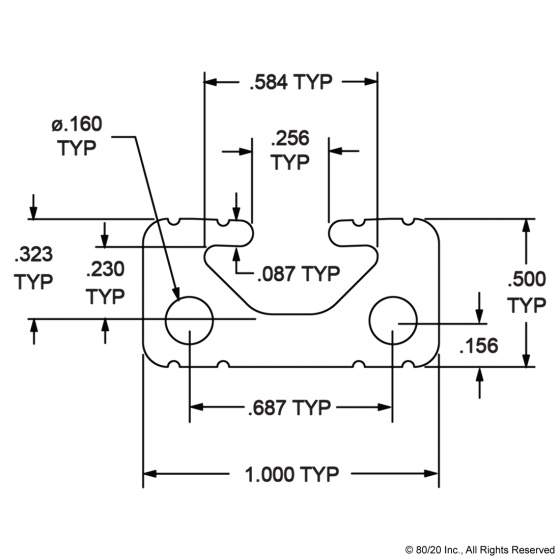

All 80/20 structures will be secured to the walls by attaching to 1050 series 80/20 that will be directly mounted to the walls running fore-aft on both sides of the van.  Method of attachment to the 1050 series will likely be via l-brackets fabricated from angle-aluminum.

1050 series will be through-bolted into existing OEM holes fitted with plus-nuts (most likely 1/4-20).  

It is important that the fastening method  is flush or recessed with respect to the outer surface of the 1050 series.  This is because there are some limiting regions at the ends of the 1050 runs were 80/20 structure will need to be fastened to the 1050 series over top of where the 1050 is through-bolted.  An example of this region is shown below.

Based on the dimensions of the 1050 series, a 1/4-20 sized fastener head would not rest flat and allow for a proper pre-loaded joint without putting a bending stress on the head.  To avoid this problem, a slide-in insert that matches the profile will be used.  

FR-4 was considered, but shaping to match the profile would be a little tricky.  Instead, a standard 80/20 slide-in T-nut will be used, with the hole reamed to pass the fastener without any thread engagment.  A 1/4-20 (or similar) hex drive pan head fastener will be used.  Stack up of the [T-nut](10_slide_in_0.25-20_dimensions.jpg) and [pan head](socket_drive_pan_head_0.24-20_dimensions.jpg) dimensions, 0.171 inch + 0.132 inch leave .02 inch of clearence to the outer [surface](1050_dimensional.jpg) of the 1050 series.  The loss of this thermal break using the T-nut vs FR4 should be fairly negligable.  A thin barrier (20 mils or so) can be considered as it is [available](https://www.mcmaster.com/grade-g-10//multipurpose-flame-retardant-garolite-g-10-fr4-sheets-and-bars/).  A [basic calculation](https://docs.google.com/spreadsheets/d/1p1W18CropUB5xi0fExdllZETDPI_Uvtx6x5fQbmkvuo/edit?usp=sharing) suggests adding the 20 mils of FR4 would increase thermal resistance of the joint by a factor of almost 2.

The top of the 1050 series will need to be opened to pass the pan head.  [Ourkaravan](https://youtu.be/mulYd1SGCyU?t=173) demonstrates doing this easily with a step bit.

To provide a thermal break, FR4 will be used between the backside of the 1050 series and the wall at the fastened locations.  In the overall arrangement model, this FR4 spacer was dimensioned at a thickness of 0.125 inches.