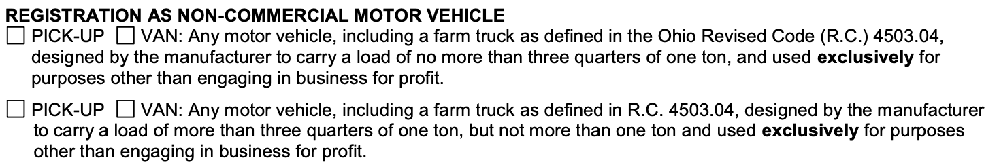

Can a Transit 350 be registered as a Non-Commercial Van in Ohio? 

It would appear it comes down to the interpretation of "one ton".  Generally 350 series or 3500 series vehicles are considered "one-ton" trucks/vans, even if the actual capacity is greater than 2000 lbs.

Phone discussion with Ohio BMV on 2020-12-9: "one-ton" means a 350 or 3500 series truck.  They agreed that it would be registered as a non-commercial motor vehicle VAN.

In Florida, it appears that a Transit 350 would have to be registered as a "Heavy Truck":

[“Heavy truck” means any motor vehicle with a net vehicle weight of more than 5,000 pounds, which is registered on the basis of gross vehicle weight in accordance with s. 320.08(4), and which is designed or used for the carriage of goods or designed or equipped with a connecting device for the purpose of drawing a trailer that is attached or coupled thereto by means of such connecting device and includes any such motor vehicle to which has been added a cabinet box, a platform, a rack, or other equipment for the purpose of carrying goods other than the personal effects of the passengers.](https://www.flsenate.gov/Laws/Statutes/2020/0320.01)

In South Dakota:

