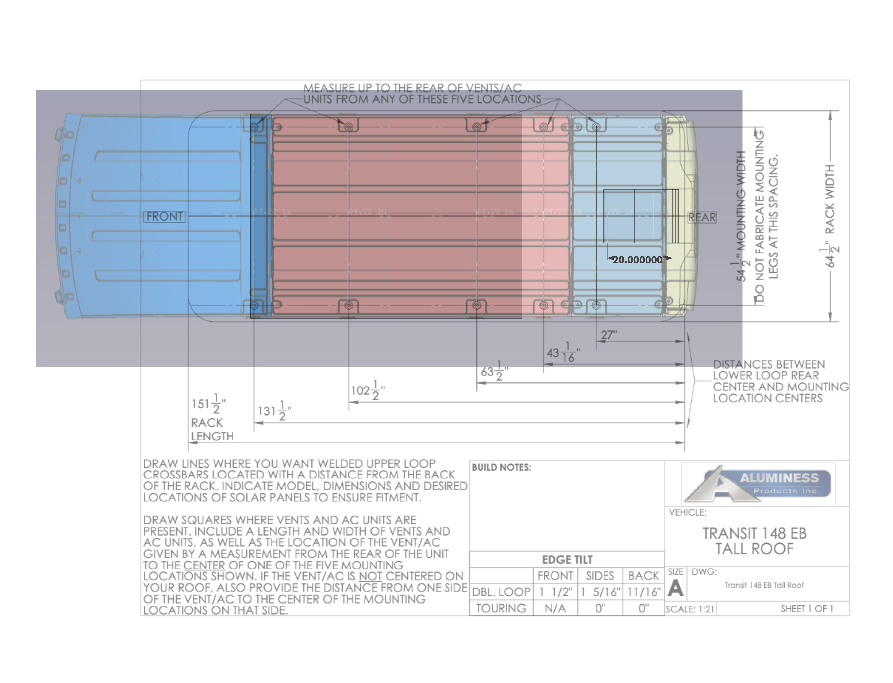
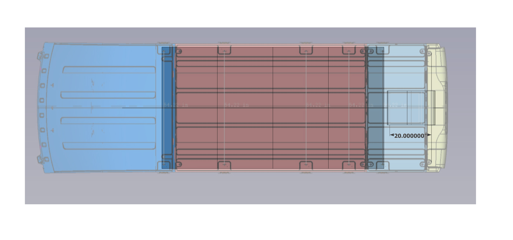
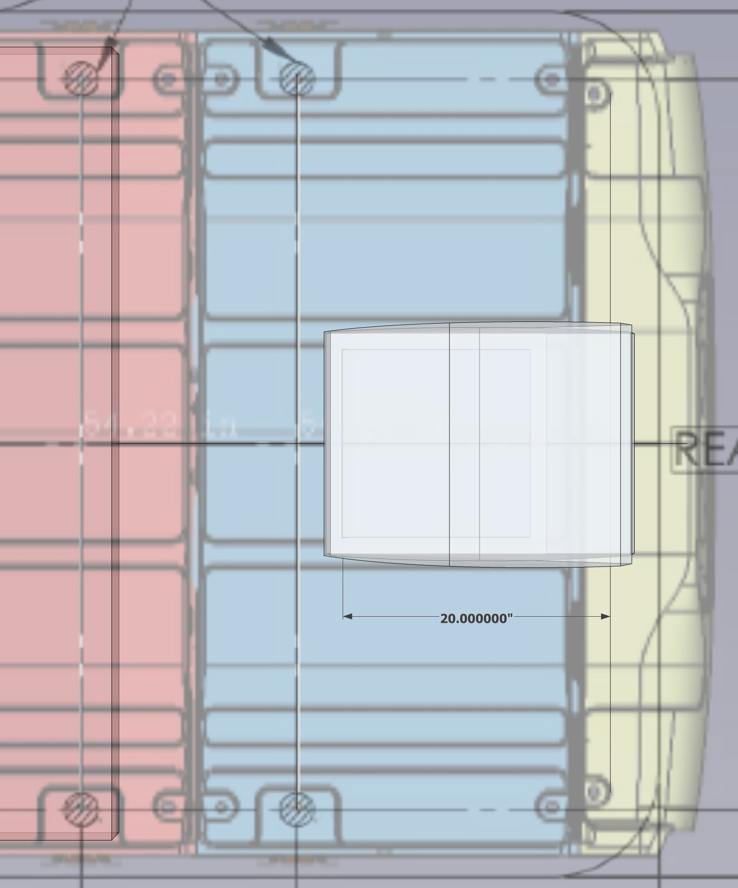
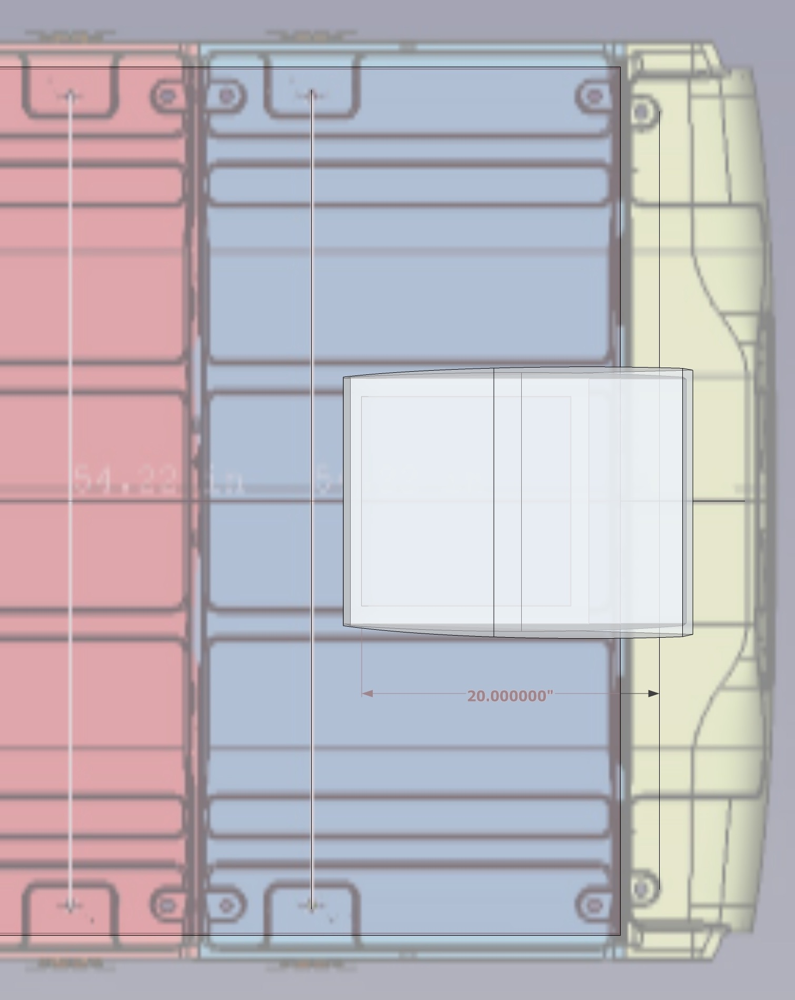
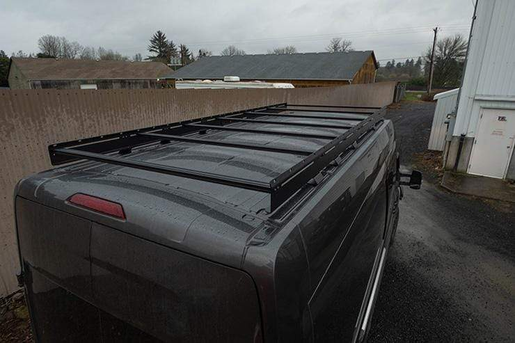
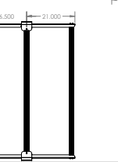

**TLDR:** The Angle AL Hein Rack results in minimum weight, minimum cost, and minimum aerodynamic impact.  It also is extremely flexible.  It results in the least usable roof space after solar is installed.  It also doesn't look the coolest.  All things considered, it is the choice we are going with.  The Aluminess touring rack was strongly considered.  The low pro rack is incompatible with our fan location, so that was a deal breaker.

## Weight

#### Aluminess 

I haven't been able to pin down a weight for an aluminess rack.  [Barefoot theory](https://bearfoottheory.com/aluminess-review-sprinter-van-roof-rack-accessories/#:~:text=Being%20able%20to%20hang%20out,of%20holes%20in%20your%20roof.) states hers is 125 lbs.  With a longer touring style rack, I'd estimate ours would be at least 150 lbs.

#### 80/20

Two 136 inch runners and three 58 inch cross bars yield 50 lbs (plus a lb or so for hardware) for standard or 35 lbs for the ultra light.  It does look like the maximum length for shipping is 102 inches, so this would be a special trip.

#### Angle AL

1.75x1.75x0.25 inch 6061-T6 Angle is 0.0783 lbs/in and is available from Metal Supermarket.  Two 136 inch angle runners and three 58 inch standerd 15 series 80/20 cross bars yield 40 lbs (plus a lb or so for hardware).

1.75x1.75x0.125 inch 6063-T52 Angle is 0.0417 lbs/in and is available from Metal Supermarket.  Two 136 inch angle runners and three 58 inch standerd 15 series 80/20 cross bars yield 30 lbs (plus a lb or so for hardware).

## Aerodynamic Impact

#### Aluminess 

Difficult to quantify.  Barefoot theory states she lost 2-3 mpg with her aluminess rack.  Placing solar panels at maximum forward position would certainly interrupt flow off the slopped portion of the roof.  Placing solar panels starting that the flat portion might mitigate things somewhat.

#### 80/20

Difficult to quantify, but certainly will definitely perform better than the Aluminess rack.  It will also allow for an air damn to aid air flow easily.

#### Angle AL

Difficult to quantify, but certainly will definitely perform better than the Aluminess rack and a little better than the 80/20 option due to the lower height.  This option places the panels closest to the roof.  It will also allow for an air damn to aid air flow easily.

## Cost

#### Aluminess 

$4450 with shipping (not including tax).  Aluminess [stated](email_with_alumines_shipping_cost.pdf) the cost for shipping to MD would be $650 to home or $500 to a commercial address.

#### 80/20

$272 for the extrusions (no shipping or tax), $390 for Hein's mounts. TODO: Contact Hein about low height availability for the LWB Extended.

#### Angle AL

$170 for the 6063 angle (no shipping or tax), $93 for the extrusions (no shipping or tax), $390 for Hein's mounts. 

$333 for the 6061 angle (no shipping or tax), $93 for the extrusions (no shipping or tax),  $390 for Hein's mounts. 

## Solar

#### Aluminess

Aluminess has [confirmed](emails_with_aluminess.pdf) that width shown in thier [dimensioned drawing](Transit_148_EB_Tall Roof.PDF) is center to center of the lower loop of the rack and that the inner width of the upper loop is 63".    [Panasonic 330W](https://panasonic.net/lifesolutions/solar/pdf/96/spec/N330_325SJ47Datasheet_190401_ol_LS.PDF) solar panel dimensions are 62.6" so they will tuck between the upper rails with a custom mounting solution.  Four [Grape Solar](https://grapesolar.com/wp-content/uploads/GS-STAR-190W-US-Spec-Sheet.pdf) 190W or four [Rich Solar](https://richsolar.com/products/200-watt-24-volt-solar-panel) 200W panels could be used at the expense of roof space for roof deck.  Placing the panels so they don't interrupt flow of the sloped roof negates some of the arrangement benefit of Aluminess.  Total solar would be 660W, 760W, 800W with the Aluminess rack option.

#### 80/20

[Panasonic 330W](https://panasonic.net/lifesolutions/solar/pdf/96/spec/N330_325SJ47Datasheet_190401_ol_LS.PDF) panels would overhang the 80/20 rails too much for our taste.  

[Grape Solar](https://grapesolar.com/wp-content/uploads/GS-STAR-190W-US-Spec-Sheet.pdf) 190W panels (58.3 x 26.6 x 1.6 in) will rest just under 1/2 inch inside the outer edge of the 80/20 rails.  To clear the curvature of the roof they need to rest on top anyways (with a spacer if using Hein's lowest mounts).  Total solar would be 760W.  To provide voltage headroom over a 24V system, the Grape Solar panels (12V) would need to be wired in series requiring an even number of panels. A small amount of room to sit with legs hanging over the back would remain.

[Rich Solar](https://richsolar.com/products/200-watt-24-volt-solar-panel) panels (58.7 x 26.8 x 1.4 in) will rest just under 1/4 inch inside the outer edge of the 80/20 rails. To clear the curvature of the roof they need to rest on top (with a spacer if using Hein's lowest mounts).  Total solar would be 800W.  These panels will provide voltage headroom over a 24V system in series or parallel (Vmp 37.6V).   A small amount of room to sit with legs hanging over the back would remain.

#### Angle AL

Panasonic 300W panels would overhang the angle AL rails too much for our taste.  

[Grape Solar](https://grapesolar.com/wp-content/uploads/GS-STAR-190W-US-Spec-Sheet.pdf) 190W panels (58.3 x 26.6 x 1.6 in) will rest inside the inner edge of the angle AL rails.  They will clear the curvature of the roof with Hein's new higher mounts.  Total solar would be 760W.  To provide voltage headroom over a 24V system, the Grape Solar panels (12V) would need to be wired in series requiring an even number of panels. A small amount of room to sit with legs hanging over the back would remain.

[Rich Solar](https://richsolar.com/products/200-watt-24-volt-solar-panel) panels (58.7 x 26.8 x 1.4 in) will rest inside inside the outer edge of the 80/20 rails. They will clear the curvature of the roof with Hein's new higher mounts.  Total solar would be 800W.  These panels will provide voltage headroom over a 24V system in series or parallel (Vmp 37.6V).   A small amount of room to sit with legs hanging over the back would remain.

#### Low Pro Rack

Spacing between athwart rack supports on the Low Pro Rack is under 58".  Panasonic panels would over hang substantially.  [Grape Solar](https://grapesolar.com/wp-content/uploads/GS-STAR-190W-US-Spec-Sheet.pdf) would sit above almost flush (due to inward angle at the top of the athwart supports).  Total solar would be 760W.  To provide voltage headroom over a 24V system, the Grape Solar panels (24V) would need to be wired in series requiring an even number of panels.  [Rich Solar](https://richsolar.com/products/200-watt-24-volt-solar-panel) would sit above almost flush (due to inward angle at the top of the athwart supports).  Total solar would be 800W.  These panels will provide voltage headroom over a 24V system in series or parallel (Vmp 37.6V).

## Fan Location

The fan will be mounted behind the rear-most roof rib, as forward as possible.  Based on the interior measurements, this would but the forward edge of the roof cut 20" from the door rib (note this will involve drilling through the lip of the rear-most-roof_rib).  The door rib location is estimated on the roof model.

#### Aluminess

The rear-most cross brace and the rear loop the aluminess rack will clear the fan.

#### 80/20

As the location of all cross braces can be chosen at will, the 80/20 rack is compatible with the planned fan install location.

#### Low Pro Rack

The Low Pro Rack is not compatible with the planned fan location.  Upon that determination it wasn't looked at any further.  

This interference was confirmed by the company.  The provided the following dimension that confirms it, given that the fan itself is 23" long when closed:

I could add a flat bracket that bolts to where the rear cross beam is and shifts the rear cross bar backwards.  That would be pretty easy to fab, but creates and even longer cantilevered rear.

## Antenna

The forum has stated that all 2020 Transits have a shark fin antenna.  The BMMM provides relocation guidance but it appears that the present location would interfear with the roof arrangements being considered.  TODO: Evaluate antenna location/relocation/integration with other comms and roof arrangements.

