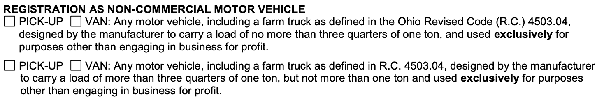

Can a Transit 350 be registered as a Non-Commercial Van in Ohio? 

It would appear it comes down to the interpretation of "one ton".  Generally 350 series or 3500 series vehicles are considered "one-ton" trucks/vans, even if the actual capacity is greater than 2000 lbs.

Phone discussion with Ohio BMV on 2020-12-9: "one-ton" means a 350 or 3500 series truck.  They agreed that it would be registered as a non-commercial motor vehicle VAN.

In Florida, it appears that it would have to be registered as a "Heavy Truck".